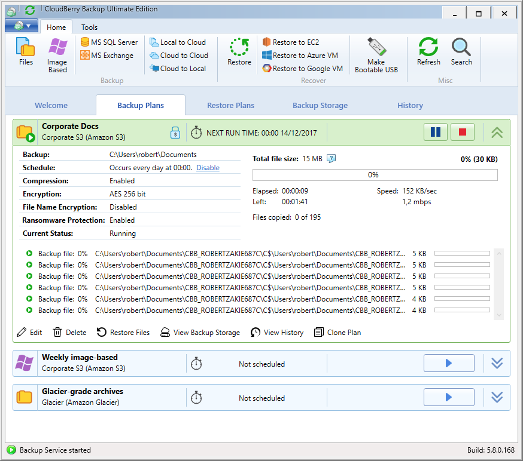

# Backup Types

The main entity of _CloudBerry Backup_ is a _backup plan_. A backup plan represents a record that contains the following information: what to back up, where to back up, how to back up, when to back up, and a number of other attributes like compression, encryption, and email notifications. Once you've configured a backup plan, it'll automatically execute according to the schedule. It is unnecessary to manually launch CloudBerry Backup, as our system service will ensure that backup plans continue executing as scheduled.

Here's a typical list of backup plans that users might have:

1. A backup plan that performs daily file-level backup of the documents folder to Amazon S3. Compression, encryption, and ransomware protection are enabled.  
2. A backup plan that performs weekly image-based backup of the entire disk to Amazon S3. Encryption is enabled while compression is disabled.

That's how the product looks in action. The following sections examine each backup type in detail.

