# Cloud to Cloud

Cloud to Cloud backup is a backup type that enables you to back up individual files or folders from one cloud account to another. For instance, you can create a backup plan that will weekly back up your Amazon S3 documents bucket to Microsoft Azure. It's similar to the regular file-level backup, except that data transfer occurs between two cloud storage services.

To create a cloud to cloud backup plan, launch CloudBerry Backup. On the main toolbar, click **Cloud to Cloud**.

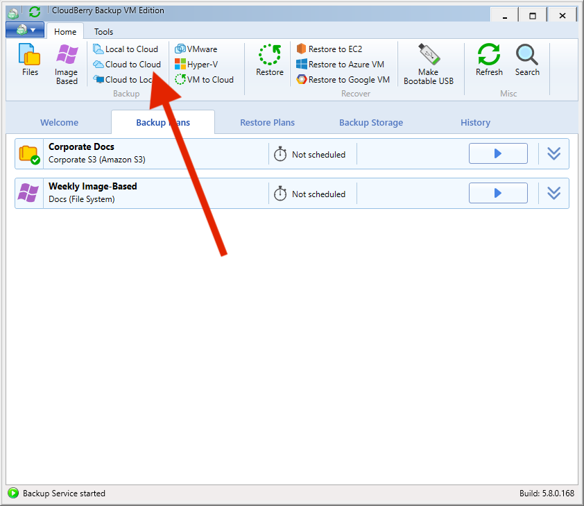

The Backup Wizard will appear, prompting you to configure the backup plan. The first step is to specify the source cloud storage.

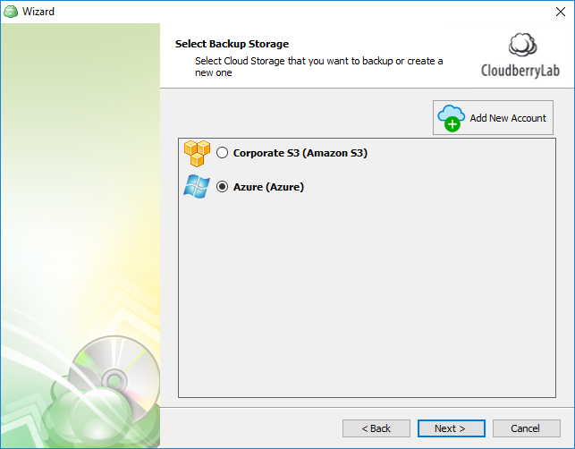

Specify the files, folders, and buckets you'd like to back up and click **Next**.

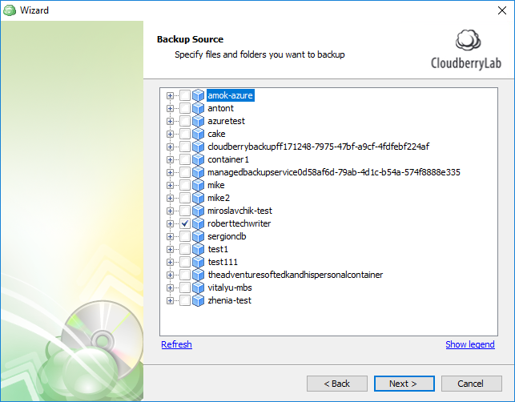

Now select the backup destination that will store the data.

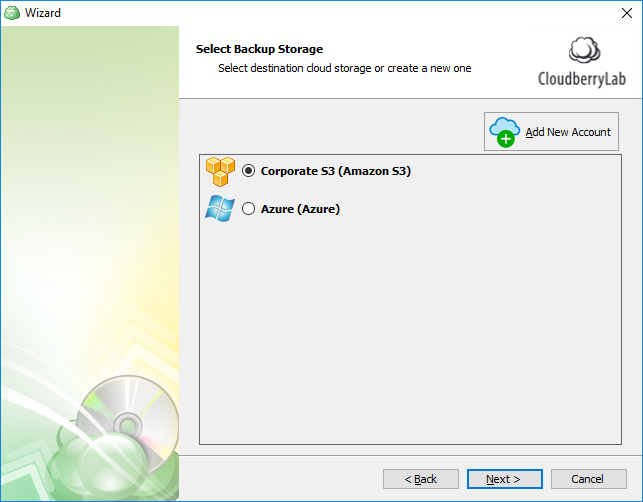

Enter the backup plan name and indicate whether you want to save the plan's configuration in the cloud.

Select the desired backup mode, depending on how thoroughly you'd like to configure the backup plan.

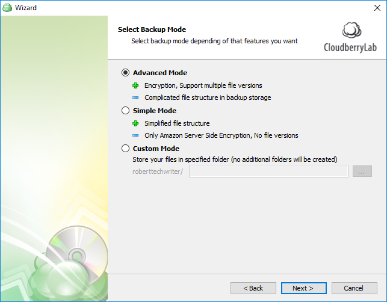

In the next step you can specify which files should be skipped / included and a number of other options.

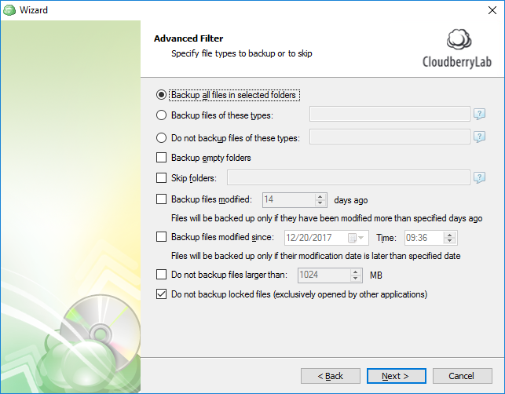

Now you can enable compression and encryption. CloudBerry Backup supports up to 256-bit military grade encryption by default. Similarly, you can enable Server Side Encryption on S3. Note that we don't store the key anywhere for security purposes. If you forget it, the data is permanently gone.

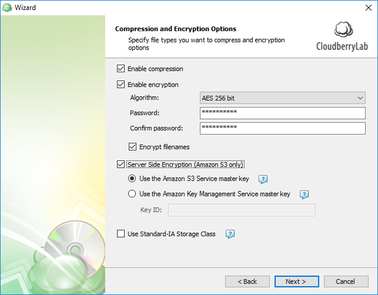

The next step is retention policy configuration. You can indicate if you want to delete versions older than a pre-defined number of days from the modification or backup date. Similarly, you can explicitly determine the number of versions of each file to be retained on the storage.

Next up is scheduling. Here you can set the required schedule with various parameters like frequency, recurrence, immediate resumption of the plan following the computer restart, and the like.

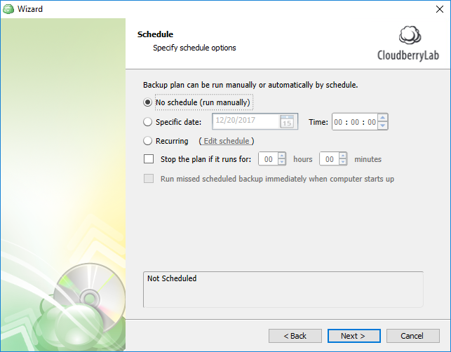

Next, specify the optional pre- and post-actions. These are essentially scripts that can be executed prior to and immediately following backup. For instance, you can run a script that turns off the computer when the backup plan completes executing. Alternatively, you can run a script that, say, disables all incoming connections during the plan execution. Backup chain allows you to automatically trigger another backup plan when the current one completes.

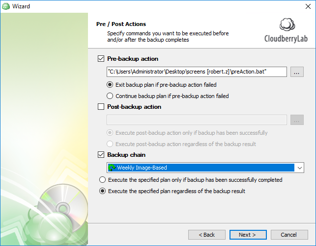

Finally, you can configure email notifications to be notified of backup plan executions and failures. We even support custom SMTP servers if you use one of those. Also available is optional detailed reporting.

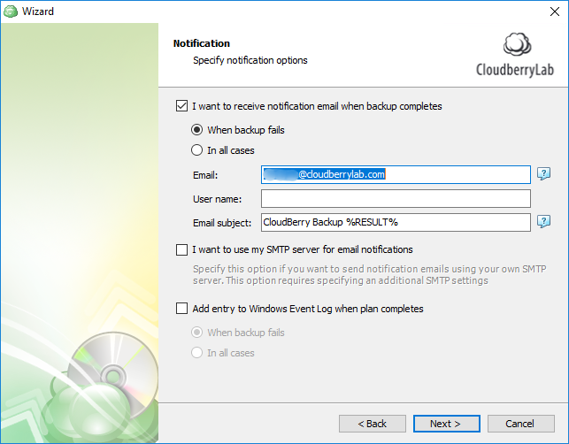

Conclude configuring the plan and, once finished, execute it. The Backup Wizard will be closed, and the backup plan will start executing. In the meantime, you can observe the backup process in the green progress bar in the dedicated dashboard section.

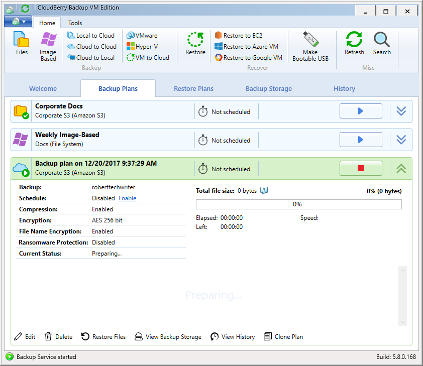

