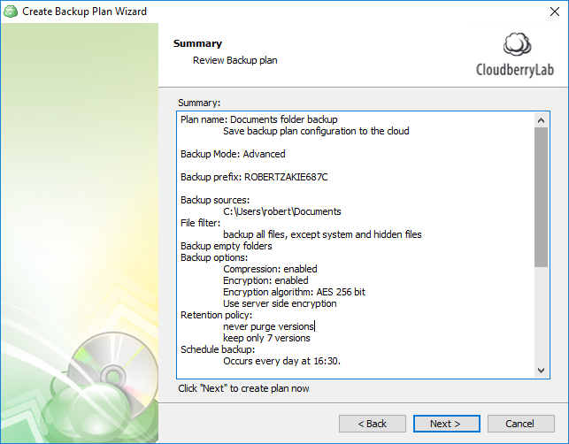
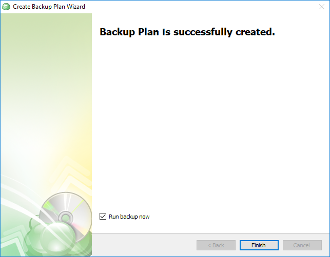
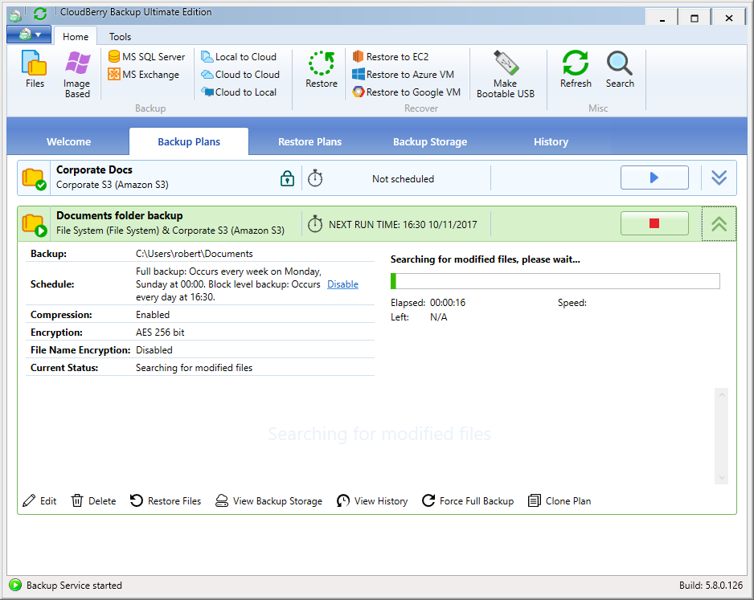

# Step 13. Backup Plan Review

### Backup plan review

Review the plan's summary and click **Next**.

Select the _Run backup now_ checkbox and click **Finish**, at last.

The Backup Wizard will be closed, and the backup plan will start executing. In the meantime, you can observe the backup process in the green progress bar in the dedicated dashboard section.

When the plan completes, you will be notified over email about the status. If you've enabled scheduling, the plan will recurrently execute without you having to open the app or click any buttons.

