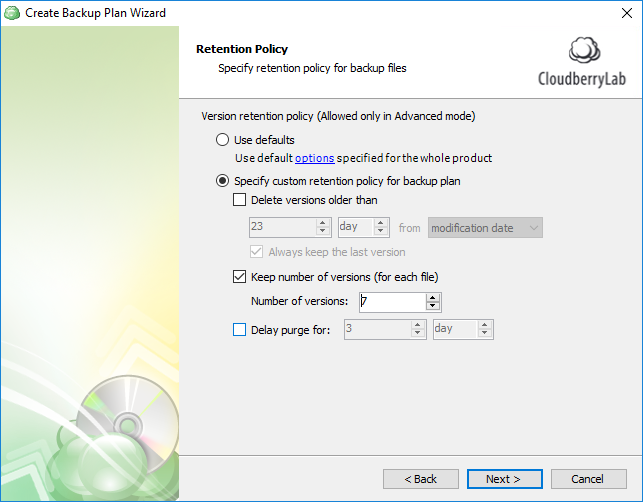

# Step 8. Retention Policy

### Retention policy

The next step is retention policy configuration. You can indicate if you want to delete versions older than a pre-defined number of days from the modification or backup date. Similarly, you can explicitly determine the number of versions of each file to be retained on the storage.

