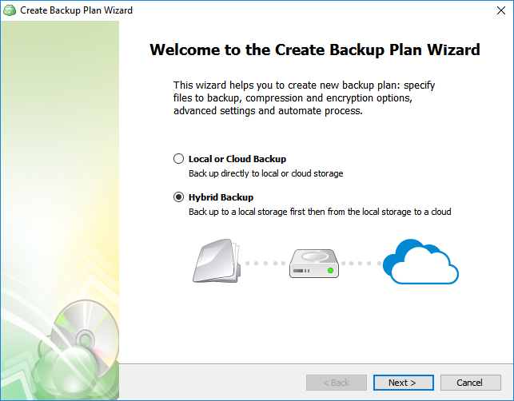
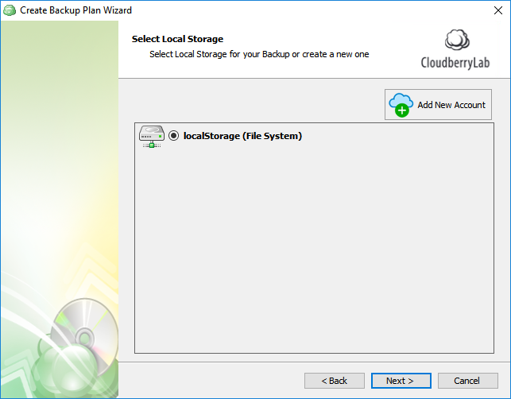
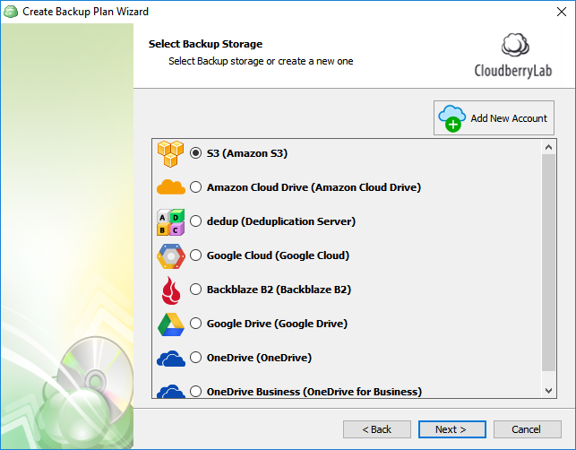

# Hybrid Backup

Our users traditionally follow the industry's best practices and thus configure at least two different backup plans—one for local and another for cloud backup. This approach is not  efficient in that it puts extra workload on the computer. First, the files are uploaded from the computer to the local storage—let's say a local NAS—and then the same process repeats to upload the files from the computer to the cloud storage. The Hybrid Backup combines those aforementioned two backup plans into one, making it easier to do the setup process. Also, encryption and compression are only performed once during the initial backup to the local storage. The already encrypted and compressed files are then uploaded to the cloud storage.

Hybrid backup is available for **all types of backup**.

## Setting up Hybrid Backup

The Backup Wizard in CloudBerry Backup 5.6 immediately asks you if you want to configure a hybrid or merely a local or cloud backup. Select **Hybrid Backup **and click **Next**.

Now select the required local storage.

Proceed to specify the cloud storage.

The remaining steps are identical to the steps of a regular backup plan. Conclude configuring the plan and execute it upon finishing.

Also, note that currently filename encryption is not supported.

