# Microsoft Exchange Backup

CloudBerry Backup \(Exchange and Ultimate Editions\) supports native backup and restore of Microsoft Exchange Server out of the box. If you're running an Exchange server on your machine, our app will automatically detect and list all of the available databases and let you back up any of them  with just a few clicks.

## Backing up Microsoft Exchange Server

To create an Exchange Server backup plan, launch CloudBerry Backup. On the main toolbar, click **MS Exchange**.

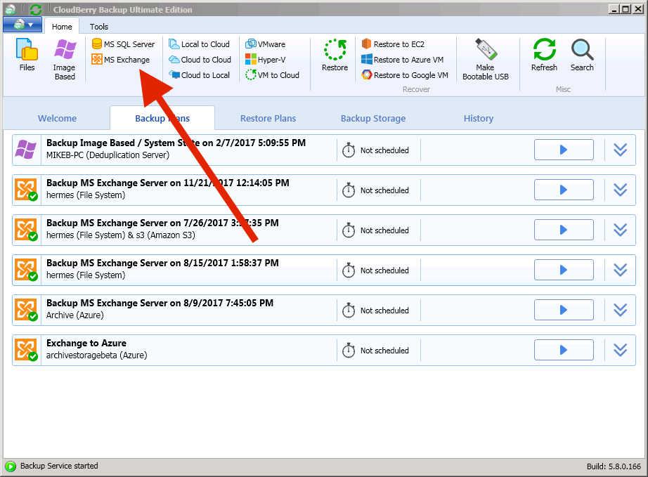

The first step is to indicate whether you want to perform backup just to a local or cloud storage or whether you want to use [**Hybrid Backup**](https://www.cloudberry.help/overview/data-backup/backup-types/hybrid-backup.html) to back up data simultaneously to a local and a cloud storage.

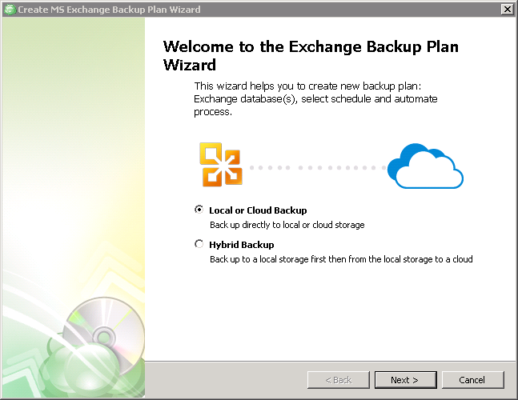

If you selected _Hybrid Backup_, first specify the local storage that will be used to store a local backup. Click **Next **and select the cloud storage that will be used to store a cloud backup. Click **Next**.

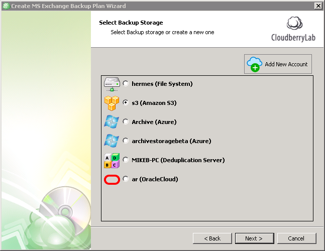

Enter the backup plan name and indicate whether you want to save the plan's configuration in the cloud.

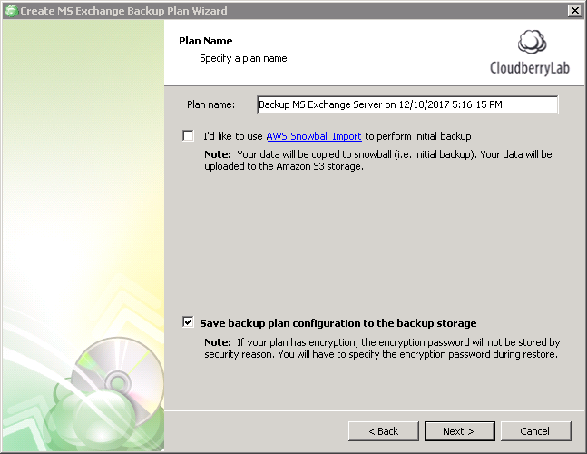

Now select the databases you want to back up. If some databases do not appear, click **Add Manually** in the bottom right-hand corner and specify the locations for data and logs files.

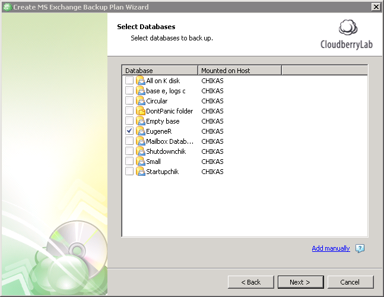

Now determine if you want to use system VSS provider.

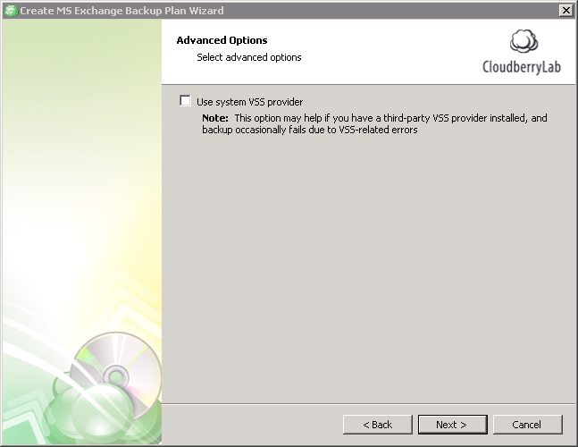

Enable compression and encryption if necessary. CloudBerry Backup supports up to 256-bit military grade encryption out of the box. If you're backing up data to Amazon S3, you can also use server side encryption. Note that we don't store the key anywhere for security purposes. If you forget it, the data is permanently gone.

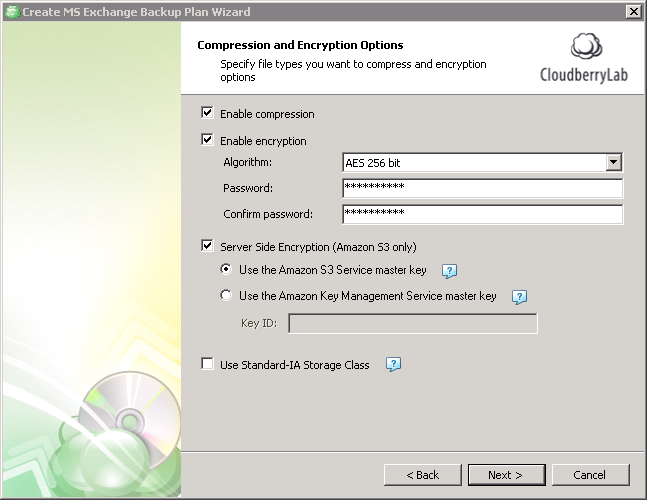

The next step is retention policy configuration. You can indicate if you want to delete versions older than a pre-defined number of days from the modification or backup date. Similarly, you can explicitly determine the number of versions of each file that must be retained on the storage.

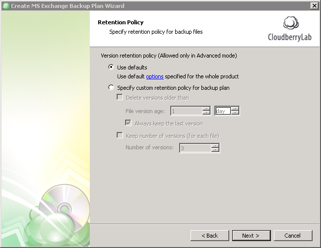

Next up is scheduling. Here you can set the required schedule with various parameters like frequency, recurrence, immediate resumption of the plan following the computer restart, and so forth.

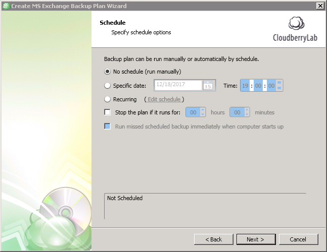

To ensure that you can at any point revert to the older versions, it is recommended to perform full backup every now and then. You can schedule full backup with the required frequency and even enforce it when the size of block-level backup exceeds the specified threshold.

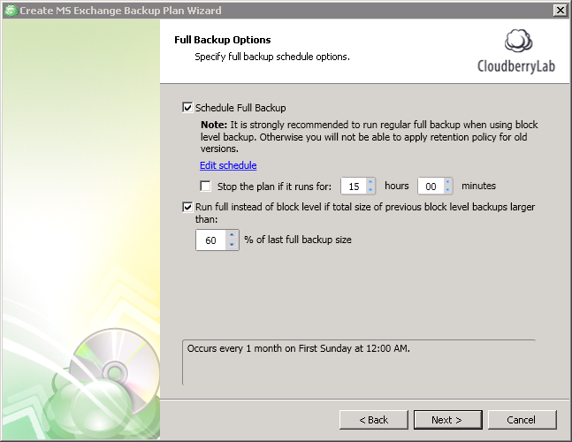

Next, specify the optional pre- and post-actions. These are essentially scripts that can be executed prior to and immediately following backup. For instance, you can run a script that turns off the computer when the backup plan completes executing. Alternatively, you can run a script that, say, disables all incoming connections during the plan execution. Backup chain allows you to automatically trigger another backup plan when the current one completes.

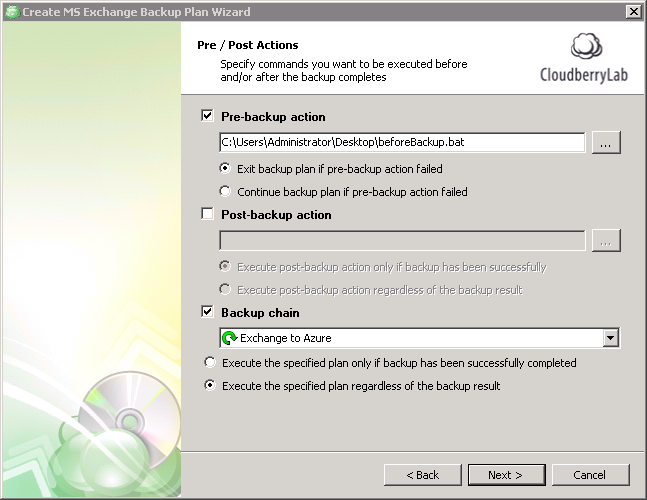

Finally, you can configure email notifications to be notified of backup plan executions and failures. We even support custom SMTP servers if you use one of those. Also available is optional detailed reporting.

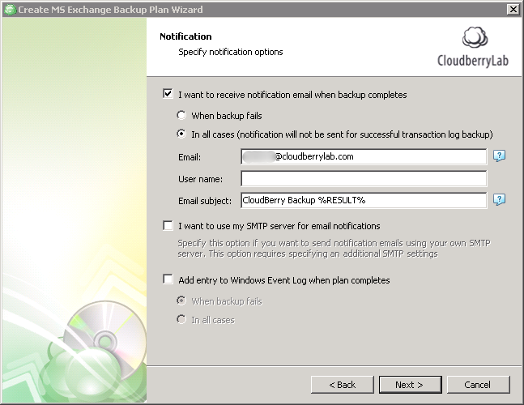

Conclude configuring the plan and, once finished, execute it. The Backup Wizard will be closed, and the backup plan will start executing. In the meantime, you can observe the backup process in the green progress bar in the dedicated dashboard section.

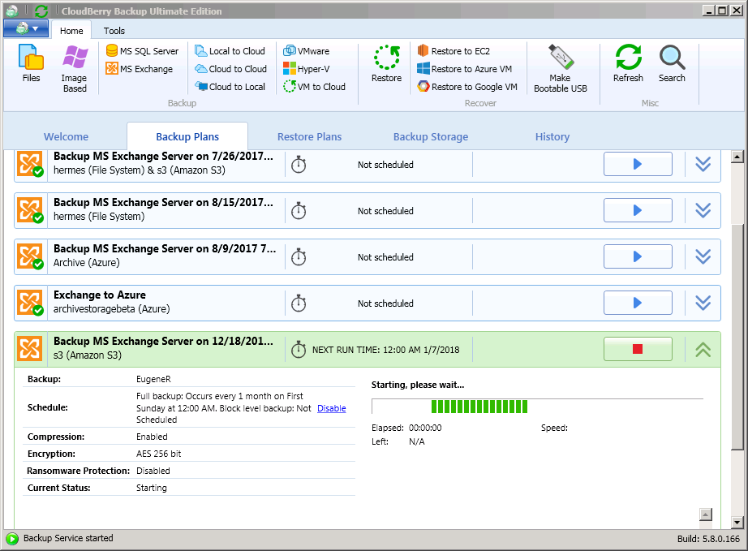

That's it! When the plan completes, you will be notified over email about the status \(if you enabled notifications\). If you've enabled scheduling, the plan will recurrently execute without you having to open the app or click any buttons.

