# Microsoft SQL Backup

Backing up your Microsoft SQL Server database is unquestionably essential for keeping your data intact and accessible. That’s where CloudBerry Backup comes in — providing a comprehensive solution that can effortlessly back up Microsoft SQL Server databases to cloud and local storages.

## Before you start

It's important that you only perform your SQL Server backups using a single product. If you currently back up using native SQL Server scripts, maintenance plans, or another product, we recommend that you first disable those backup jobs before enabling SQL Server backups with CloudBerry Backup.

If you have two products running backups on the same set database, you may end up with differential and transaction log backups that cannot be restored.

As an example, let’s say you use two backup products and do the following procedure:

1. Back up your Customer database using CloudBerry Backup \(CustomerFull1\).
2. Perform the first differential backup for that database using CloudBerry Backup \(CustomerDiff1\).
3. Back up the Customer database using another product \(CustomerFull2\).
4. Perform the second differential backup for the master database using CloudBerry Backup \(CustomerDiff2\).

You would expect that CustomerDiff2 could be restored after CustomerFull1, but in reality CustomerDiff2 is based off of CustomerFull2 — created by a different product.

This case only applies to individual databases. If you perform a backup of two different databases using two different backup plans or backup products, there should be no issues.

## Creating a MS SQL Server backup plan

Naturally, we assume that you’re already familiar with how SQL Server functions, as this article only covers the way in which our backup solution interacts with the SQL Server. Ensure that your server is up and running and then proceed over to CloudBerry Backup.

To create a backup plan, launch CloudBerry Backup. On the main toolbar, click **MS SQL Server**.

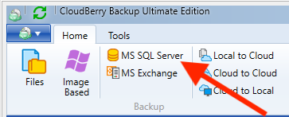

The first step is to indicate whether you want to perform backup just to a local or cloud storage or whether you want to use [**Hybrid Backup**](https://www.gitbook.com/book/cloudberry/cloudberry-backup/edit#) to back up data simultaneously to a local and a cloud storage.

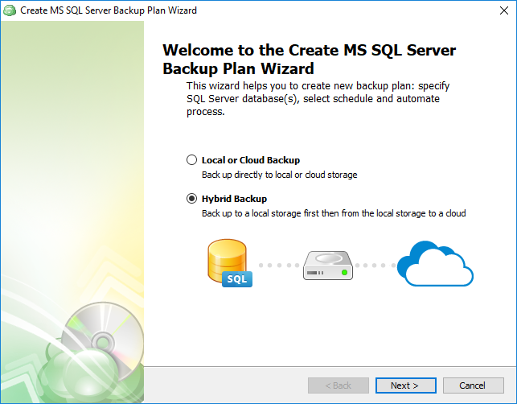

Select the backup destination\(-s\) and click **Next**_._

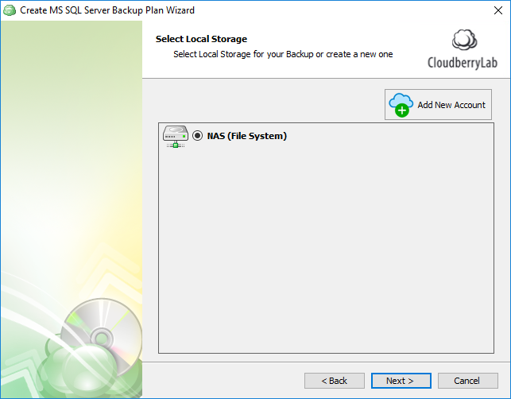

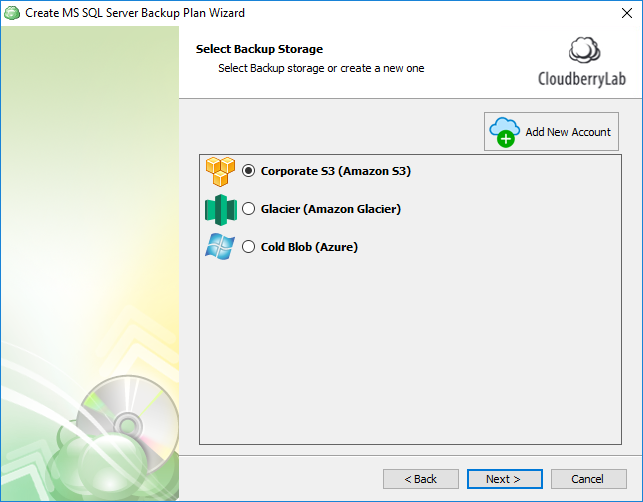

Enter the backup plan name and indicate whether you want to save the plan's configuration in the cloud.

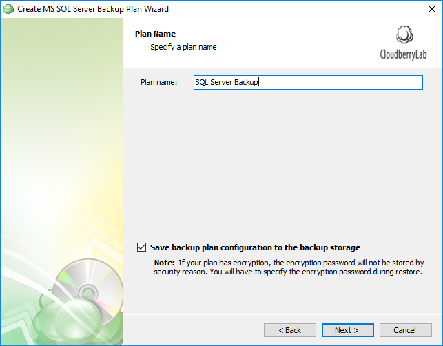

Now let’s specify the information about the SQL Server. Select the desired SQL Server instance from the drop-down menu and login authentication type/credentials. If you want CloudBerry Backup to check if the specified account has the necessary permissions to run a SQL Server backup, leave this option checked. Click **Next**.

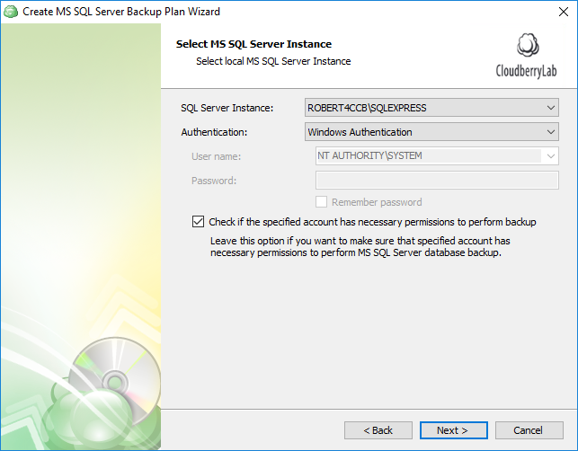

Next up is the database selection step. Here you have 3 options:

1. **Back up all databases**. This is by far the best option for disaster recovery. If your server breaks down, having a complete database backup will enable you to restore the system as it was prior to the calamity. This type of backup includes all system databases like master and model and all user databases.
2. **Back up all user databases only**. This option only backs up user databases.
3. **Back up selected databases**. The final option lets select specific databases for backup. It goes without saying that if you back up only certain databases, the rest of them will sink into oblivion following a disaster. For that reason we recommend you back up all databases.

Click **Next**.

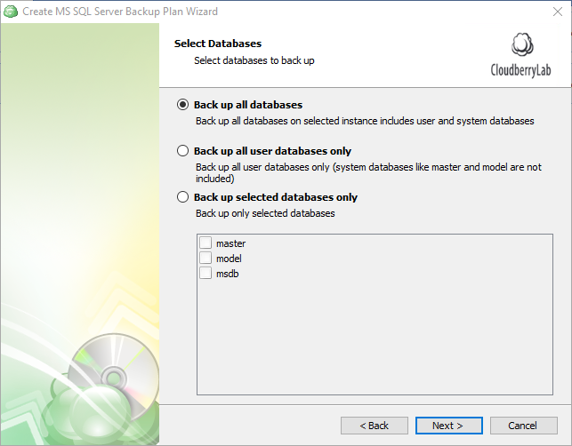

Next up is compression and encryption. As we’ve already mentioned, Microsoft employs a proprietary backup compression for SQL Server — but not for all versions or editions. Here are the supported versions:

* SQL Server 2008: Enterprise, Developer;
* SQL Server 2012 and higher: Enterprise, Business Intelligence, Standard, Developer.

If the version/edition supports native backup compression, CloudBerry Backup enables this option during backup. When a version/edition of SQL Server does not support native backup compression, CloudBerry Backup uses its own compression algorithm — as is the case with other types of backup.

For reference: SQL Server 2008 Enterprise and later versions support compressing backups, and SQL Server 2008 and later versions can restore a compressed backup.

Regarding security, CloudBerry Backup offers 256-bit, military grade encryption which will firmly protect your most sensitive databases and transactions. Note that we don't store the key anywhere for security purposes. If you forget it, the data is permanently gone.

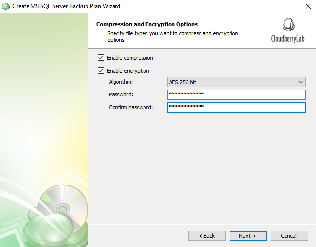

The next step is retention policy configuration. You can indicate if you want to delete versions older than a pre-defined number of days from the modification or backup date. Similarly, you can explicitly determine the number of versions of each file that must be retained on the storage.

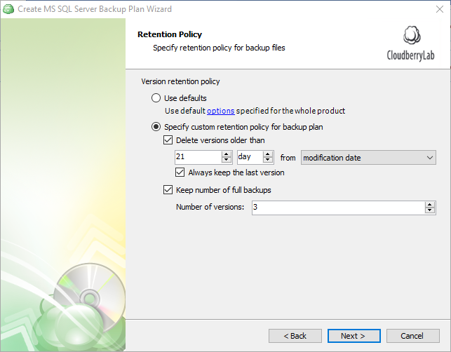

Now it’s time to set the schedule. It is in fact a critical step, as here we slowly transition to the deeply important database backup types. You have 4 options to choose from:

* **No schedule **or **Specific date**. It’ll be a one-time job; a full-backup will be performed with no differential or transaction log backup taking place.
* **Recurring schedule with predefined or advanced templates**. These two options enable you to meticulously configure your SQL server backup schedule: the frequency of full, differential, and transaction log backups.

Here are the definitions of these terms:

* **Full backup **— a database backup that contains all the needed information in a database to perform a full restore.
* **Differential backup **— a database backup that contains only the data that has changed since the last full backup.
* **Transaction log backup **— a backup of current database transaction that includes all log records that were not backed up in a previous log backup.

Note that SQL Server backup and restore operations occur within the context of the recovery model of the database. Recovery models are designed to control transaction log maintenance. A _recovery model is a database property that controls how transactions are logged, whether the transaction log requires \(and allows\) backing up, and what kinds of restore operations are available. Three recovery models exist: simple, full, and bulk-logged. Typically, a database uses the full recovery model or simple recovery model. A database can be switched to another recovery model at any time in the SQL Server settings. If you want to perform transaction log backup, ensure that your database recovery model property is set to Full or Bulk_; any other value will result in an error.

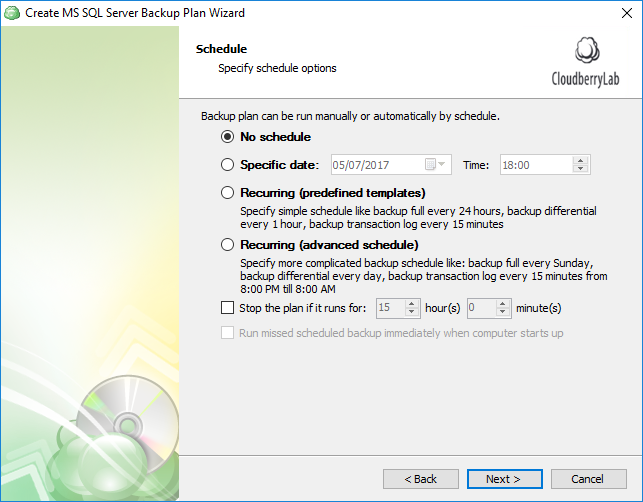

Having selected the predefined templates, you’ll be able to choose from one of our recommended templates. We provide fairly sensible backup schedules, and you can also configure the parameters to your liking.

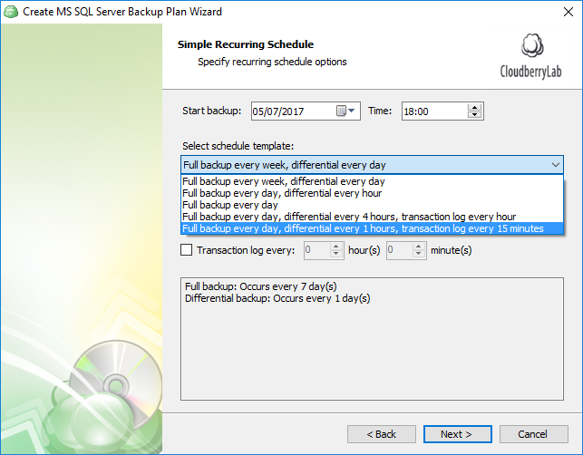

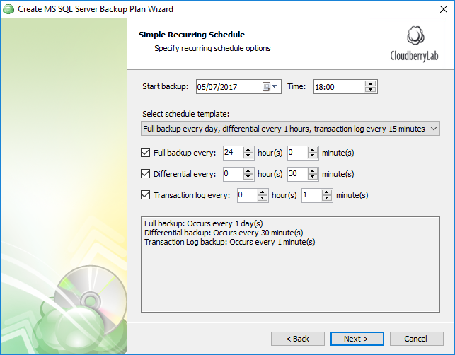

Alternatively, if you go with advanced scheduling, the level of customization rises dramatically. There you can indicate the required frequency by minutes/hours/days, schedule bi-weekly backups, and so forth.

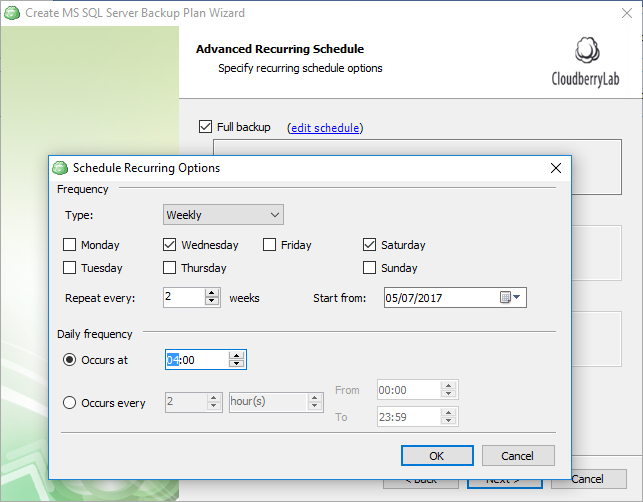

Next, specify the optional pre- and post-actions. These are essentially scripts that can be executed prior to and immediately following backup. For instance, you can run a script that turns off the computer when the backup plan completes executing. Alternatively, you can run a script that, say, disables all incoming connections during the plan execution. Backup chain allows you to automatically trigger another backup plan when the current one completes.

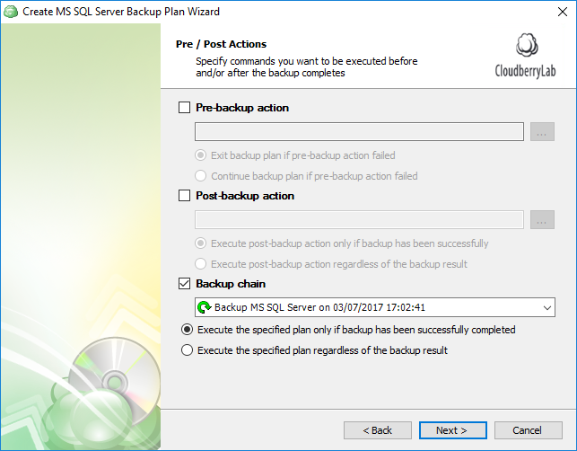

Complete the backup wizard and wait for the next scheduled execution or execute immediately if necessary.

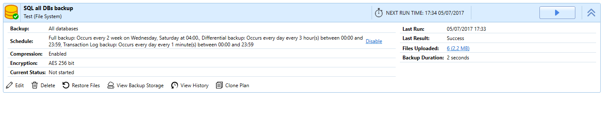

In a short while you backup will be complete, and the backups will be displayed in the backup storage tab.

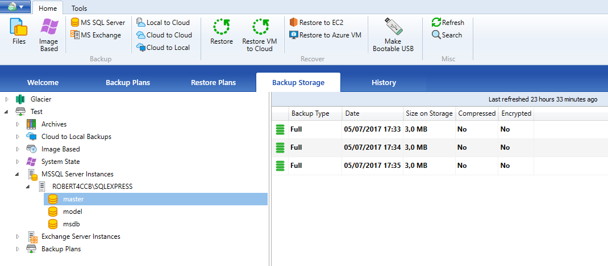

