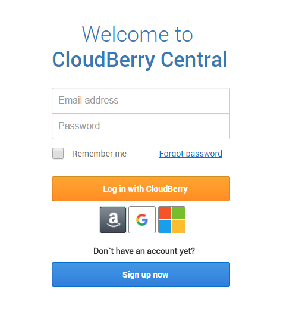
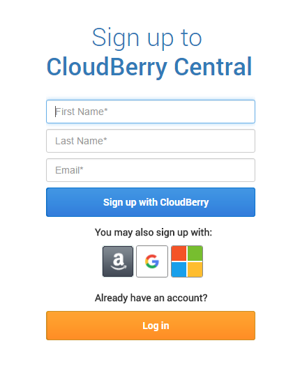
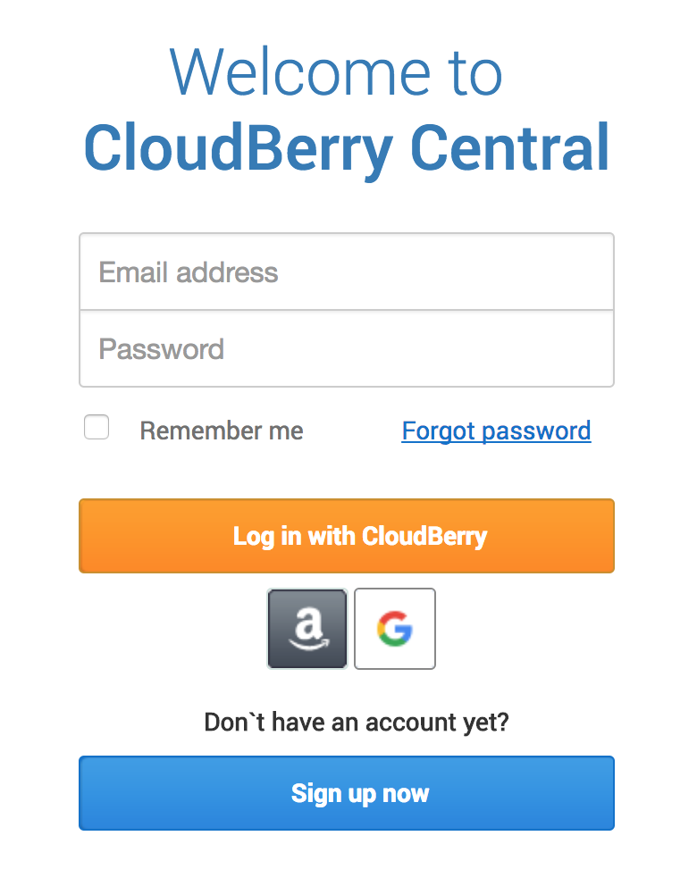
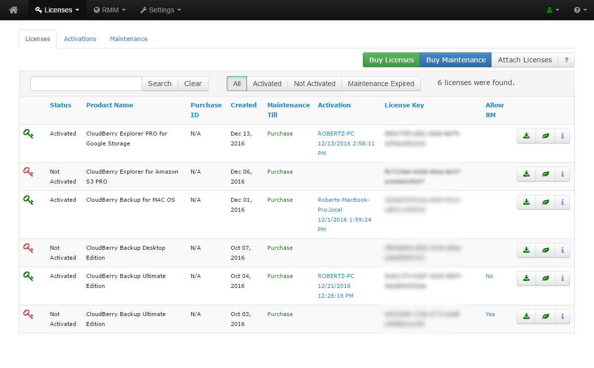

# Getting Started with CloudBerry Central

## A brief overview

**CloudBerry Central **is your go-to place to manage all your CloudBerry products and licences. In short, it allows you to do the following things:

* Manage your **licenses **and activations.
* Set up **reports **\(just as you would set them up in the Backup and Restore Wizards\).
* **Remotely manage **and monitor your computers and CloudBerry products.
* Download **installation packages **\(the latest versions for each of your licenses\).
* Perform **offline activations**.
* Check **maintenance**.
* Check your **license activations**.
* Set up **notifications**.
* Check your **license status**.

## Getting Started

You can start using CloudBerry Central by signing up for it at [www.cloudberrycentral.com](https://github.com/cloudberry/cloudberry-backup/tree/9aa2ad18088a07f9b2bb84e673fd86be9d56c25c/www.cloudberrycentral.com). Note that you cannot use a Managed Backup \(MBS\) account to sign in, as MBS accounts are different from CloudBerry Central accounts. Also, it is important that you use the email address that you used when purchasing the licenses. Otherwise, you'd have to manually hook up your licenses to CloudBerry Central.

When it comes to logging in, you have two options. You can do so by either creating an account on CloudBerry Central or by logging in using your Google, Amazon, or Microsoft credentials. If you choose the second option, please ensure that your Google, Amazon, or Microsoft account address is the one you used to purchase licenses, so as to avoid manually attaching licenses later on.

Afterward, fill in the form, and then click **Sign up with CloudBerry**.

Now get back to [cloudberrycentral.com](https://github.com/cloudberry/cloudberry-backup/tree/9aa2ad18088a07f9b2bb84e673fd86be9d56c25c/cloudberrycentral.com) and enter your login and password. If this is not your first login, and you have formerly enabled 2-step verification, you will also need to enter the verification code.

Upon logging in, you'll see something resemblant to the following screenshot:

All the features of CloudBerry Central are covered thoroughly in the subsequent sections of this section. If you still have any questions regarding CloudBerry Central — be it general inquiries, licensing, sign-up, or any other issues — feel free to drop us a line at [support@cloudberrylab.com](mailto:support@cloudberrylab.com), and we will get back to you shortly.

