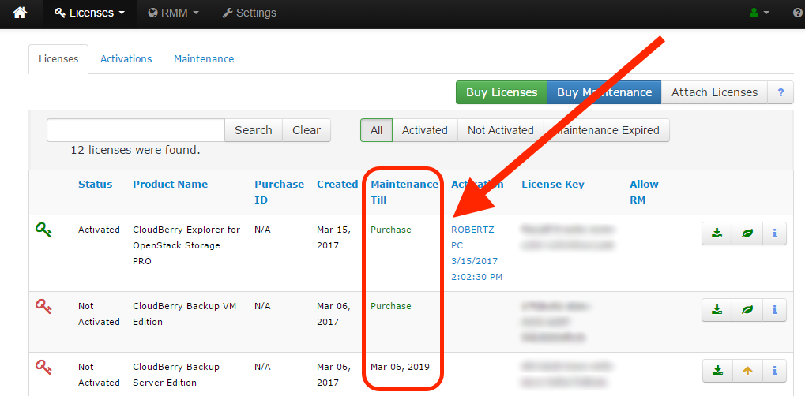

# Managing maintenance

## Introduction

When you initially purchase a product, it only includes a lifetime license. However, maintenance for the product — which includes upgrades and support — has to be purchased separately and will cost you 20% of the product’s price. In other words, acquiring a maintenance for $299 CloudBerry Backup Ultimate edition would cost you $60. In this article we explain how to effortlessly purchase maintenance for all your CloudBerry products via CloudBerry Central. Bear in mind that you can also purchase maintenance via out website, yet we strongly recommend you do it via CloudBerry Central so as to avoid issues with different email addresses \(it’s crucial that the email address you use to purchase maintenance is identical to your CloudBerry Central login\).

## Purchasing a single maintenance

Go to [CloudBerry Central](http://cloudberrycentral.com/). If you don't know what it is, read [our article](../getting-started-with-cloudberry-centralx.md) that explains it in detail as well as the sign up process. Once you've singed up, you can go ahead and purchase maintenance.

Under **Licenses**, click **Licenses**.

Maintenance can be purchased in 2 ways — individually per license or in bulk for all of them. To purchase maintenance for a single license, simply click on the little green leaf icon next to the license key.

Click **Buy**.

You will immediately be redirected to the checkout page. Once you've made the payment, you maintenance will be automatically renewed annually.

When you go back to CloudBerry Central, you'll see that your maintenance has been automatically hooked up to your license. If CloudBerry Central failed to do so, go ahead and do it manually. Simply click **Assign maintenance**.

## Purchasing maintenance in bulk

Alternatively, you can purchase maintenance in bulk for all your licenses at once. On the main page, click **Buy Maintenance**.

The freshly appeared dialog window will prompt you to purchase the required number of maintenances for all you licenses \(1 maintenance per license\). Click **Buy**.

The **Licenses **page has a dedicated column where you can track your active and inactive maintenances.

Moreover, you can look through your available maintenances on the **Maintenance **tab.

If you experience any issues with regard to attaching, purchasing, or managing your maintenances — feel free to drop us a line at [support@cloudberrylab.com](mailto:support@cloudberrylab.com).

