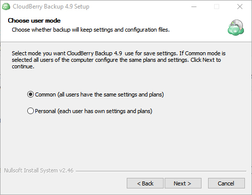
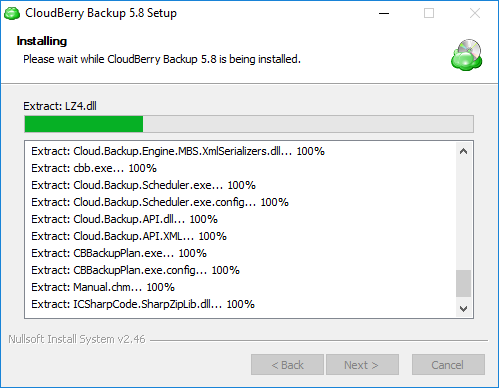

# Installing CloudBerry Backup

Having downloaded the installer from our [website](https://www.cloudberrylab.com/backup/ultimate.aspx), you can go ahead and install CloudBerry Backup in one of two ways: silent installation via command line interface or the more common installation via GUI.

## Installation via GUI

1. Navigate to the folder that contains the freshly downloaded installer and double-click on it.
2. Follow the instructions in the installer. Eventually you will be prompted to select the user for whom you'd like to install the app. You can either configure identical settings for all users or specific settings for each user.



The app will take about a minute or so to install. Afterward, you can go ahead and launch it from the _Start_ menu.



## Silent installation via command line interface

Start the command prompt as administrator and navigate to the folder that contains the freshly downloaded installer


```text
 C:\Users\robert\Downloads
```

Run the following command to install CloudBerry Backup with default settings :

```text
CloudBerryOnlineBackupSetup_vx.x.x.xALLEDITIONSnetv4.0.exe /S
```

The path and the build name may vary, so make sure that you enter the correct commands. If you'd like to install CloudBerry Backup to a specific folder or to a specific user only \(as available in GUI\), check out our [dedicated section](https://github.com/cloudberry/cloudberry-backup/tree/9aa2ad18088a07f9b2bb84e673fd86be9d56c25c/command-line-interface.md) that comprehensively covers all of the the command line commands.

