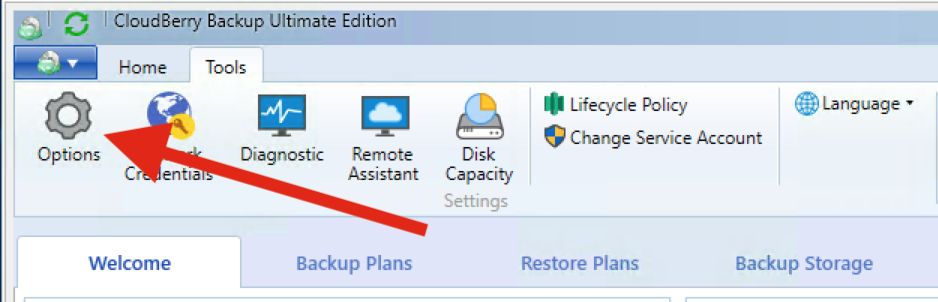
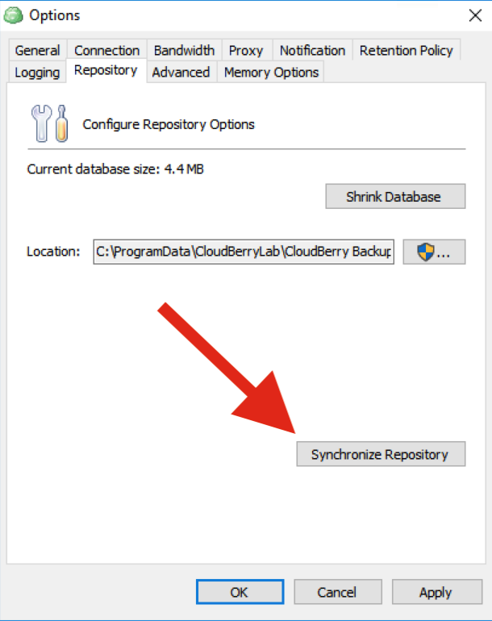
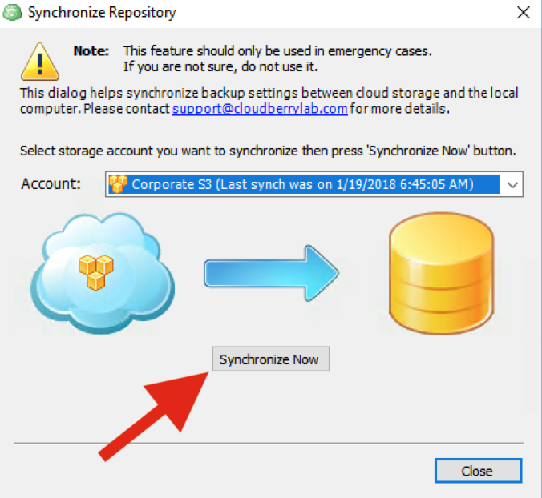
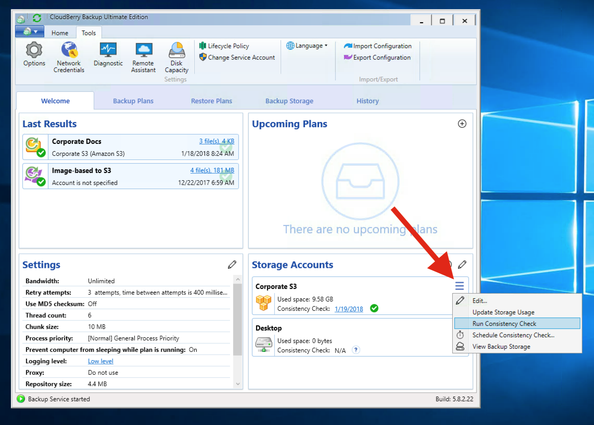

# Repository Sync

When you initially perform backup, all of your data is uploaded to the backup destination. At the same time, CloudBerry Backup generates a so-called _repository_ which is an SQLite database that contains information on all of the backed up data, operations that have been performed with the data, and some other service information. CloudBerry Backup uses the repository to track the data that has already been backed up, so that ensuing backup jobs will not upload files that are already in the cloud. By using the repository, CloudBerry Backup reduces the number of requests sent to the cloud and thus lowers your storage bills.

Repository is responsible for tracking information on your data in the cloud and is only modified when you execute a backup plan. If you yourself start tinkering with the cloud data with some 3rd party software \(like [CloudBerry Explorer](https://www.cloudberrylab.com/explorer/amazon-s3.aspx)\), the data in the repository will be inconsistent with the cloud as a result of your actions. To rectify this mistake, you need to _sync repository_ to update its contents in line with the cloud.  

Case in point: suppose you accidentally deleted a file in the cloud that you had previously backed up. If you start the backup plan that is supposed to back up this file — it won't do anything because the repository thinks that the file is in the cloud. But if you run the repository sync, the repository will register that the file is missing in the cloud and next time you start the backup plan — this file will be reuploaded. 



1. Launch CloudBerry Backup. Under **Tools**, click **Options**.

   2. Under **Repository**, click **Synchronize  Repository**.

   3. Select the storage you want to sync and click **Synchronize Now**.




1. Launch CloudBerry Backup. On the first tab, next to the cloud storage, click on the burger icon and click **Run Consistency Check.**  

This will essentially trigger the repository sync from the first tab and additionally display the discrepancy between the repository and the cloud in the _History_ tab.





Syncing the repository will not modify either the data in the cloud, or the backup plans. It will simply update the local database \(repository\) in line with the information fetched from the cloud.  


It is generally not  recommended to perform repository sync unless something happened with the backed up data in the cloud.  

