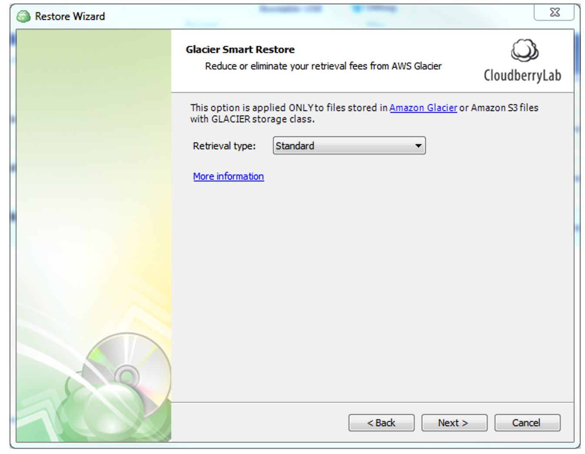

# Glacier Retrieval Rates

Amazon Glacier provides 3 different retrieval options for your files:

**Expedited**: for those users who are willing to spend more on storage fees for higher speeds. The data is retrievable in as little as 1 to 5 minutes. Retrievals cost $0.03 per GB and $0.01 per request. 

Note that there are some provisions that may impede smooth restoration. If you need to get your data back in this time frame even in rare situations where demand is exceptionally high, you can provision retrieval capacity. Once you have done this, all Expedited retrievals will automatically be served via your Provisioned capacity. Each unit of Provisioned capacity costs $100 per month and ensures that you can perform at least 3 Expedited Retrievals every 5 minutes, with up to 150 MB/second of retrieval throughput. If you exceed that limit, expect errors on the part of Amazon.

**Bulk**: for those users who want to limit expenses by sacrificing access time. It is perfect for planned or non-urgent cases, with retrieval taking anywhere from 5 to 12 hours at a cost of $0.0025 per GB and every 1000 requests amounting to $0.025.

**Standard**: the option with typical retrieval hours \(3 to 5\), costing $0.01 per GB along with $0.05 for every 1,000 requests.

By default, the Standard tier is used to retrieve data. So if you don't explicitly specify the tier, expect the Standard fees and retrieval waiting time.

