# Signing up for Amazon S3

In this tutorial we will explain how to sign up for Amazon S3 in just a few steps.


AWS China region requires separate account credentials unique to the AWS China. This means that you need to create a separate Amazon S3 \(China\) Account or Amazon Glacier \(China\) Account \(different from global AWS accounts\). Head over to [AWS China](https://www.amazonaws.cn/en/) page to lear more about the sign up process.


## Signing up for Amazon S3

1. Go to [Amazon Web Services](http://aws.amazon.com/).
2. Click "**Sign in to the Console**" in the top right-hand corner.

   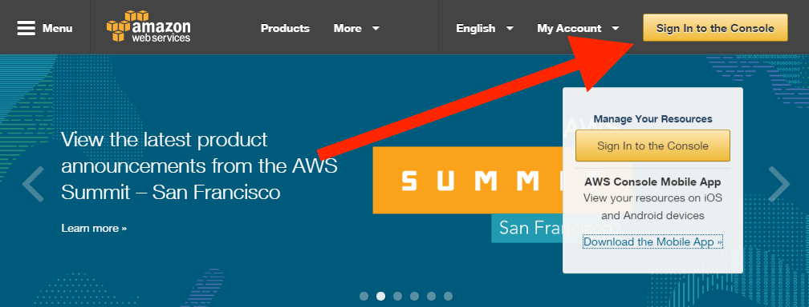

3. Specify your email and click **Sign in using our secure server **button.

   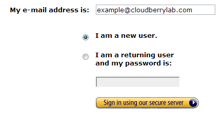

4. Specify your name, email, password and click **Continue**.

   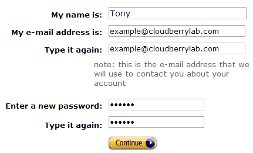

5. Fill the form with your details, select the AWS Customer Agreement checkbox and click 

   **Create Account and Continue**.

   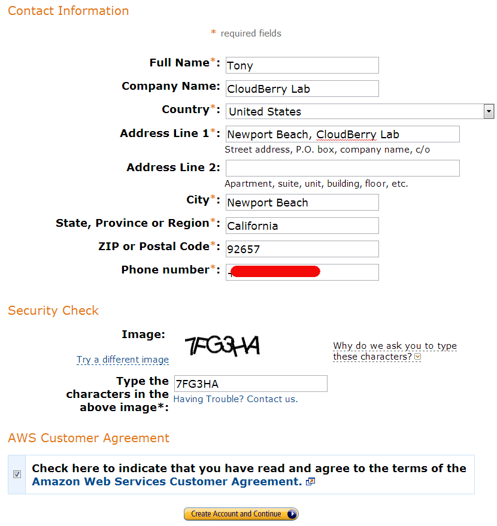

6. Specify your credit card details and billing address. Click **Continue**.

   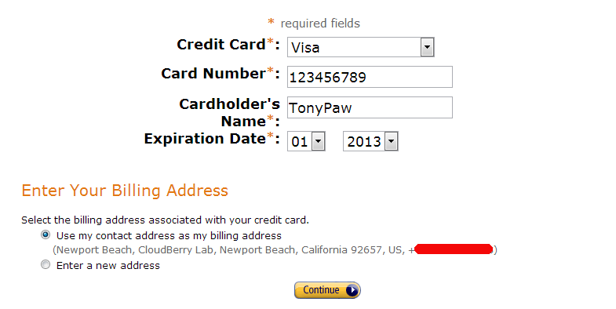

7. On the Identity Verification step, specify your actual phone number and click **Call Me Now**. You will receive a call and will be asked to enter a pin code displayed on your monitor.

   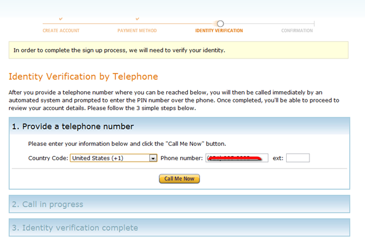

8. As soon as you finish this stage you’ll be forwarded to the last step with email verification. You will receive a **message from Amazon **with the link, just follow the link and your AWS account will be activated. Now you need to sign up for Amazon Simple Storage Service \(S3\).

Completing the signing up process, you will be redirected to the greetings page. To sign up for S3 you will need to do the following:

1. Click on the **Amazon Simple Storage Service **link on the list.
2. Click on the "**Sign up For This Web Service**" button.

## How to Find Out AWS Access Key ID and Secret Access Key

You cannot use your AWS account to access Amazon S3. For that you need to generate AWS credentials that you'll later use authenticate in CloudBerry Backup.

To generate security credentials, take the following steps:

1. Go to [Amazon Web Services console](https://aws.amazon.com/) and click on the name of your account \(it is located in the top right-hand corner of the console\). Then, in the expanded drop-down list, click **Security Credentials**.

   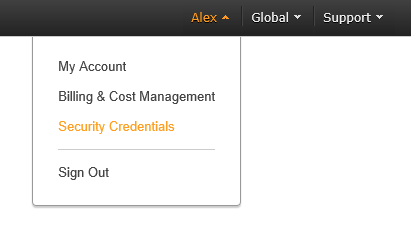

2. Click **Continue to Security Credentials**.

   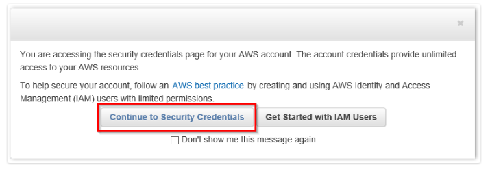

3. Expand the **Access Keys \(Access Key ID and Secret Access Key\) **option. You will see the list of your active and deleted access keys:

   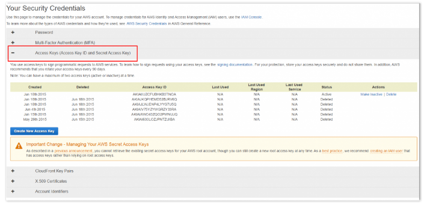


You cannot retrieve the existing secret key. You can see the secret key only once immediately after creating. So, in order to get a secret key, you will need to create a new one.


4. To generate new access keys, click **Create New Access Key**.

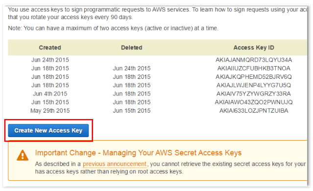

5. Click **Show Access Key **to have it displayed on the screen. Note, that you can download it to your machine as a file and open it whenever needed. To download it, just click **Download Key File**.

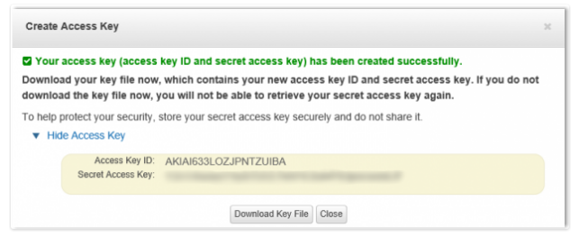


If you do not write down the key or download the key file to your computer before you click **Close **or **Cancel **you will not be able to retrieve the secret key in future. Then you'll have to delete the keys that you created and create new ones.


Now that you've signed up for Amazon S3, it's time to use use the newly created credentials when [adding a backup destination](../../getting-started-1/installation-and-configuration/adding-a-backup-destination.md) in CloudBerry Backup.

