# Signing up for Google

In this tutorial we will explain how to sign up for Google Cloud in just a few steps.

## Signing up for Google Cloud

Go to [https://cloud.google.com/storage/](https://cloud.google.com/storage/) and click **TRY IT FREE**.

Agree with their terms of service and fill in the registration form.

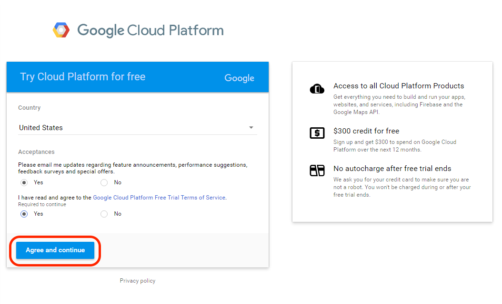

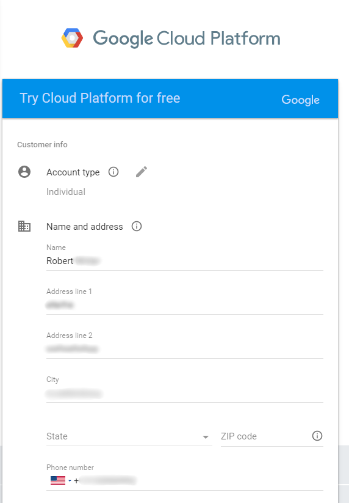

Once the registration form is complete, click **Start my free trial**.** **

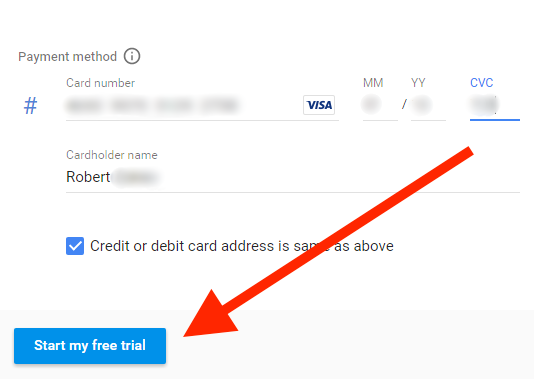

Next up you'll see the main dashboard. Proceed to the navigation drawer to create a so-called project.

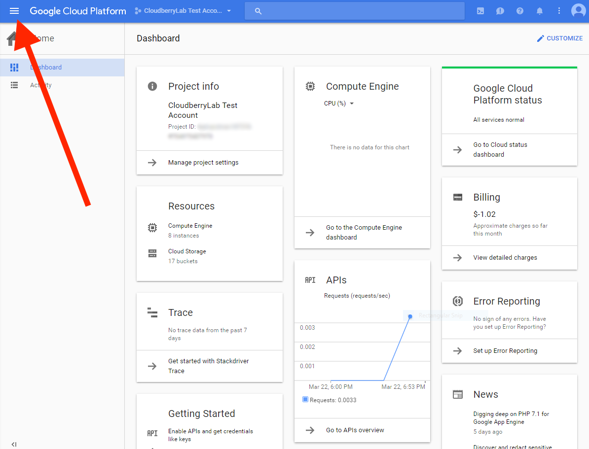

Select **IAM & Admin**.

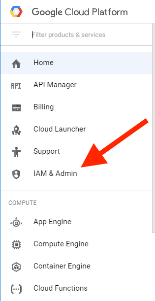

In **Projects**, click **Create Project**.

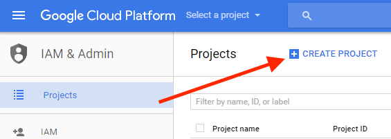

All data in Google Cloud Storage belongs inside a project. A project consists of a set of users, a set of APIs, billing, authentication, and monitoring settings for those APIs. You can have one or multiple projects.

Give your project a name and click **Create**.

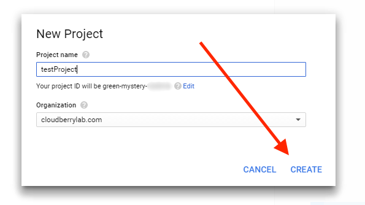

Once the new project is created you will be able to create your first storage bucket inside this project. In the navigation drawer, click **Storage**.

Click **Create bucket**.

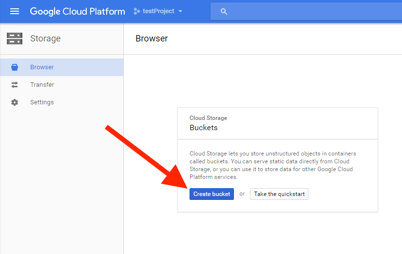

Specify the bucket name, default storage class, and location. Click **Create**.

**Note**: Buckets belong to a particular project and cannot be shared among projects. There is no limit however on the number of buckets that you can create within a project.

## Preparing Service Account

Google Cloud Storage lets you use service accounts to authenticate your application. A service account's credentials include a generated email address that is unique, a client ID, and at least one public/private key pair.

In the navigation drawer, select **API Manager**.

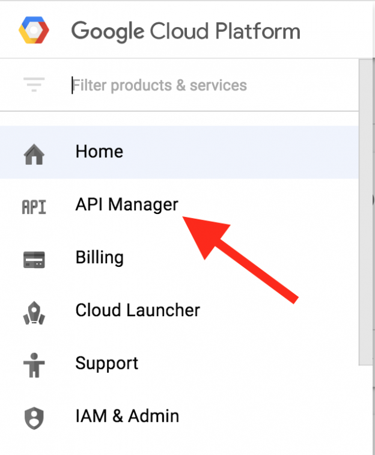

Under **Credentials**, expand **Create credentials **and click **Service account key**.

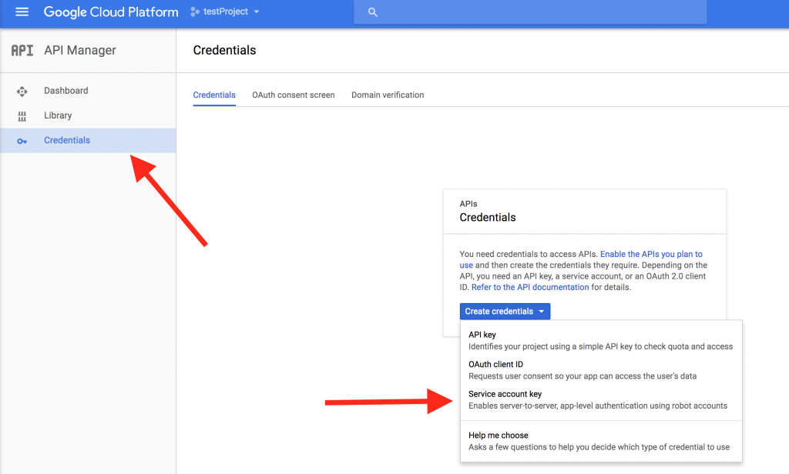

Specify the service account and the key type \(P12\). Click **Create**.

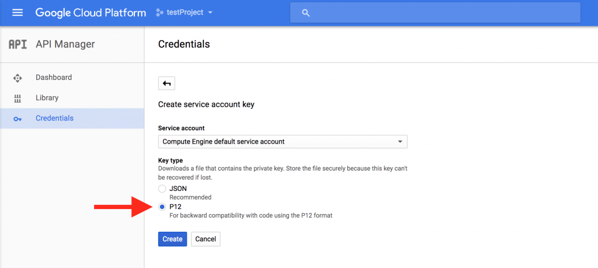

The key will shortly start downloading. The private key's password will be shown on a pop-up window. Write it down somewhere so as to not lose it in the future.

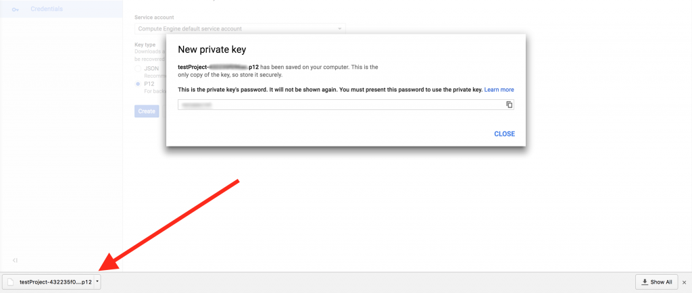

In addition to the mentioned file, the service account information will also be displayed in the Credentials Dashboard.

You're finished. Now that you've signed up for Google Cloud, it's time to use the newly created credentials when [adding a backup destination](../../getting-started-1/installation-and-configuration/adding-a-backup-destination.md) in CloudBerry Backup.

