# Backing up data using AWS Snowball

## What's AWS Snowball?

CloudBerry Backup can easily back up any amount of data. Although, sometimes it may take days — even weeks — to back up terabytes of data. Besides, many internet providers impose data caps on the bandwidth which makes it difficult to upload large volumes of data.

That's why Amazon has come up with a convenient tool to solve this problem. It’s called Amazon Snowball. It is basically a giant box that is capable of storing up to 80 TB of data.

It works pretty simply; in a nutshell, you request the box from Amazon, upload your data to it, ship the box back to Amazon, and then wait for them to upload it to your bucket at their data storage facility.

While ordering and shipping the box back is performed by Amazon, the data transfer from your machine\(s\) onto the Snowball is conducted with the help of our backup product. Basically, you set up a backup plan as usual, except that your destination is now the Snowball, not a cloud storage.

It’s critical that you use a suitable machine for data transportation. It should be able to meet high demands in terms of processing, memory, and networking. Read [Amazon's](http://docs.aws.amazon.com/AWSImportExport/latest/ug/specifications.html#workstationspecs) article to learn more about the workstation specifications.

### Creating a job

1. Go to [Amazon Web Services](https://eu-central-1.console.aws.amazon.com/importexport/home?region=eu-central-1#/wizard) \(be sure to select your region\). Here you can create a so-called import or export job.

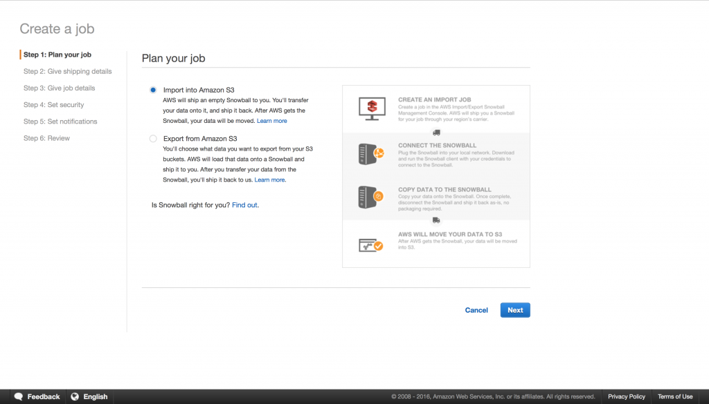

1. Next step is to fill in your address and select the preferred shipping speed.

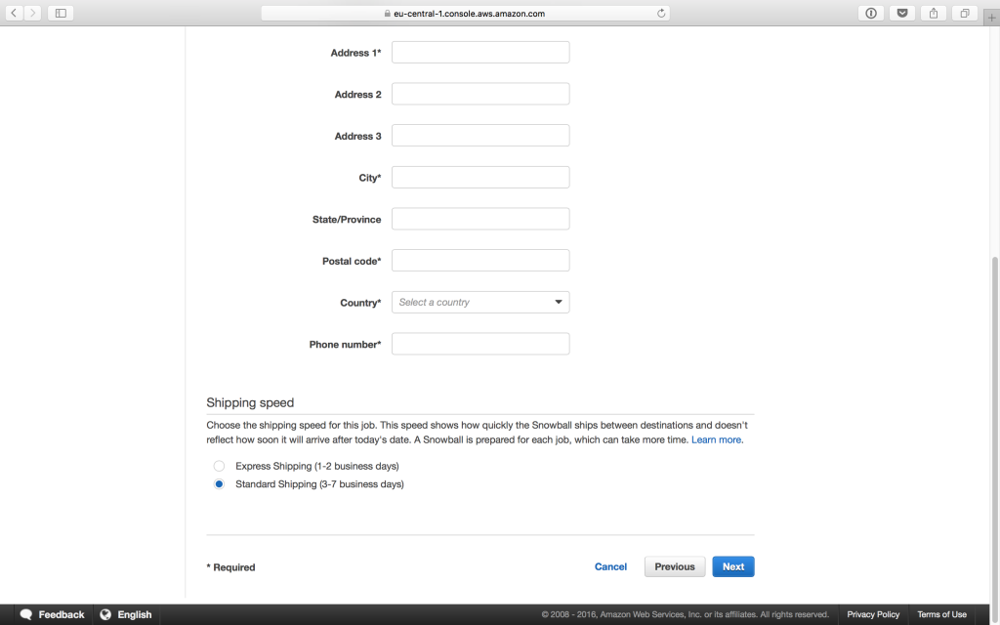

1. Now you need enter the job details. Namely, the job’s name, the necessary bucket, and the Snowball's capacity. Once you're finished, click **Next**.
2. Configure the security parameters.

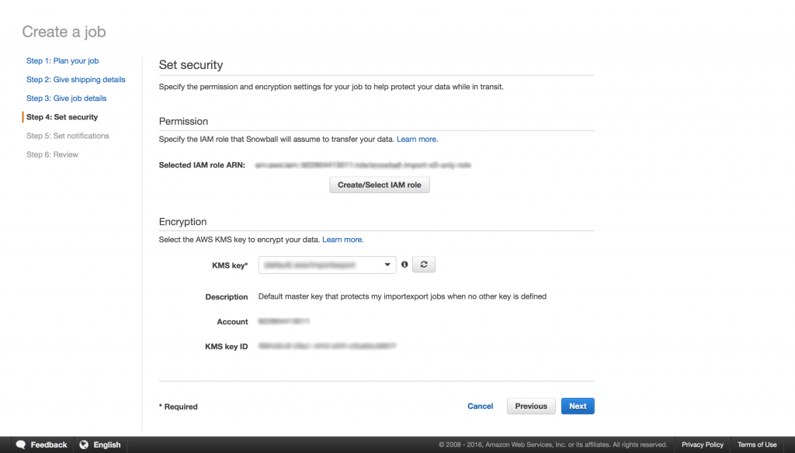

1. Configure the notifications preferences.

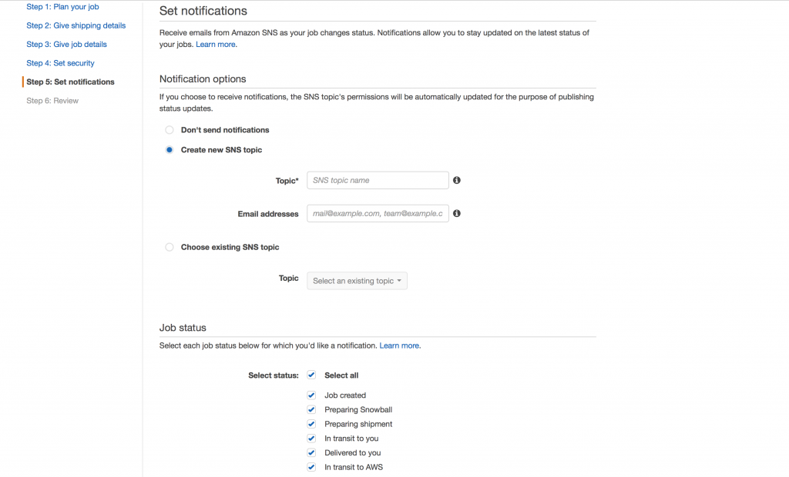

Carefully examine all the information on the review page, and if it is accurate—click **Create Job**.

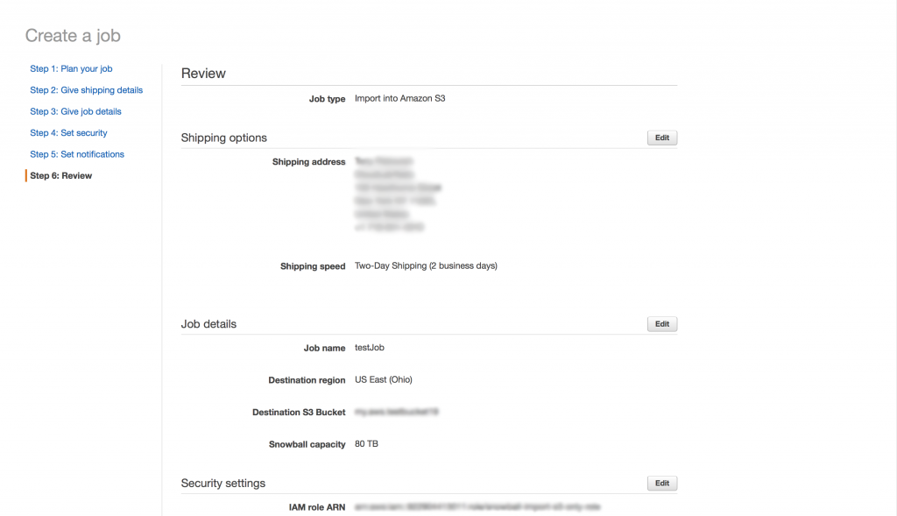

Now that you've created the job, expect the box shortly. Once it arrives, you can start backing up your data to the box.

### Leveraging CloudBerry Backup for the Snowball

Here is a short breakdown of the backup process:

1. Plug the Snowball in. Connect the powered-off box to your computer. Turn it on. Optionally, set up a custom IP address.
2. Create a backup plan in CloudBerry Backup. The process is virtually indistinguishable from the usual process. Only this time you use the AWS Snowball as the backup destination for the initial backup.
3. Download and launch the so-called **S3 Adapter** to enable CloudBerry Backup to communicate with the box \(AWS Snowball has its own file management system\).
4. Wait for the backup to be completed and then ship the box back to Amazon. Once your data has been successfully transferred from the box into your AWS bucket, launch CloudBerry Backup and let it know that the data is in the cloud, so that it can pick up the backup process during the following backups.  

### Setting up the box

Connect the powered-off box to your computer. There are various ways of doing it, be sure to read [this article](http://docs.aws.amazon.com/AWSImportExport/latest/ug/getting-started-connect.html) to learn more about connecting the Snowball to your network. Turn it on, and you’ll see the following information on the box’s E-ink screen:

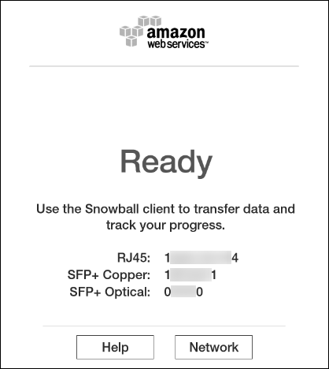

The Snowball automatically fetches the IP address. Click **Network **to see it displayed. However, network settings can be manually changed. Refer to the aforementioned article to learn more about it.

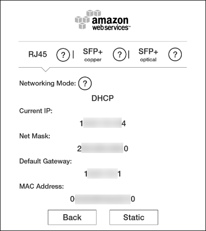

### Creating a backup plan for the Snowball

Before creating the plan, open your cloud storage settings and ensure that you selected the exact same bucket you had indicated when creating a job over at Amazon.

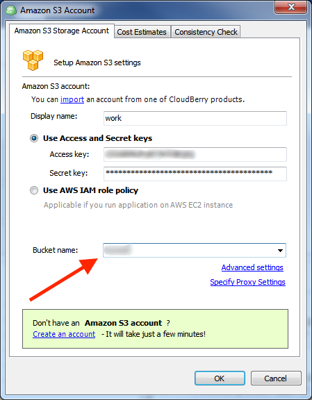

Now proceed to create a new backup plan. Select the **I’d like to use AWS Snowball feature to make initial backup** checkbox when specifying the plan’s name.

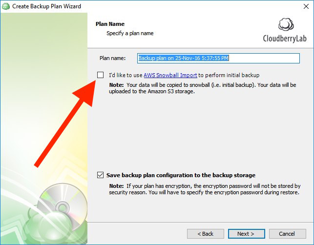

Continue setting up the plan. Eventually you’ll reach the **AWS Snowball** step that describes further procedures. Click on the link in step №2 to download Amazon S3 adapter.

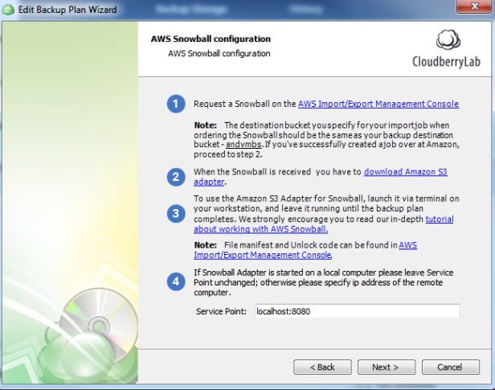

Once downloaded, unzip it and launch the command line. Navigate to the folder that contains Amazon S3 adapter and execute the following command:

```bash
cd snowball-adapter\bin
call snowball-adapter.bat -i <Snowball IP> -m <path to manifest.bin> -u <unlock code>
```

Ensure that you don't have any other services running on port **8080** \(checkable with _netstat_\).

Both the manifest file and the client unlock code can be found in your AWS Console:

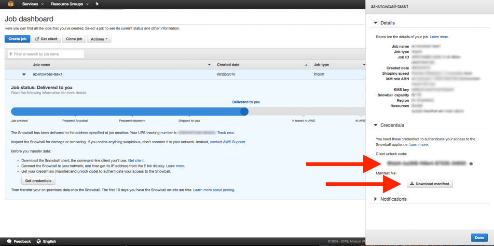

If you’ve done everything correctly, you should see the following message: **“Server up and running on port 8080”**.


Do not close the command line! It should be running all throughout the process.


Now go back to _CloudBerry Backup_ and conclude setting up the backup plan. Upon finishing, run it and wait for it to complete.

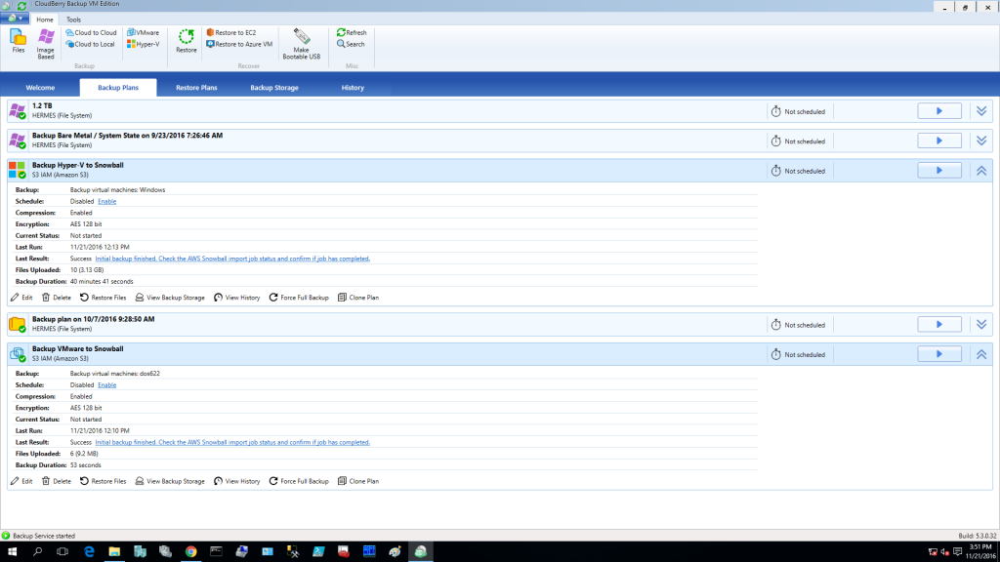

Now that the data has been successfully transferred to the AWS Snowball, ship the box back to Amazon. When they notify you of your data having been moved to your bucket, go ahead and confirm it in CloudBerry Backup. Click on **“Initial backup finished…”**.

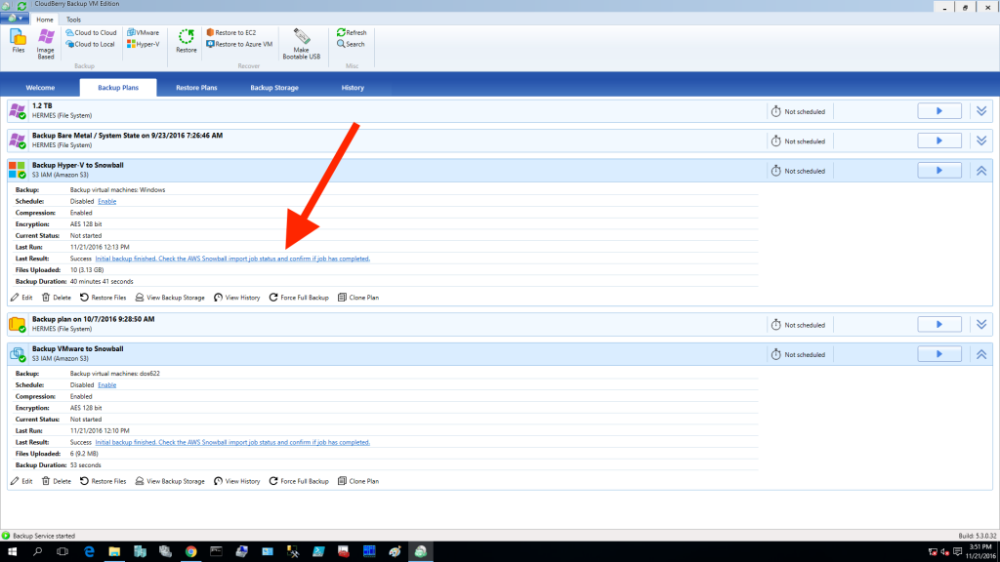

Select the **Import Job Completed** checkbox and click **OK**.

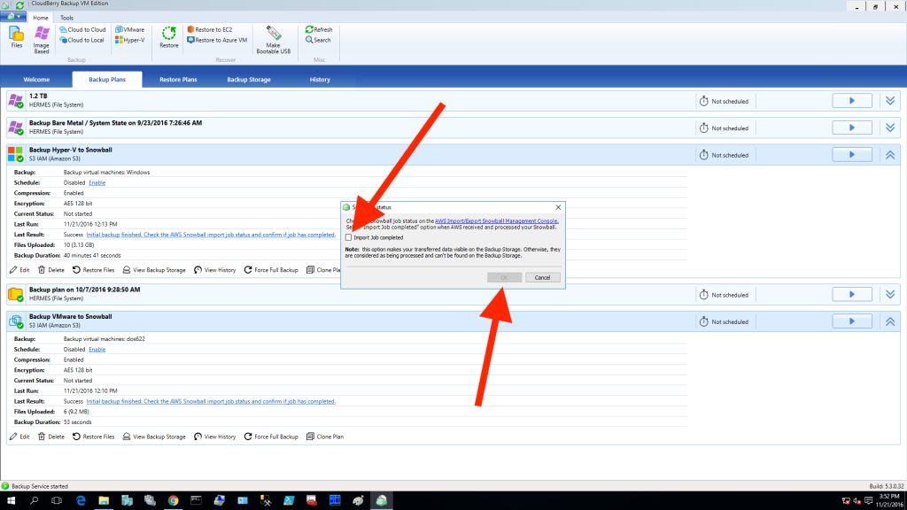

Your files are now being renamed in the cloud. This process takes place because of certain peculiarities of CloudBerry Backup and the way our software works with file structures.

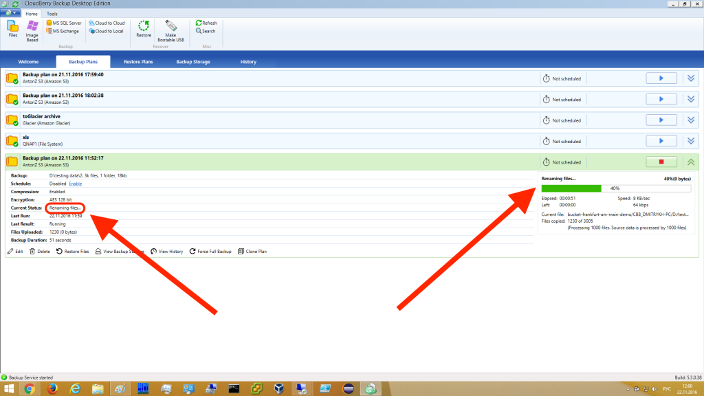

Your initial backup has been successfully performed with the help of AWS Snowball. All future backups will be performed as usual from your PC into the cloud by means of CloudBerry Backup.


Do not _Sync Repository_ before the files are all renamed in the cloud. This may lead to unintended consequences.


