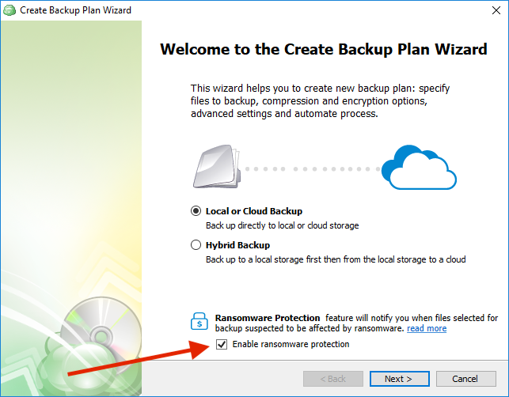
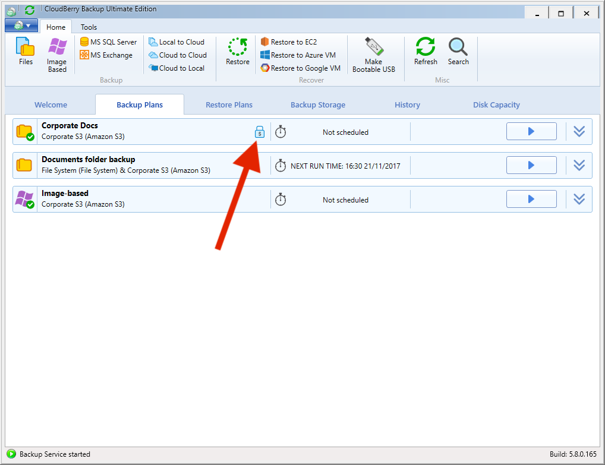
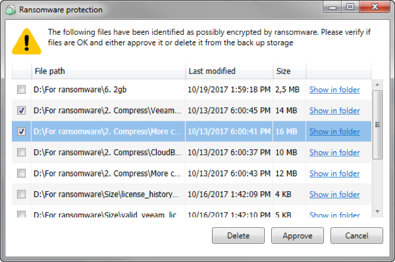
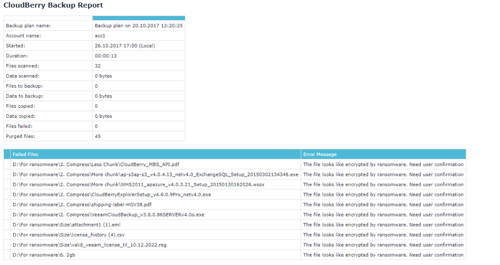

# Step 1. Hybrid Backup & Ransomware

## Hybrid Backup

The first step is to indicate whether you want to perform backup just to a local or cloud storage or whether you want to use **Hybrid Backup **to back up data simultaneously to a local and a cloud storage. Now let's discuss what Hybrid Backup is.

Our users usually configure at least two different backup plans—one for local and another for cloud backup. This approach is not  efficient in that it puts extra workload on the computer. First, the files are uploaded from the computer to the local storage—let's say a local NAS—and then the same process repeats to upload the files from the computer to the cloud storage. The Hybrid Backup combines those aforementioned two backup plans into one, making it easier to do the setup process. Also, encryption and compression are only performed once during the initial backup to the local storage. The already encrypted and compressed files are then uploaded to the cloud storage.

Hybrid backup is available for **all types of backup**.

## Ransomware

Next step is **Ransomware**. CloudBerry Backup can detect encryption changes in file and prevents existing backups from being overwritten until an administrator confirms if there is an issue. Let’s dive a bit deeper into the underlying process.

When you enable ransomware protection in a backup plan, two things happen:

1. CloudBerry performs the initial backup and efficiently analyzes the bit structure of each file to determine if the file is encrypted.
2. During subsequent backups, we compare the original byte structure to the current byte structure. This allows us to identify any newly encrypted files. The backup plan completes normally, however, we prevent existing backups from being deleted regardless of retention policies. This way, existing good backups are protected and are available for restore. 

You can enable ransomware protection on the same screen by selecting the **Enable ransomware protection** checkbox.

Once the plan is saved, you'll see a "lock" icon for any plan with ransomware protection enabled.

If encryption changes are detected, any deletes from backup storage will be disabled for flagged files. Admins can quickly see a list all of all affected files and approve any false-positive detections.

You manually inspect those files in _Windows / File Explorer_ using the _Show in Folder_ option. If you want to remove the most recent backup of an affected file from backup storage, select the file and click _Delete_.

If you click _Cancel_, purge settings for any affected files will continue to be disabled and those files will remain on the list.

You can also be notified with an email that lists of all flagged files.

Having configured Hybrid Backup and ransomware protection, proceed to add a local destination.

