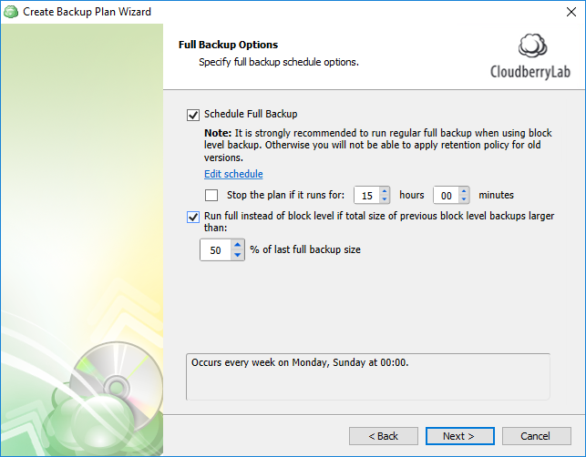

# Step 10. Full Backup Scheduling

## Full Backup scheduling

To ensure that you can at any point revert to the older versions, it is recommended to perform full backup every now and then. You can schedule full backup with the required frequency and even enforce it when the size of block-level backup exceeds the specified threshold.

