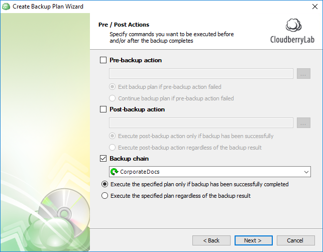

# Step 11. Pre- & Post-actions

## Pre- and post-actions.

Next, specify the optional pre- and post-actions. These are essentially scripts that can be executed prior to and immediately following backup. For instance, you can run a script that turns off the computer when the backup plan completes executing. Alternatively, you can run a script that, say, disables all incoming connections during the plan execution. Backup chain allows you to automatically trigger another backup plan when the current one completes.

