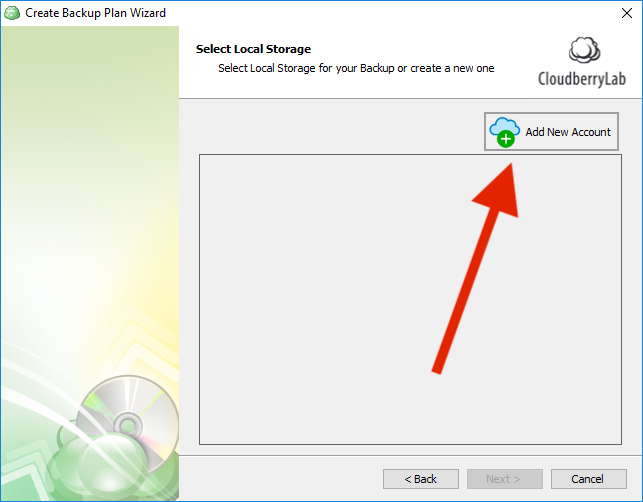
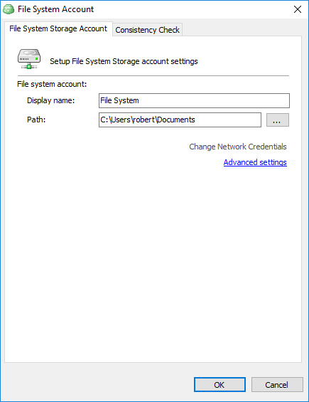

# Step 2. Adding a Local Backup Destination

## Adding a local backup destination

If you selected _Hybrid Backup_, first specify the local storage that will be used to store the backup. If this is the first time you're setting up a backup plan, click **Add New Account** to add a local storage.

Enter the display name and path for the storage and click **OK**.

Now that you've added a local backup destination, go ahead and add a cloud backup destination.

