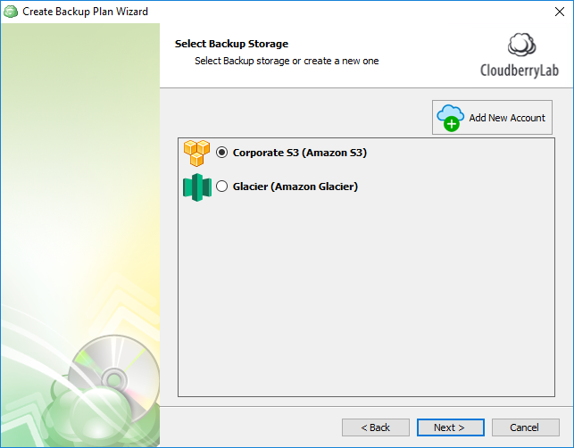
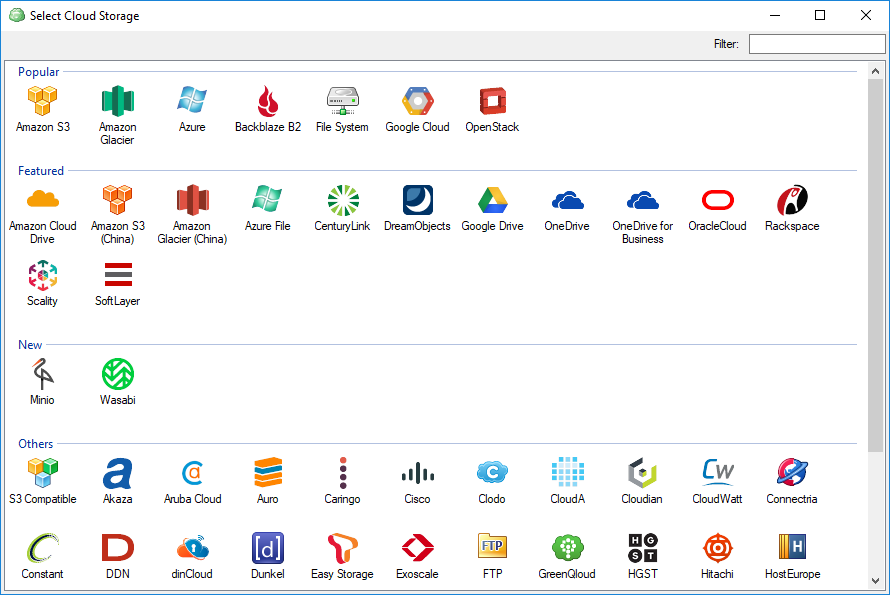
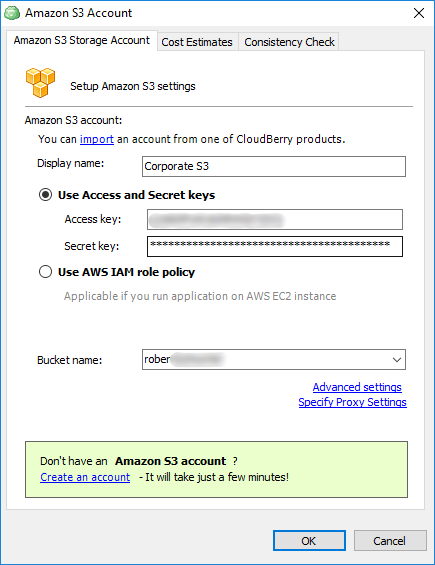

# Step 3. Adding a Cloud Backup Destination

## Adding a cloud backup destination

Specify the desired cloud backup storage. If this is the first time you're setting up a backup plan, click **Add New Account** to add a cloud storage.

Identify your storage and double-click on it. We'll go with Amazon S3 in this tutorial, for example.

In the freshly appeared window, specify your credentials: **the display name**, **access key,** and **secret key**. Finally, specify the bucket name and click **OK**.

