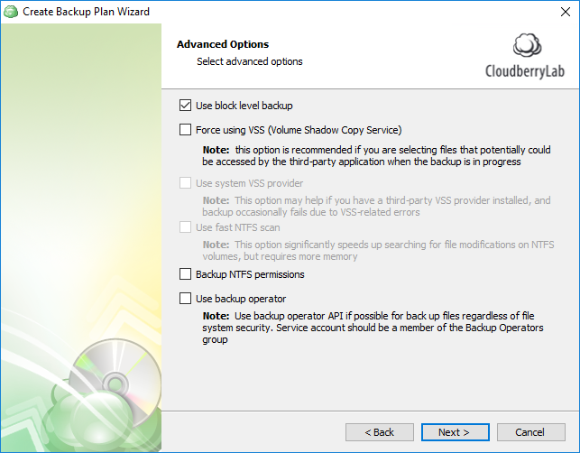

# Step 4. Advanced Options

The Advanced Options step contains the following options:

1. **Block-level backup**. It's a type of backup that allows you to backup only modified parts of the files instead of running a full backup every time the file is changed. Block-level backup takes less bandwidth for regular backups and reduces the backup time.
2. **Force using VSS**. If this option is enabled, CloudBerry Backup will backup files from a snapshot so as to avoid any conflicts if the files are being modified during the backup. 
3. **Use system VSS provider**.  Enable this option if you have a malfunctioning third-party VSS provider installed. When the backup starts, CloudBerry backup will force-use the system VSS provider.
4. **Use fast NTFS scan**. It's basically our proprietary file scanning & search mechanism. Our method — as opposed to Windows's NTFS file scanning method — generates a file tree. Navigating through said file tree is considerably faster, resulting in overall faster backups. Performance varies depending on the type of storage device you're using and the number of files targeted for backup. Note that you must have VSS enabled \(option \#2\) in order to use fast NTFS scan. 
5. **Backup NTFS permissions**. This option is self-explanatory; it essentially allows you to backup NTFS permissions for all backed up files and folders. 
6. **Use backup operator**. If you're running CloudBerry Backup service under an account that is part of the _Backup Operators_ group,  you can use backup operator API to perform backup. Using this option might help if, for example, you cannot backup NTFS permissions. 

