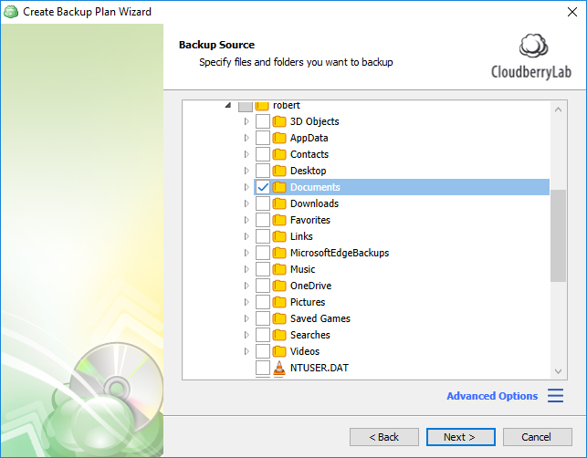
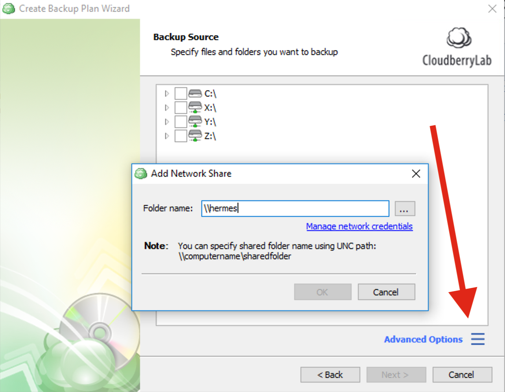

# Step 5. Selecting Files & Folders

## Specifying Files & Folders to back up

Specify the files and folders you'd like to back up and click **Next**.

If you want to add a network share, click on the burger icon in the bottom right-hand corner and then click **Add network share**.

