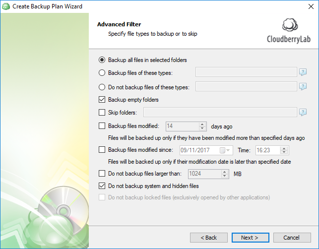

# Step 6. File Filter

## Specifying the filter

In this step you can indicate which files should be skipped based on the following parameters:

1. **Format**. Indicate which file formats should be backed up or, conversely, skipped.
2. **Modification date**. You can back up only data that was modified more than X days ago. Alternatively, you can back up only data that has been modified since a certain date.
3. **Size**. You can indicate the threshold for the size of files.

   You can also choose not to back up system and hidden files.

