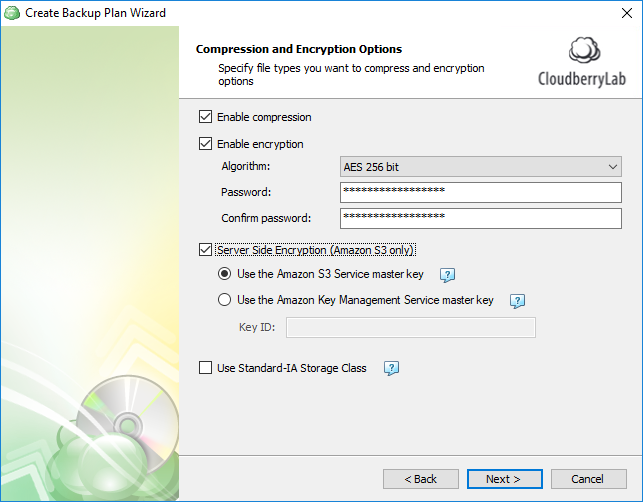

# Step 7. Compression & Encryption

## Compression and Encryption

Here you can enable compression and encryption. CloudBerry Backup supports up to 256-bit military grade encryption by default. Similarly, you can enable Server Side Encryption on S3. Note that we don't store the key anywhere for security purposes. If you forget it, the data is permanently gone.

