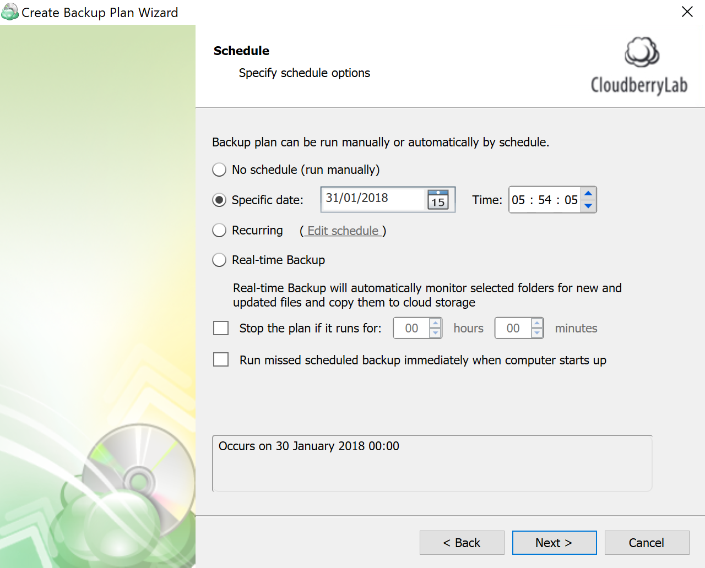
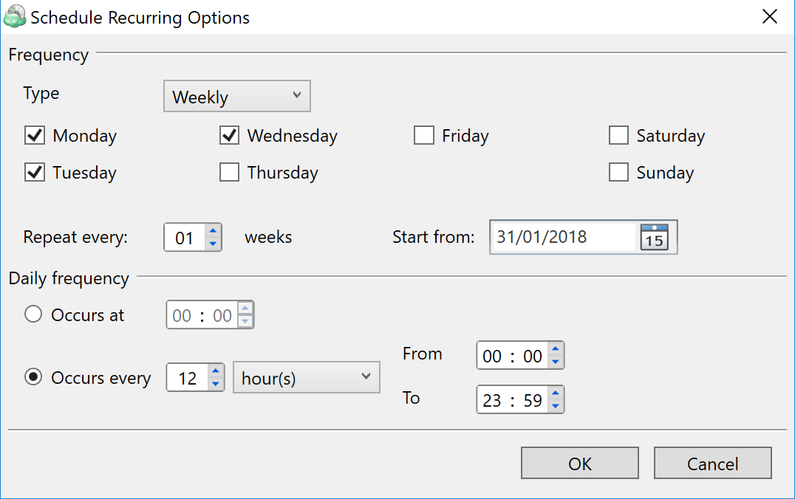

# Step 9. Custom Schedule

Next step is _Scheduling_ configuration.

Scheduling can be configured in the four following ways:

1. **Specific date**. The backup will only be executed once, on the specified date. Not recommended.
2. **Recurring**. This is by far the most flexible option. Here you can schedule the backup plan to be executed daily, weekly, monthly, and even yearly. In fact, it is  possible to combine various frequencies to enable maximum flexibility.

1. The last option is **Real-time Backup**. It essentially allows you to perform constant backup of the selected files. In other words, whenever a file is modified, CloudBerry Backup receives a notification and backs up the file. This mechanism works similar to Google Drive.  

Optionally, you can terminate the back up plan if it takes too long to complete. You can also instruct CloudBerry Backup to run the missed plan if the computer was shut down at the time the backup was supposed to be performed.

