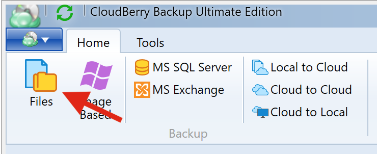
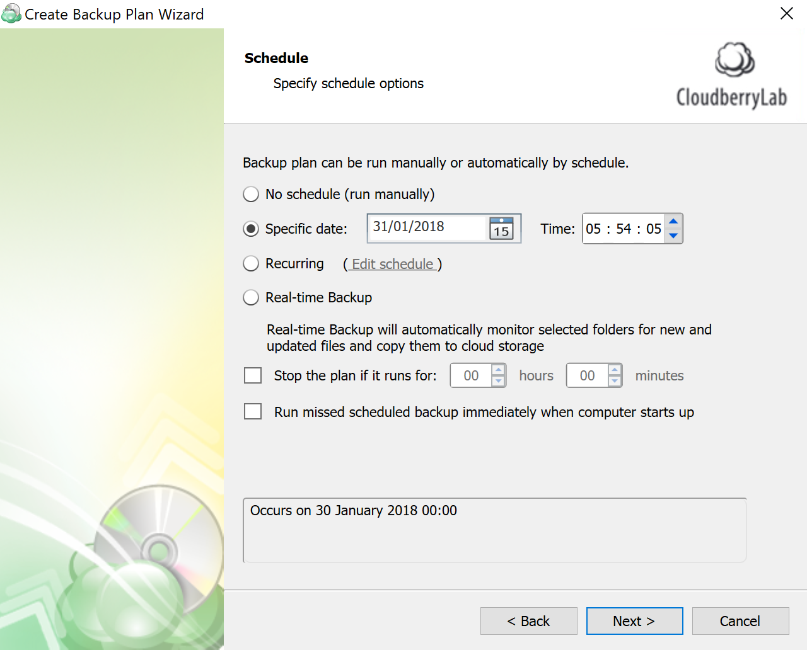
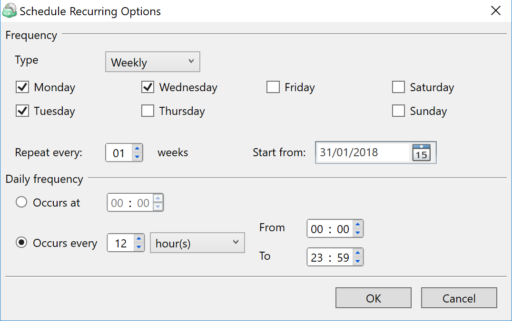
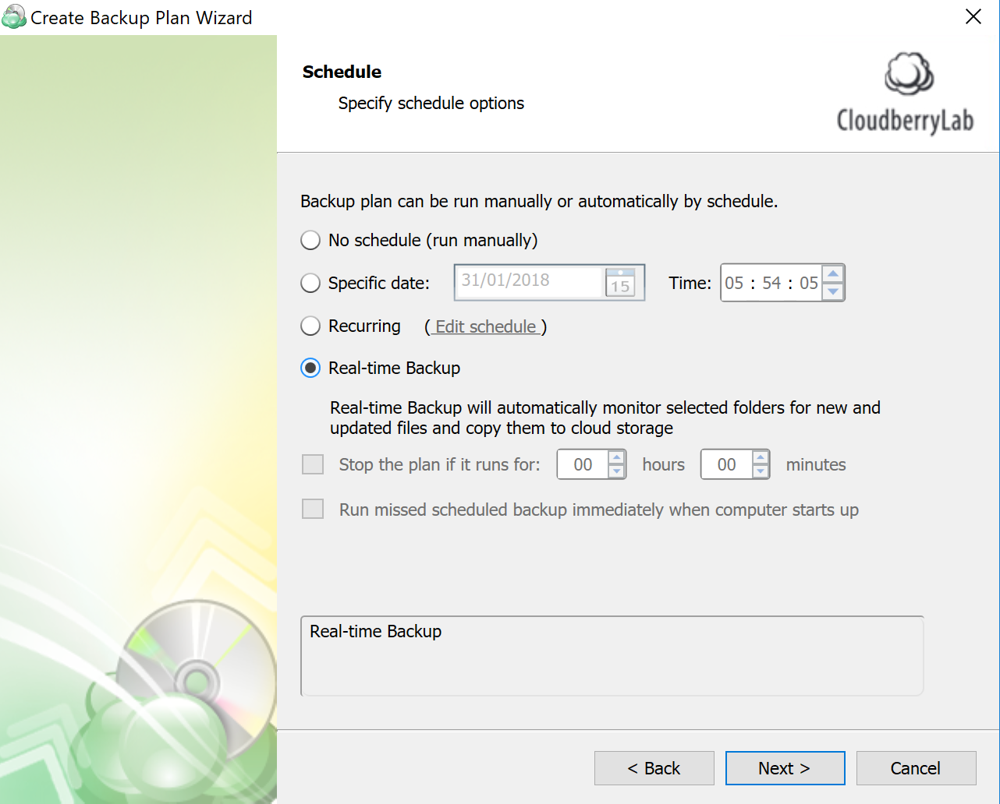

# Creating custom schedule for backups

### Introduction

It is recommended to perform regular backups of your most critical data to ensure that you can always resume business continuity in case of emergency. That's why it's important to schedule data backups with a certain frequency. 

There are many other reasons for creating a custom schedule, including:

1. Inconvenience of performing backups during working hours \(excessive bandwidth load, CPU resources consumption, etc.\);
2. Reducing the internet bill by performing backups at nighttime;
3. Utilization of backup rotations schemes, like GFS. 

### Creating a custom schedule in CloudBerry Backup

During the initial configuration of a backup plan in CloudBerry Backup, you have the option to create a custom schedule. That backup plan will consequently be executed according to that schedule. To configure a custom schedule, launch _Backup Wizard _by clicking **Ctrl+B** or clicking **Files** on the mail toolbar.

Start configuring the backup plan until you reach the _Scheduling_ step.

Scheduling can be configured in the four following ways:

1. **Specific date**. The backup will only be executed once, on the specified date. Not recommended.
2. **Recurring**. This is by far the most flexible option. Here you can schedule the backup plan to be executed daily, weekly, monthly, and even yearly. In fact, it is  possible to combine various frequencies to enable maximum flexibility.

3. The last option is **Real-time Backup**. It essentially allows you to perform constant backup of the selected files. In other words, whenever a file is modified, CloudBerry Backup receives a notification and backs up the file. This mechanism works similar to Google Drive.  

Optionally, you can terminate the back up plan if it takes too long to complete. You can also instruct CloudBerry Backup to run the missed plan if the computer was shut down at the time the backup was supposed to be performed. 

### Conclusion

Creating a custom schedule is essential to data integrity and business continuity. CloudBerry Backup offers  quite flexible scheduling configurations which can help you to have backups of your most critical data at any point. Schedule your backups wisely in order to maintain a balance between data redundancy, storage fees, and bandwidth usage.

