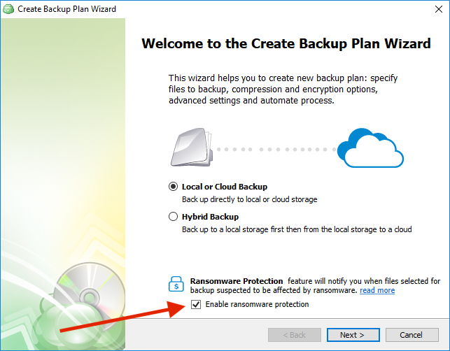
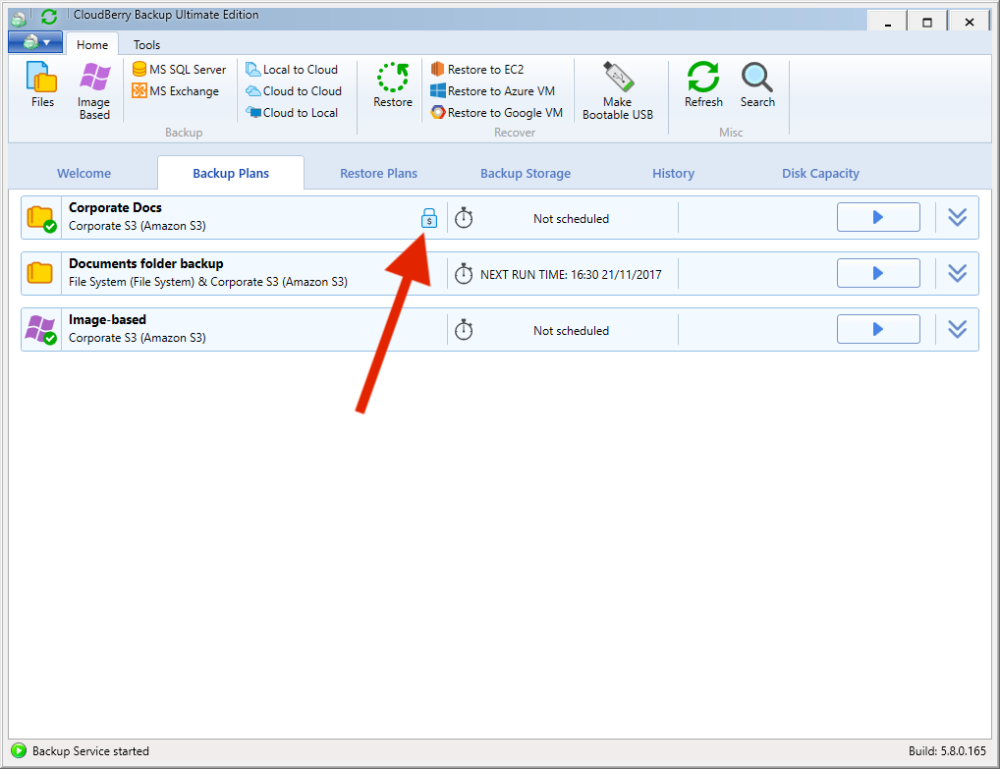
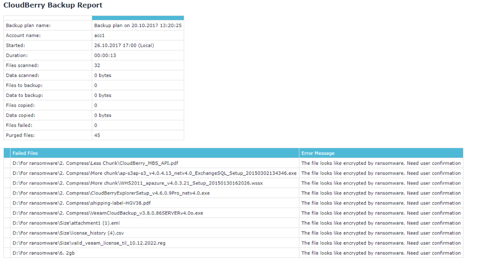

# Ransomware Protection

[Ransomware attacks](https://www.cloudberrylab.com/blog/five-tips-and-three-tools-to-protect-small-business-from-ransomware-attacks/) disrupt normal business continuity by encrypting important business documents \(or personal files like pictures, video, and documents\) and demanding a ransom to recover the data. You either recover by paying the ransom or manually restoring backups, if you have them. To help protect customer backups, we implemented ransomware protection functionality in CloudBerry Backup 5.8.

CloudBerry Backup detects encryption changes in files and prevents existing backups from being overwritten until an administrator confirms if there is an issue. Let’s dive a bit deeper into the underlying process.

When you enable ransomware protection in a backup plan, two things happen:

1. CloudBerry performs the initial backup and efficiently analyzes the bit structure of each file to determine if the file is encrypted.
2. During subsequent backups, we compare the original byte structure to the current byte structure. This allows us to identify any newly encrypted files. The backup plan completes normally, however, we prevent existing backups from being deleted regardless of retention policies. This way, existing good backups are protected and are available for restore. 

## Enabling Ransomware Protection

Ransomware protection must be enabled in the Backup Wizard and is currently supported only for File-Level Backup. Launch the Backup Wizard and select the _Enable ransomware protection_ option.

Once the plan is saved, you'll see a "lock" icon for any plan with ransomware protection enabled.

If encryption changes are detected, any deletes from backup storage will be disabled for flagged files. Admins can quickly see a list all of all affected files and approve any false-positive detections.

You manually inspect those files in _Windows / File Explorer_ using the _Show in Folder_ option. If you want to remove the most recent backup of an affected file from backup storage, select the file and click _Delete_.

If you click _Cancel_, purge settings for any affected files will continue to be disabled and those files will remain on the list.

You can also be notified with an email that lists of all flagged files.

### **Conclusion**

CloudBerry Backup now provides the ability to enable ransomware protection that prevents your data in the cloud from being overwritten by the ransomware-encrypted data regardless of your retention policies.

