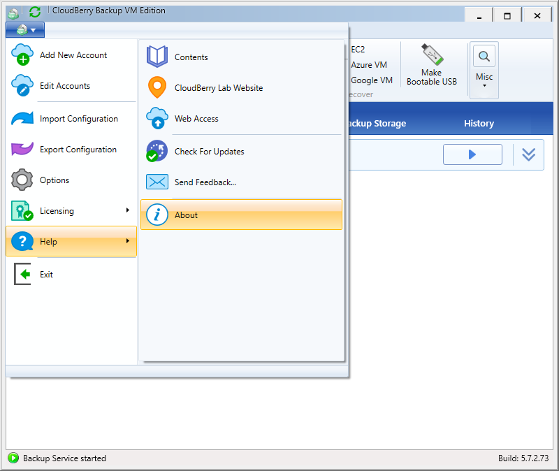
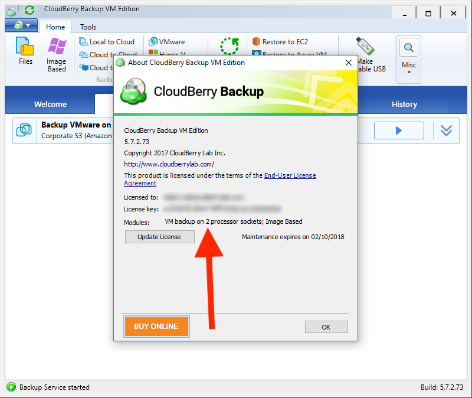
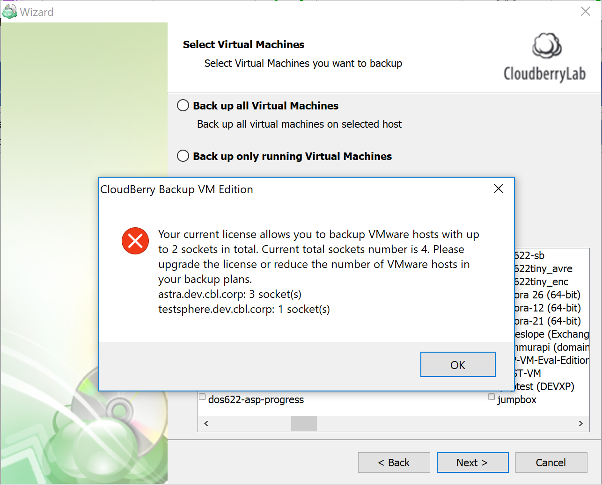
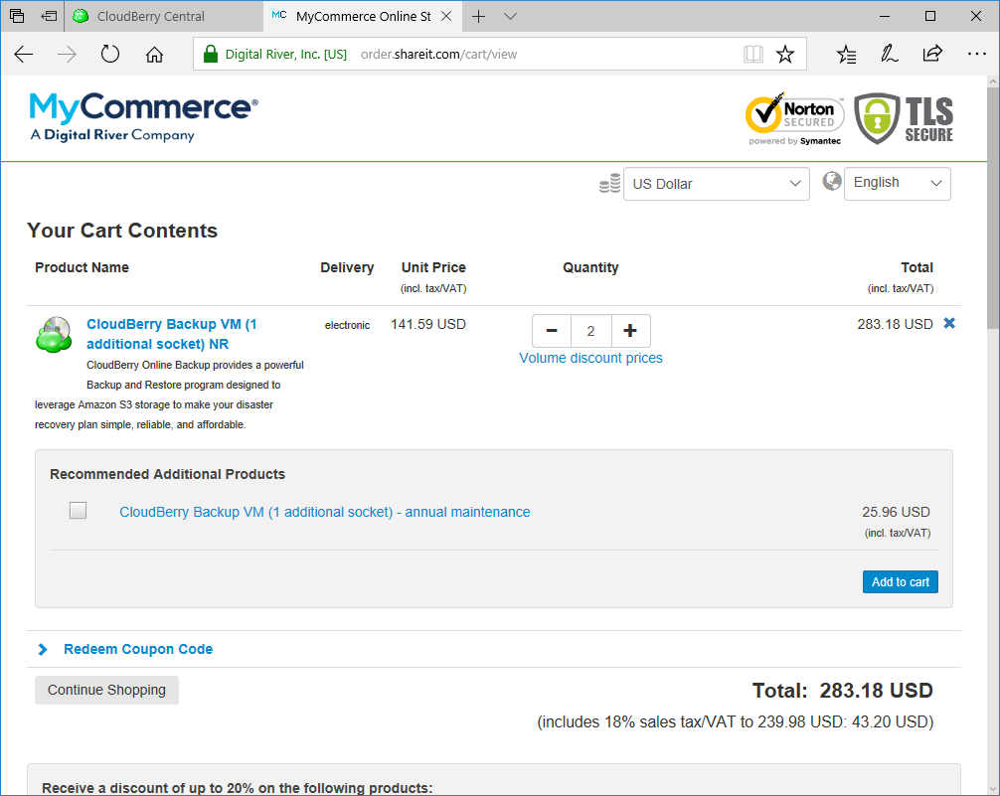
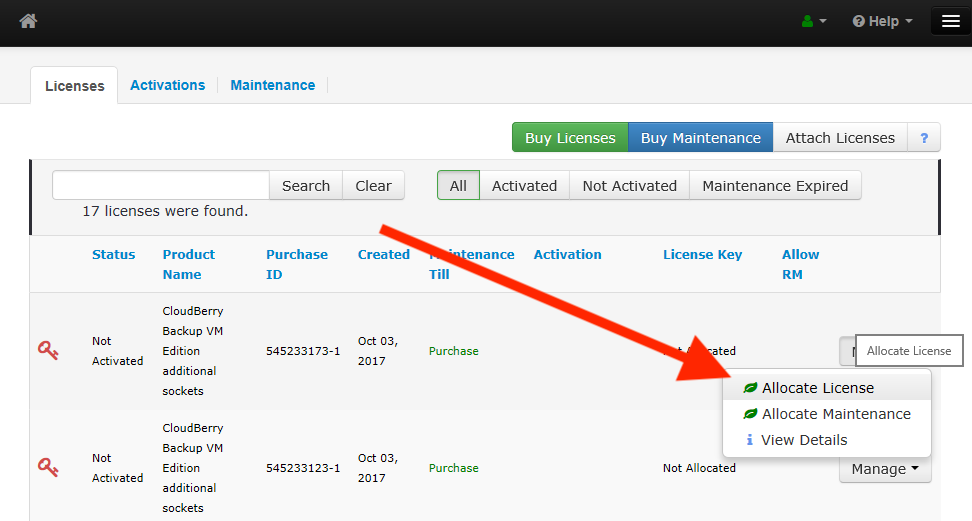
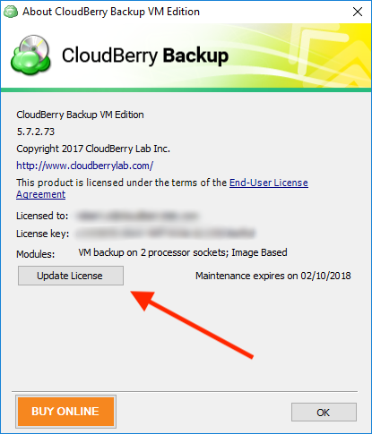
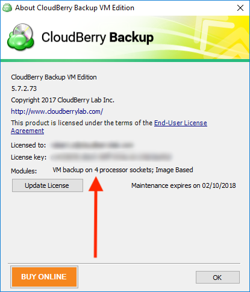
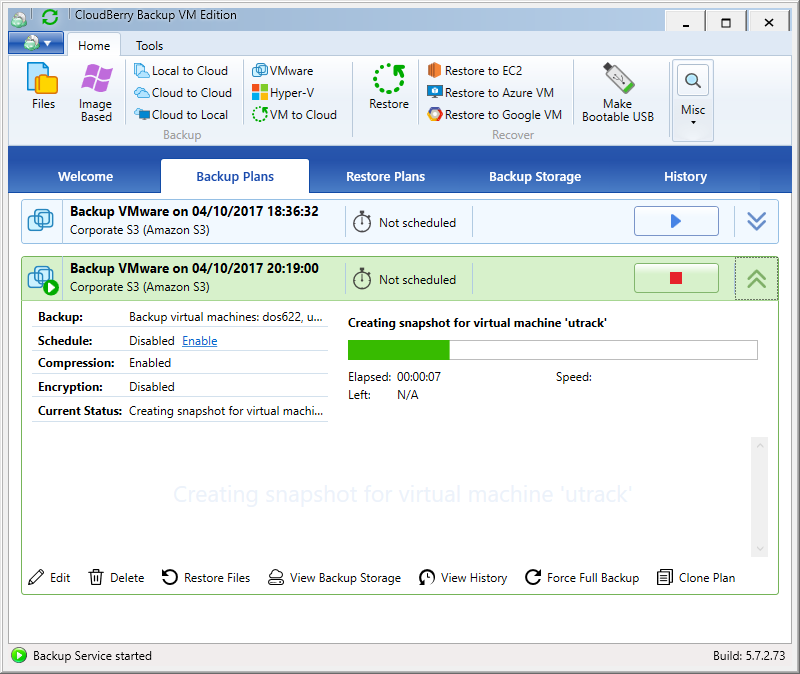

# Allocating VM socket licenses

## Introduction

CloudBerry Backup VM edition by default comes with two processor socket licenses included, meaning that you can only backup your virtual machines from a hypervisor that has no more than two physical processors. If your hypervisor incorporates three or more physical processors, acquiring an extra processor socket license will be required for each processor. In this section we will explain how to purchase the said socket licenses and attach them to your main CloudBerry Backup VM edition license.

## Purchasing VM socket licenses

Before purchasing socket licenses, determine whether you have sufficient licenses or not. Launch CloudBerry Backup. Click on the **CloudBerry button**, point to **Help**, and click **About**.

See if the number of sockets you have on your license matches that of your physical processors.

If there's a mismatch, you'll encounter an error when trying to back up virtual machines in the Backup Wizard:

From the screenshot above you can infer that we're trying to back up virtual machines from hypervisors that collectively have 4 sockets. That means we need at least two more socket licenses added to our primary CloudBerry Backup license. To do that, head over to [ShareIt](https://order.shareit.com/cart/add?vendorid=200082138&PRODUCT[300651341]=1&_ga=2.141538491.805011496.1507122627-216628767.1506383613) and purchase two socket licenses.

When done, go back to CloudBerry Central and there you should see your newly purchases socket licenses. The next step is license allocation. In essence this process reflects the attachment of your socket licenses to your main license. Under **Manage**, click **Allocate License**.

Select your current CloudBerry Backup VM license and click **Apply**. Do that for both \(or however many you've purchased\) socket licenses.

Now go back to the **About** window and click **Update License**. The license will shortly be updated.

Restart the app. The number of available sockets should match your purchased VM socket licenses \(including the default two\):

Now you're pretty much all set. If you attempt to back up virtual machines from a hypervisor with more than two sockets \(four in our case\), the backup plan should be configured and executed smoothly and flawlessly.

If you experience any issues regarding VM socket licenses, feel free to drop us a line at [support@cloudberrylab.com](mailto:support@cloudberrylab.com).

