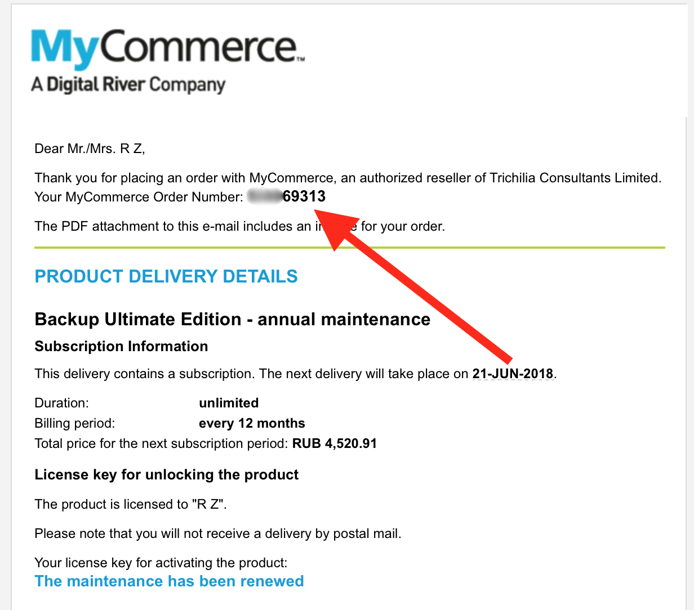
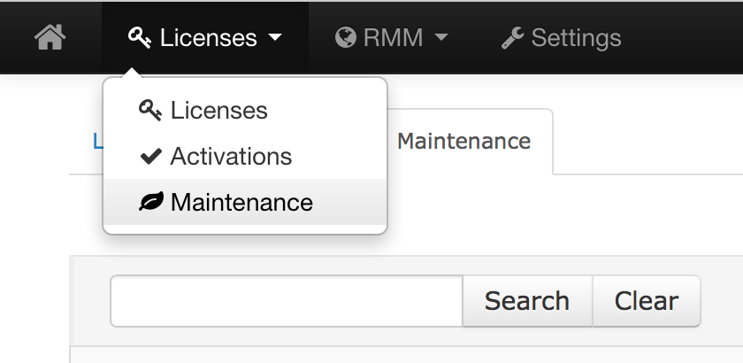
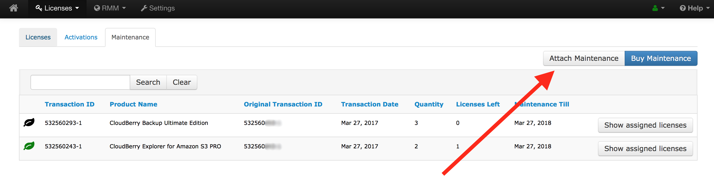
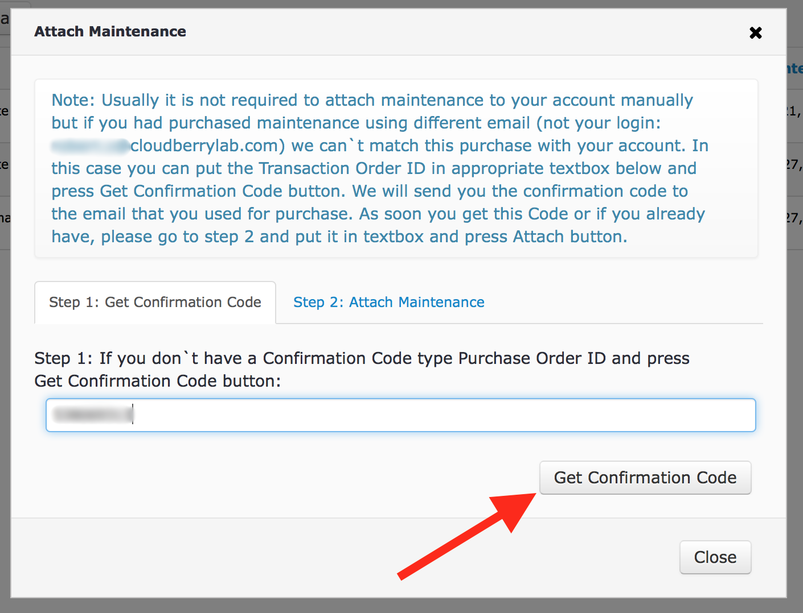
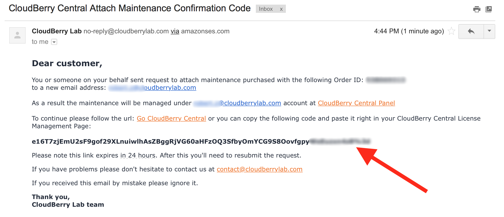
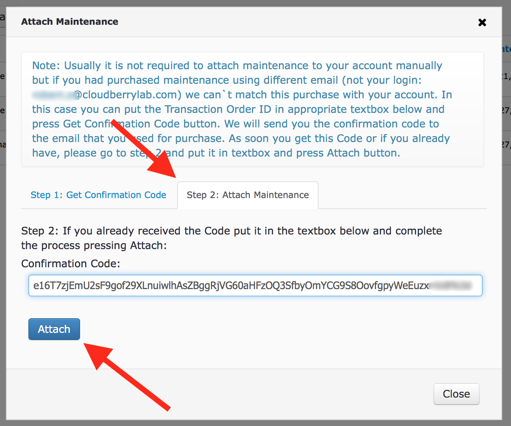
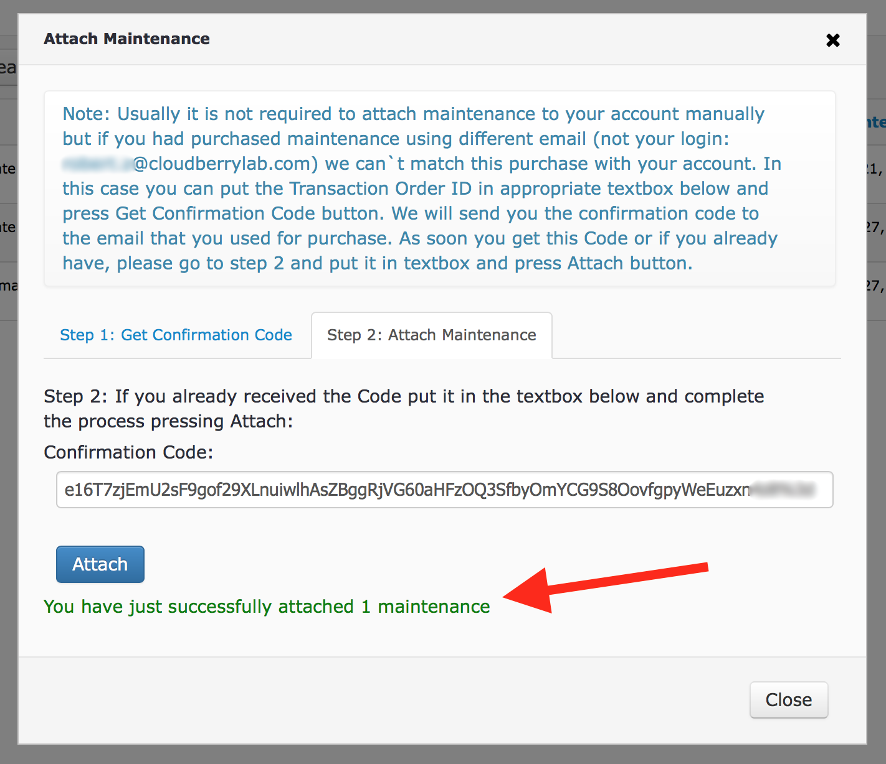
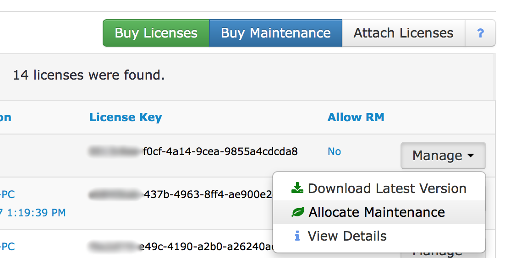
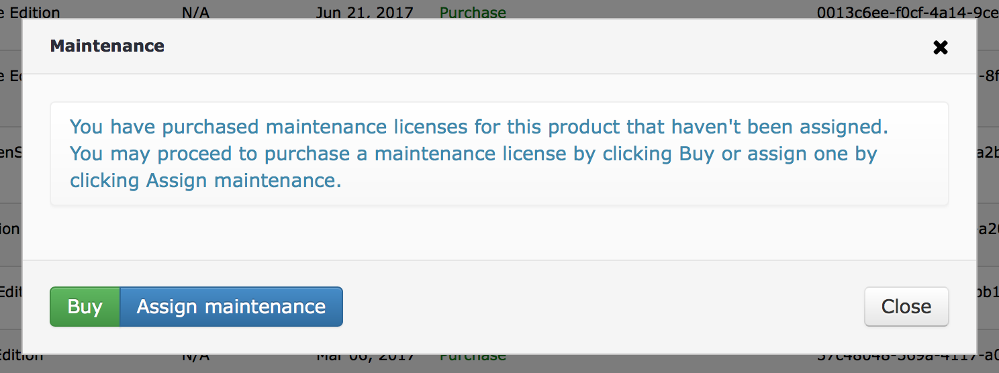
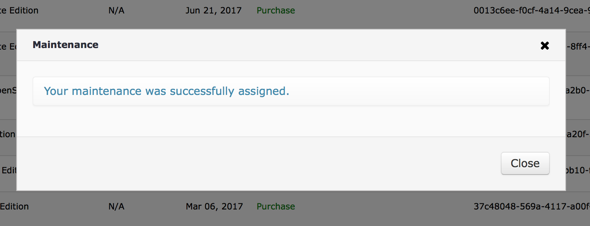

# Importing and allocating maintenance

## Introduction

CloudBerry products are shipped with a lifetime license; however, that does not include maintenance. To be eligibe for support and upgrades, you have to separetely purchase annual maintenanace. Our pricing policy on maintenance is pretty straightforward — 20% of the product's price. That is to say, purchasing maintenance for $29.99 CloudBerry Backup will set you back $6. Acquiring maintenance is feasible in two ways: through our website and via CloudBerry Central. And while we strongly recommend you do it through the latter option, you still can assign maintenance to your licences even if they were purchased using a different email address.

## Assigning maintenance purchased via a different email address

Suppose you've purchased maintenance on our website and later received a confirmation email. That email contains the order number that you'll need to enter in CloudBerry Central when attempting to assign that purchased maintenance.

To assign the maintenance to one of your licenses, go to the CloudBerry Central's main dashboard. Under **Licences**, click **Maintenance**.

Next, click **Attach Maintenance**.

Copy the order number from the first screenshot and paste it into the text field on the appeared window. Click **Get Confirmation Code**.

The confirmation code will shortly be sent over to your email address \(CloudBerry Central's login\).

Copy the confirmation code and head back to CloudBerry Central. On **Step 2**, paste the code and click **Attach**.

Shortly, the maintenance will be successfully imported and you will be notified.

The maintenance is now available to you; however, it's not automatically assigned to one particular license. To do so, go to the main dashboard. Locate the required license, expand the Manage drop-down menu next to it, and click **Allocate Maintenance**.

Next, click **Assign maintenance**.

That's it. The maintenance will immediately be allocated, as you have already imported it.

If you experience any issues as to importing or allocating maintenance — feel free to drop us a line at [support@cloudberrylab.com](mailto:support@cloudberrylab.com).

