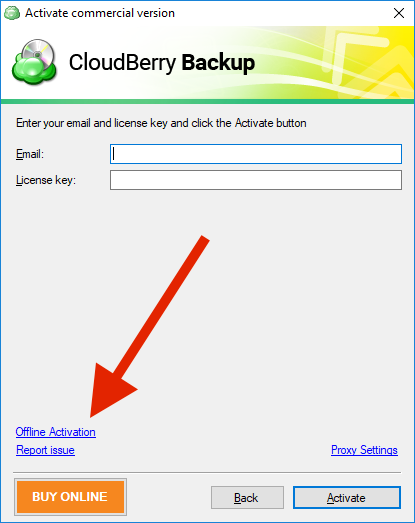
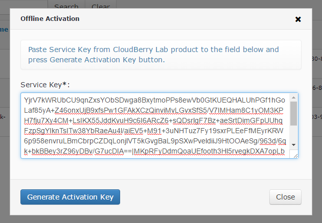

# Offline Activation

Previously, the process of offline activation was a pretty difficult task, as you had to contact our support team to get a special activation key that you would later enter in one of our products. Thankfully, we have eliminated that middle person from the process, and now you are able to perform offline activation yourself with the help of only CloudBerry Central.

Below is a step-by-step tutorial on how to perform offline activation in our products.

First, launch any of our product. Click **Offline activation**.

Next, enter your **Email address **your **license key**, and click **Generate Service Key.**

**Note**: If you want to take advantage of the **15-day free trial**, you can click **Activate Trial **and then enter the code that we'd sent you right before you started downloading the installer from our website. If you've lost the code, click **I don't have the code **under the text field. Similarly, you can activate **Freeware version**.

Copy the generated Service Key by clicking **Copy to Clipboard** button in the bottom right-hand corner.

Go to [cloudberrycentral.com](https://www.cloudberrycentral.com/Admin/cloudberrycentral.com). Under **Licenses**, click **Activations**.

Click **Offline activation**.

Next, paste the service key into the text field and click **Generate Activation Key**.

Click **Copy to clipboard.**

Then paste the activation key into the text field on the second tab of the Offline Activation window. Click **Activate**.

That's it. If you've done everything correctly, your product should be successfully activated. If you experience any issues as to offline activation — feel free to drop us a line at [support@cloudberrylab.com](mailto:support@cloudberrylab.com).

