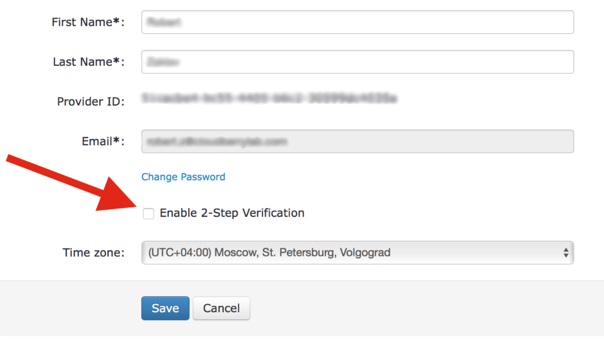
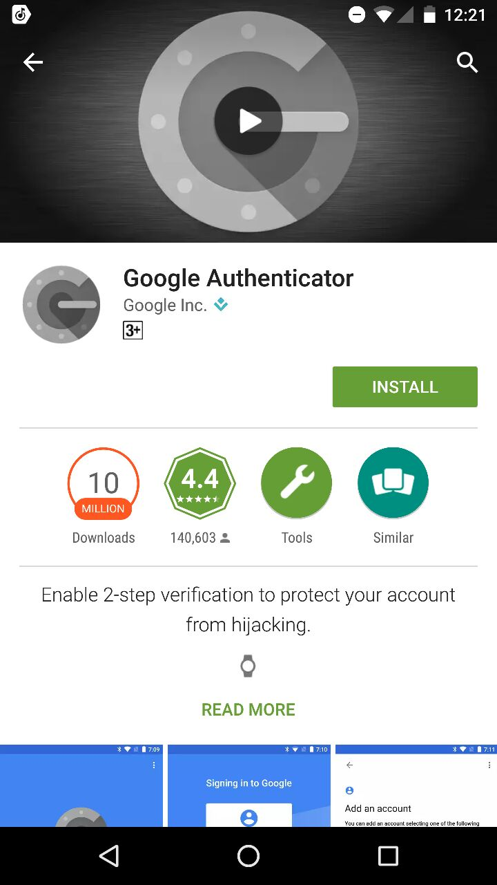
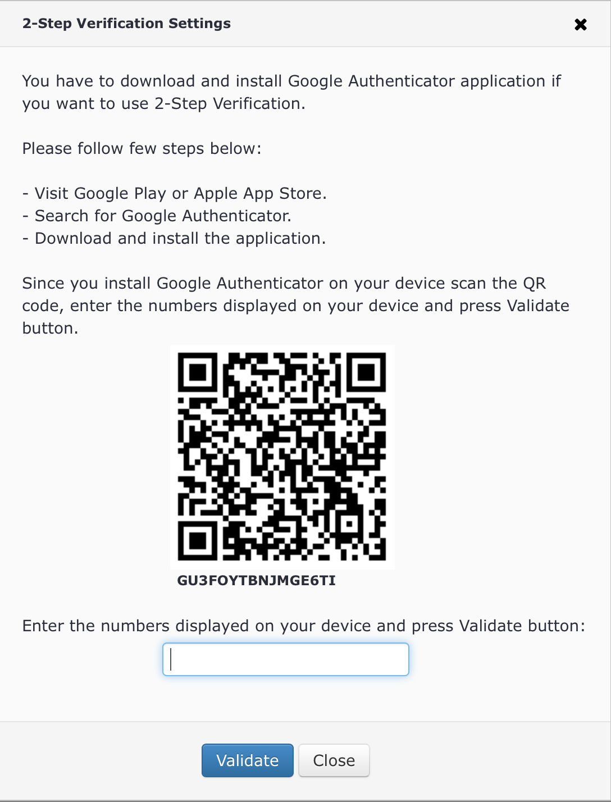
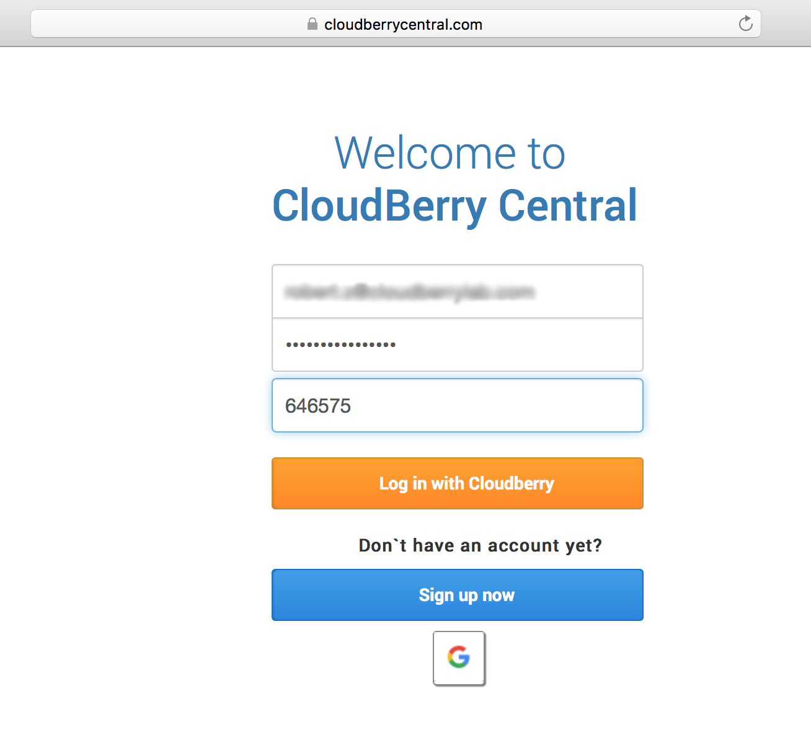

# Settings

The last section of CloudBerry Central is **Settings**. Here you can configure your preferences. The _General_ tab allows you to change your first and last name, your password, and your time zone. Also here is the ability to enable 2-step verification, so as to mitigate security risks.

## Enabling 2-step verification

1. Select the appropriate check box, then you’ll see a pop-up window describing further steps.

1. Download the **Google Authenticator** app from the Play Store.

1. Open the app and use it to scan the barcode provided to you in the aforementioned pop-up window. Tap **Scan a barcode**.

1. Now you should see **6 digits** that you will need to enter back in the pop-up window on CloudBerry Central.

1. Upon finishing, click **Save**, and then the 2-step verification should be enabled.

1. Now you can log in to CloudBerry Central with 2-step verification enabled, which ensures maximum level of security for your account.

