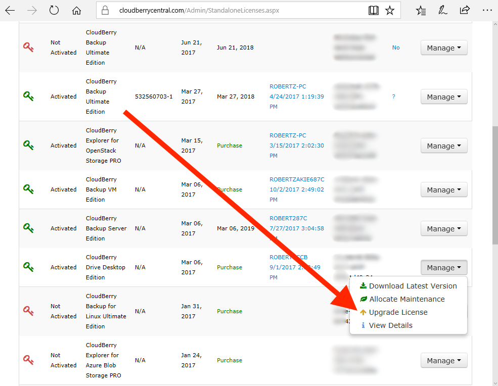

# Upgrading Licenses

The latest version of CloudBerry Central enables you to update your product licenses conveniently and swiftly right within the website.

Under **Licenses**, click **Licenses**. Now you see the list of all licenses you have purchased. Those licenses that are eligible for upgrade feature a little yellow arrow icon that indicates upgradability.

Click on the icon to get an expanded view of the upgradability options.

Select the preferable product version. Note that once you've received the upgrade coupon, the inferior license will be permanently disabled. **If you click Update and fail to purchase the requested license, your old license will be disabled and you will be left without either license until you purchase the one you received the coupon for. **Click **Update**.

However, ensure that that you've released the license in the software beforehand. Otherwise, you will encounter the following error:

Having appropriately released the license, you will see a pop-up window indicating that a link to the checkout page has been sent to your email address.

Click on the link and proceed to checking out. If you experience any issues as to upgrading your licenses — feel free to drop us a line at [support@cloudberrylab.com](mailto:support@cloudberrylab.com).

