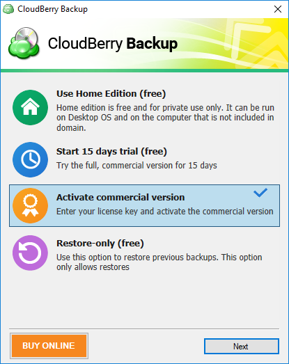
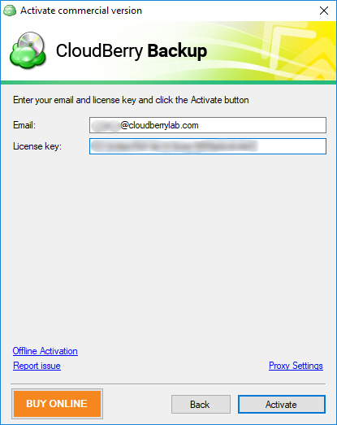
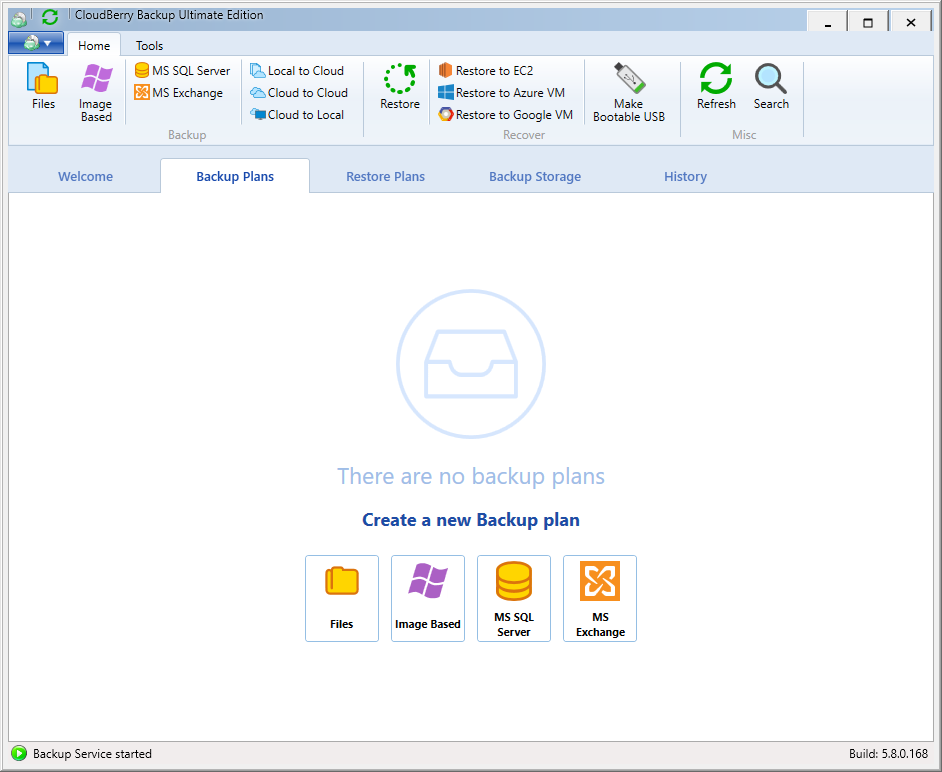

# Activation

CloudBerry Backup is distributed by a licensing model, on a per-user basis. Each edition of CloudBerry Backup \(five in total\)  offers a free 14-day trial version with complete functionality and a freeware version with the most basic functionality for personal use.

When you launch CloudBerry Backup for the first time, you will be prompted to select one of the following modes:

* **Home Edition**. This is a free version that supports only file-level backup. It can be run on a desktop \(non-server\) OS and on a computer that is not part of any domain.
* **Trial Version**. You can try any edition of CloudBerry Backup and all of its features for 15 days free of charge.
* **Commercial version**. If you've already purchased a license, you may enter the license key and start using the product right away. 
* **Restore-only mode**. This mode allows you to restore backups that you have performed earlier. No backup functionality is available in this mode.

In this example we will demonstrate how to activate the commercial version. Select **Activate commercial version** and click **Next**.

Enter the email address that you used to purchase the license and enter the license key. Click **Activate**. You can also configure proxy settings by clicking on **Proxy Settings**.

CloudBerry Backup should start and you can go ahead and add a local or cloud backup destination.

If you don't have an internet connection, you can perform offline activation through CloudBerry Central. Read [this article]() that explains the process in detail.

