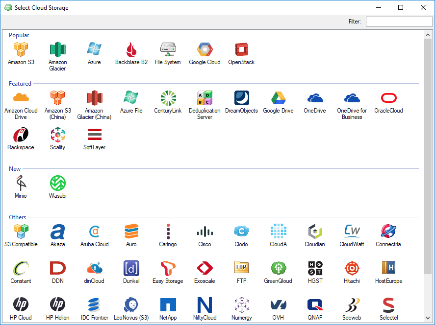
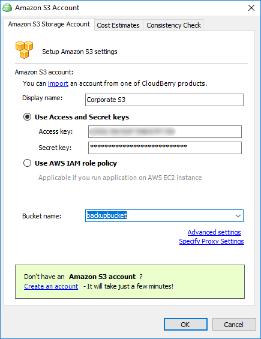
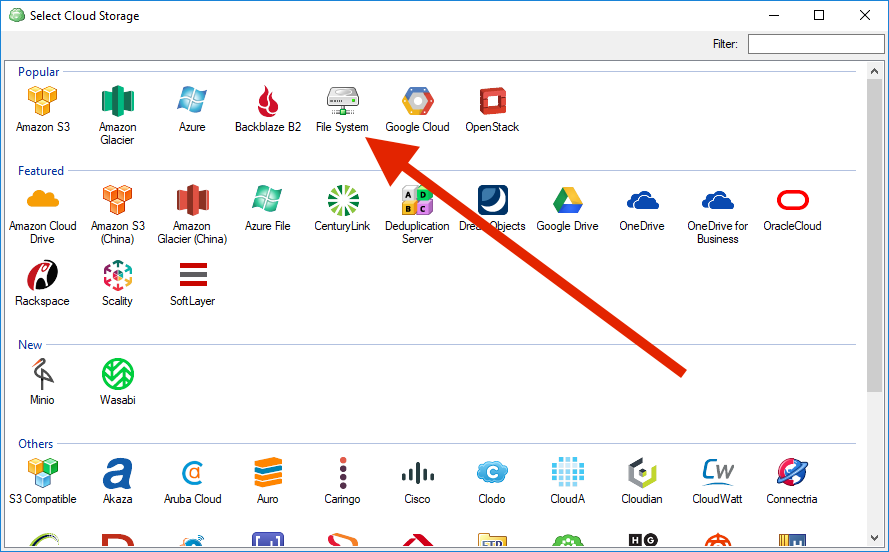
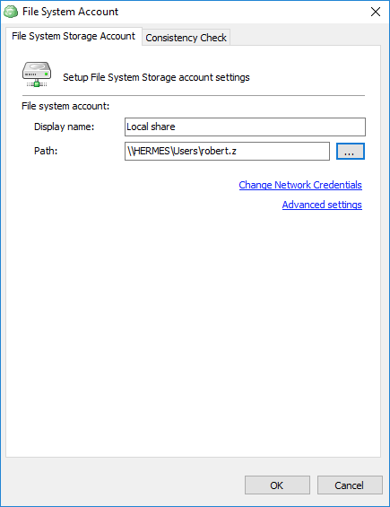

# Adding a Backup Destination

Having installed and activated CloudBerry Backup, the next step is adding a backup destination \(a.k.a. backup storage\). Backup destination is a cloud or local storage that will be used to store your backups. We support pretty much all of the most popular cloud storage services, including Amazon S3, Google Cloud Platform, and Microsoft Azure, among others.

## Adding a Cloud Storage

To add a cloud storage, launch CloudBerry Backup and click on the _CloudBerry_ button. Click **Add New Account**.

Select the cloud storage you'd like to add and double-click on it.

In this example we'll go with Amazon S3. Specify the display name that will appear throughout the programm. Enter the S3 credentials — **Access and Secret keys**. Finally, select or create a bucket on the cloud storage and click **OK**.


Your storage has been added!


## Adding a Local Storage

The process of adding a local storage does not differ much from adding a local storage. Simply click **File System** when adding a backup destination.

Next, enter the display name and specify the path. In this case we're going to use our local shared storage. Click **OK**.

That's it. Now that you've added a backup destination, you may proceed to create backup plans and start backing up your data to a local storage or to the cloud!

