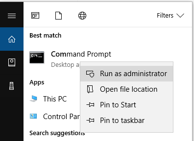

# Command Line Interface

## Command Line Interface for CloudBerry Backup

CloudBerry Backup command line interface allows to back up and restore files to/from cloud storage, edit global options, list backup plans and accounts, etc. In fact, it entirely mirrors the functionality of the UI. Command line interface can be used for integrating backup process into production environment.

CloudBerry Backup command line interface is implemented by a little tool called **cbb.exe**. To try it out, run windows command line console -**cmd.exe**. Make sure you change your current folder to CloudBerry Backup product installation folder.

```text
cd "C:\Program Files\CloudBerryLab\CloudBerry Backup"
```

### Silent Installation

Alright, before you can start using cbb.exe, let's go ahead and install CloudBerry Backup itself.

Start the command prompt as administrator:



Navigate to the folder that contains the freshly downloaded installer:

```text
 C:\Users\robert\Downloads
```

Run the following command to install CloudBerry Backup with default settings :

```text
CloudBerryOnlineBackupSetup_vx.x.x.xALLEDITIONSnetv4.0.exe /S
```

The path and the build name may vary, so make sure that you enter the correct commands.

If you want to install CloudBerry Backup to a specific folder, run the following command:

```text
CloudBerryOnlineBackupSetup_vx.x.x.xALLEDITIONSnetv4.0.exe /S /D="C:\customFolder"
```

To install CloudBerry Backup to a specific user profile \(i.e. all settings will be saved to the user's profile and not for all users as done by default\), type:

```text
CloudBerryOnlineBackupSetup_vx.x.x.xALLEDITIONSnetv4.0.exe /S /UserName
```

### Activating CloudBerry Backup

To activate a commercial license, run the following command:

```text
cbb activatelicense -e "email" -k "license_key"
```

where "email" is your personal email, "license\_key" is the license key  you received when purchasing the product.

**Request trial license **for a certain edition \(Email, edition are required\):

```text
cbb activatelicense -e "email" -edition "ultimate" -t
```

where -edition can be: desktop / server / mssql / msexchange / ultimate.

### Offline activation {#section-offline-activation}

If you are unable to **activate** CloudBerry Backup** **online, you can perform offline activation.

First, generate offline license request using your email and license key:

```text
cbb activatelicense -e "email" -k "license_key" -or
```

where "email" is your personal email and "license\_key" is your license key that you received when buying the product.

You will get a service key as an output. Now you should go to [CloudBerry Central]() and generate an activation key there.

Once you have the activation code, run the following command:

```text
cbb activatelicense -e "email" -k "license_key" -oa "activationkey_received"
```

Alternatively, if you want to request a **trial version** offline, run the following command:

```text
cbb activatelicense -e "email" -edition "ultimate" -t -or
```

You will get a service key as an output. Now you should go to [CloudBerry Central]() and generate an activation key there.

Once you have the activation code, run the following command:

```text
cbb activatelicense -e "email" -edition "ultimate" -oa "activationkey_received"
```

### License commands

Run the following command to find more details:

```text
cbb.exe activateLicense ?
```

| Parameter | Description | Value |
| :---: | :---: | :---: |
| -e\(mail\) | Email for license activation |  |
| -k\(ey\) | License Key |  |
| -t\(rial\) | Request trial |  |
| -edition | Product edition | desktop, server, mssql, msexchange, ultimate |
| -or | Offline request for activation key |  |
| -oa | Offline activation request | - |

Show license \(showLicense\):

```text
cbb.exe showLicense
```

Release license \(it's crucial to release the license before uninstalling CloudBerry Backup\):

```text
cbb.exe releaseLicense
```

## Managing Accounts

### Create account \(addAccount\):

Run the following command to find more details:

```text
cbb.exe addAccount ?
```

| Parameter | Description | Value |
| :---: | :---: | :---: |
| -d | Display Name |  |
| -st | storageType: type of storage account | AmazonS3, Azure, FileSystem, Google, Glacier, S3Compatible, Scality, Dunkel, Tiscali, HostEurope, DreamObjects, Seeweb, Connectria, Walrus, OpenStack, Rackspace, Clodo, HPCloud, HPHelion, IDCFrontier, GreenQloud |
| -as | \[authService\]: Authentication Service. Used only for OpenStack storage. | yes, no \(default\) |
| -at | \[accountType\]: Account Type. Used only for Rackspace storage. | UK, US |
| -ac | Access Key / Account \(Azure\) / QueryID \(Walrus\) / User Name \(OpenStack, Rackspace, Clodo, HPCloud\). Not used for File Storage. |  |
| -sk | Secret Key / Shared Key \(Azure\) / API Key \(OpenStack\). Not used for File Storage. |  |
| -sp | Service point \(optional\). Not used for Amazon S3, Azure, File System, Google, OpenStack, Rackspace, Clodo, HPCloud. |  |
| -c | Bucket / Container \(Azure, OpenStack, Rackspace, Clodo, HPCloud\) / Path \(File storage\). Mandatory parameter. |  |
| -bp | Bucket prefix \(optional\) | Computer name \(default\) |
| -ssl | Use SSl | yes / no \(dafult\) |

### Edit account \(editAccount\):

You can rename account, edit storage credentials, change bucket / container or backup prefix, manage SSL option.

Renaming account:

```text
cbb.exe editAccount -d "my" -n "join"
```

Editing storage credentials \(e.g. for Amazon S3\):

```text
cbb.exe editAccount -d "my" -ac "newAccessKey" -sk "newSecretKey"
```

— where "newAccessKey" and "newSercetKey" are new access and secret Amazon S3 keys respectively.

Use the following command to find more details:

```text
cbb.exe editAccount ?
```

### Delete account \(deleteAccount\): {#section-delete-account}

```text
cbb.exe deleteAccount [accountName, accountName]
```

### List accounts \(account -l\): {#section-list-account}

Lists all available accounts:

```text
cbb.exe account -l
```

### Synchronize account \(account -s\): {#section-synchronize-account}

Sync the local database with a cloud storage:

```text
cbb.exe account -s "accountname"
```

Sync the local database with a cloud storage if the **encrypt filenames** was enabled:

```text
cbb.exe account -s "accountname" -syncpassword "password"
```

Sync the local database with a cloud storage for **custom mode** backups:

```text
cbb.exe account -s "accountname" -customfolders "foldername"
```

## Operations with Files

Use the following command to find more details:

```text
cbb.exe backup ?
```

| Parameter | Description | Value |
| :---: | :---: | :---: |
| -a\(ccount\) | Account name |  |
| -aid | Account ID |  |
| -f\(ile\) | Backup file |  |
| -d\(irectory\) | Backup directory |  |
| -ifm | Include file mask |  |
| -efm | Exclude file mask |  |
| -es | Skip system and hidden files | yes\(default\),no |
| -skipf | Skip folders. Example: “bin;\*temp\*” |  |
| -c | Compression | yes,no\(default\) |
| -ea | Encryption algorithm | no,aes128,des64,rc240,3des112,.. |
| -ep | Encryption password |  |
| -bef | Back up empty folders | yes,no\(default\) |
| -rrs | Use reduced redundancy storage \(for Amazon S3 only\) | yes,no\(default\) |
| -sse | Use server-side encryption \(for Amazon S3 only\) | yes,no\(default\) |
| -sia | Use Standard-Infrequent Access \(for Amazon S3 only\) | yes,no\(default\) |
| -s\(imple\) | Use simple mode | yes,no\(default\) |
| -oa\(onlyafter\) | Backup files only after specified date/time |  |
| -vss | Force using VSS \(Volume Shadow Copy Service\) | yes, no\(default\) |
| -sharerw | Use share read/write mode on errors. Can help if file is open in share read/write mode | yes, no\(default\) |

### Restore files \(restore\): {#section-restore-files}

Run the following command to learn more about restore commands:

```text
cbb.exe restore ?
```

| Parameter | Description | Value |
| :---: | :---: | :---: |
| -a\(ccount\) | Account name |  |
| -f\(ile\) | Restore file |  |
| -d\(irectory\) | Restore directory |  |
| -rl | Restore location | original \(default\), "path" |
| -rt | Restore type | latest \(default\), Date time |
| -o\(verwrite\) | Overwrite existing files |  |
| -ep | Encryption password |  |
| -bp | Backup prefix |  |
| -rn \(-restorenew\) | Restore only new files. Existing files will be overwritten only if the modification date of backed up files is later than the current one | - |

### Delete files/folders from cloud \(delete\): {#section-delete-files}

Use the following command to find more details:

```text
cbb.exe delete ?
```

| Parameter | Description | Value |
| :---: | :---: | :---: |
| -a\(ccount\) | Account name |  |
| -f\(ile\) | Restore file |  |
| -d\(irectory\) | Restore directory | - |

### View files versions \(list\):

Use the following command to find more details:

```text
cbb.exe list ?
```

| Parameter | Description | Value |
| :---: | :---: | :---: |
| -a\(ccount\) | Account name |  |
| -f\(ile\) | Restore file |  |
| -d\(irectory\) | Restore directory | - |

## Managing Plans

### File-level plans {#section-file-level-plans}

#### Create backup plan \(addBackupPlan\):

Use the following command to find more details:

```text
cbb.exe addBackupPlan ?
```

| Parameter | Description | Value |
| :---: | :---: | :---: |
| -n\(ame\) | Plan name |  |
| -a\(ccount\) | Account name |  |
| -aid | Account ID |  |
| -f\(ile\) | Backup file |  |
| -d\(irectory\) | Backup directory |  |
| -s\(imple\) | Use simple mode | yes, no \(default\) |
| -custom | Use custom mode. Custom path should be specified. |  |
| -ifm | Include file mask |  |
| -efm | Exclude file mask |  |
| -es | Except system and hidden files | yes\(default\), no |
| -bef | Backup empty folders | yes, no\(default\) |
| -ea | Encryption algorithm | No, aes128,des64,rc240,3des112,... |
| -ep | Encryption password |  |
| -rrs | Use reduced redundancy storage \(for Amazon S3 only\) | yes, no\(default\) |
| -sse | Use server-side encryption \(for Amazon S3 only\) | yes, no\(default\) |
| -sia | Use Standard-Infrequent Access \(for Amazon S3 only\) | yes, no\(default\) |
| -oa\(onlyafter\) | Backup files only after specified date/time |  |
| -purge | Purge versions that are older than a period \(except the lastest version\) |  |
| -keep | Keep limited number of versions | all, “number” |
| -keepLastVersion | Always keep the last version. | yes, no |
| -delayPurge | Specify purge delay. | No, 1d\(w,m\) |
| -vss | Force using VSS \(Volume Shadow Copy Service\) | yes, no\(default\) |
| -sharerw | Use share read/write mode on errors. Can help if file is open in share read/write mode | yes, no\(default\) |
| -skipf | Skip folders | Example: -skipfolder "bin;\*temp\*;My\*" |
| -df | Delete files that have been deleted locally after specified number of days | days |
| -preAction | Specify command to be executed before backup completes | command |
| -pac | Specify to continue backup plan if pre-backup action failed | yes, no |
| -postAction | Specify command to be executed after backup has been successfully completed | command |
| -paa | Specify to execute post-backup action in any case \(regardless the backup result\) | yes, no |
| -notification | Specify to receive notification email when backup fails \(errorOnly\) or in all cases \(on\) | errorOnly, on, off |
| -dr | Specify to generate detailed report | yes, no |
| -winLog | Specify to add entry to Windows Event Log when backup fails \(errorOnly\) or in all cases \(on\) | errorOnly, on off |
| -sp | Save  the backup plan configuration to the backup storage | yes\(default\), no |
| -cloneplan | Clone an existing plan. The plan's name should be specified. | - |

| Schedule Options |
| :---: |


| -every | Recurring schedule type | day, week, month, dayofmonth, real-time |
| :---: | :---: | :---: |
| -at | Specific datetime of time of schedule | "datetime" or "time" |
| -day | Specific day for "dayofmonth" schedule | 1..31 |
| -weekday | Days of week for "weekly" schedule | List of weekdays \(e.g. "su,mo,tu,we,th,fr,sa"\) |
| -weeknumber | Number of week for monthly schedule | first,second,third,fourth,penultimate,last |
| dailyFrom | Specify daily recurring “from” time |  |
| dailyTill | Specify daily recurring “till” time |  |
| -occurs | Specify recurring period type. | hour, min |
| -occurValue | Specify recurring period value |  |
| -everyForce | Specify recurring type for force incremental backup | day, week, month, dayofmonth, real-time |
| -atForce | Specify datetime or time of schedule for force incremental backup | "datetime" or "time" |
| -dayForce | Specify day for “dayofmonth” schedule | 1..31 |
| -weekdayForce | Specify days\(s\) of week for weekly schedule for force incremental backup. | List of weekdays \(e.g. "su,mo,tu,we,th,fr,sa"\) |
| -dailyFromForce | Specify daily recurring “from” time |  |
| -dailyTillForce | Specify daily recurring “till” time |  |
| -occursForce | Specify recurring period type. | hour, min |
| -occurValueForce | Specify recurring period value | - |

#### Examples:

* Specific date:

  ```text
  -at "datetime"
  ```

* Recurring daily:

  ```text
  -every day -at "time"
  ```

* Recurring weekly:

  ```text
  -every week -weekday "sa,su" -at "time"
  ```

* Recurring monthly:

  ```text
  -every month -weeknumber first -weekday "su" -at "time"
  ```

* Recurring day of month:

  ```text
  -every dayofmonth 7 -at "time"
  ```

#### Edit backup plan \(editBackupPlan\)

Use the following command to find more details:

```text
cbb.exe editBackupPlan ?
```

Renaming a backup plan:

```text
cbb.exe editBackupPlan -n "Documents" -nn "Work Documents"
```

Disabling schedule:

```text
cbb.exe editBackupPlan -n "Work Documents" -sd
```

### MS SQL Server plans {#section-sql-server-plans}

#### Create backup plan \(addBackupMsSqlPlan\)

Use the following command to find more details:

```text
cbb.exe addBackupMsSqlPlan ?
```

**Example**: Creating a backup plan for "AdventureWorks" and "AdventureWorks2008" databases that performs full backup with compression, every work day at 23:00 using SQL authentication:

```text
cbb.exe addBackupMsSqlPlan -n "Backup MS SQL databases" -a mssql_backup -instancename "SQL2008" -username sa -password "qwerty" -winauth no -dbselectiontype Selected -databases "AdventureWorks;AdventureWorks2008" -c yes -every week -at "23:00" -weekday "mo, tu, we, th, fr"
```

**Specific parameters for MS SQL Server backup plan:**

1. SQL Server instance name:

   ```text
   -instance "Name"
   ```

2. Authentication:

   ```text
   -username "SqlUserName" -password "SqlPassword"
   ```

   Windows Authentication

   ```text
   -winauth no|yes
   ```

3. Databases:

   ```text
   -dbselectiontype All|User|Selected
   ```

   For "Selected" type you need to specify a list of databases using-databases parameter\(e.g. -databases "AdventureWorks;AdventureWorks2008"\)

4. Copy-only backup:

   ```text
   -copyonly no|yes(by default "no")
   ```

5. Verify backup:

   ```text
   -verify no|yes
   ```

   \(by default "no"\).

6. Scheduling full, differential, transaction log backups:
7. Full backup:-every\|-at\|-occurs\(see related option in _How to define specific schedules for file-level backup/restore_\)
8. Differential backup:

   ```text
   -everyDiff|-atDiff|-occursDiffwith related options -dayDiff, -weekdayDiff, -weeknumberDiff, dailyFromDiff, dailyTillDiff, occurValueDiff
   ```

9. Transaction log backup:

   ```text
   -everyTLog|-atTLog|-occursTLogwith related options -dayTLog, -weekdayTLog, -weeknumberTLog, dailyFromTLog, dailyTillTLog, occurValueTLog.
   ```

#### Edit backup plan \(editBackupMsSqlPlan\)

Use the following command to find more details:

```text
cbb.exe editBackupMsSqlPlan ?
```

#### Create restore plan \(addRestoreMsSqlPlan\)

Use the following command to find more details:

```text
cbb.exe addRestoreMsSqlPlan ?
```

**Example**: Creating a plan for restoring "AdventureWorks" database as an instance on the original SQL Server instance \(using SQL authentication\):

```text
cbb.exe addRestoreMSSQLPlan -n "Restore MS SQL database" -a mssql_backup -instancename "SQL2008" -username sa -password "qwerty" -winauth no -dbin "SQL2008" -dbn "AdventureWorks" -dbnn "AdventureWorks" -ov yes
```

**Specific parameters for MS SQL Server restore plan:**

* SQL Server data and log directories that will be used for restored database:

  ```text
  -dp "DataPath" -lp "LogPath"
  ```

* SQL database filename for restoring. You can use a %DATABASENAME% macros that will automatically use an original database name to generate the database filename \(e.g. %DATABASENAME%\_restored\):

  ```text
  -fm "FileName"
  ```

* Overwriting existing database files:

  ```text
  -ov yes | no
  ```

* Closing existing database connections before the restore:

  ```text
  -cc yes | no
  ```

* Specifying a name for the restored databases:

  ```text
  -dbin "InstanceName" -dbn "DatabaseName" -dbnn "NewDatabaseName"

  E.g.: -dbin "SQL2008" -dbn "AdventureWorks" -dbnn "AdventureWorks_restored"
  ```

### Image-Based plans {#section-image-based-plans}

#### Create backup plan \(addBackupIBBPlan\)

Use the following command to find more details:

```text
cbb.exe addBackupIBBPlan ?
```

**Example**: Creating an image-based backup plan for backing up system required volumes to an external drive \(i.e. files system account called fileSsytemConnectionName\) with compression every friday at 23:00:

```text
cbb.exe addBackupIBBPlan -n "Backup system required volumes" -a fileSystemConnectionName -r -disableVSS -c yes-every week -at "23:00" -weekday "fr"
```

**Specific parameters for Image-Based backup plans:**

Specifying which volumes to back up:

* `-r` – only system required volumes;
* `-av`– only system required volumes;
* `-v "volumeID"` – specified volume\(s\);
* `-ignoreBadSectors` – allows to ignore bad sectors. Values: yes \(default\), no.

Using VSS:

* `—disableVSS` – allows to use a direct access to NTFS volume. Values: yes, no \(default\);
* `—useSystemVSS` — allows to use system VSS provider. Values: yes, no \(default\).

Manage blocks for block-level backup:

* `-useBlockLevelBackup` – enables block-level backup. Values: yes \(default\), no;
* `-blockSize` – defines a block size \(KB\). Values: 128, 256, 512, 1024 \(default\).

#### Edit backup plan \(editBackupIBBPlan\)

Use the following command to find more details:

```text
cbb.exe editBackupIBBPlan ?
```

#### Create restore plan \(addIBBRestorePlan\)

Use the following syntax to find more details:

```text
cbb addIBBRestorePlan ?
```

**Example**: Here is sample command to restore the image copy:

* named **RestoreIBBPlanFromCLI**
* restores all volumes from the **latest backup**
* of disk specified by **diskFromBackup **parameter as **VHD virtual disk**
* to folder **D:\restoreTarget**

```text
cbb addIBBRestorePlan -n RestoreIBBPlanFromCLI -a fileSystemConnection -rt LatestVersion -av -vdt \"Hyper-V Virtual Disk (VHD-format) fixed" -diskFromBackup 00000000-0000-0000-0000-000000000000 -vdn RestoredVirtualDisk -vdf d:\restoreTarget\
```

**Specific parameters for image-based restore plan:**

1. Physical or virtual target:

`-pd(-physicalDisk)` — restore to physical disk specified by Id. You can list existing disks using **cbb listDiskVolumes **command;

`-pv(-physicalVolume)` — restore to volume specified by id. You can list existing volumes using **cbb listDiskVolumes **command;

`-vdt(-virtualDiskType)` — restore to virtual disk. You need to specify one of the types:

* RAW disk image;
* VirtualBox Virtual Disk fixed;
* VirtualBox Virtual Disk dynamic;
* Hyper-V Virtual Disk \(VHDX-format\) dynamic;
* Hyper-V Virtual Disk \(VHD-format\) fixed;
* Hyper-V Virtual Disk \(VHD-format\) dynamic;
* VMware Virtual Disk vmfsfixe;
* VMware Virtual Disk vmfsdynamic.

`-vdn(-virtualDiskName)` — set target virtual disk name;

`-vdf(-virtualDiskFolder)`— set target virtual disk destination folder;

1. Source drive:

`-did(-diskId,-diskFromBackup)` — backed up disk id. You can list backed up disks using **cbb listIBBContent **command;

`-av(-allVolumes)` — restore all volumes;

`-v(-selectedVolume)` — restore volume by id. It is WindowsVolumeIdentity from the result of the **cbb listIBBContent **command.

### Make bootable drive \(createrecovery\) {#section-bootable-drive}

Command help:

```text
cbb.exe createrecovery ?
```

To create a password-protected bootable USB:

```text
cbb.exe createrecovery -d "F:" -p "qwerty"
```

To create a password-protected ISO file:

```text
cbb.exe createrecovery -d "D:\Temp\win2008s.iso" -iso -p "qwerty"
```

### Common operations

#### List plans \(plan -l\):

Lists all available plans \(name and id\):

```text
cbb.exe plan -l
```

#### Run / Stop plan \(plan -r, plan -s\)

To execute a certain plan, run the command:

```text
cbb.exe plan -r "planname"
```

To stop a particular plan, execute the command:

```text
cbb.exe plan -s "planname"
```

#### Delete plan \(deleteBackupPlan\)

To delete a certain plan, execute the following command:

```text
cbb.exe deleteBackupPlan -n "Work Documents"
```

#### View plan settings \(getBackupPlanDetails\)

To view plan settings, execute the command:

```text
cbb.exe getBackupPlanDetails -n "Work Documents"
```

or

```text
cbb.exe getBackupPlanDetails -id planID
```

### Notification Settings \(notificationSettings\) {#section-notification-settings}

Specify the email address to receive notifications when backup completes:

```text
cbb.exe notificationSettings -email your@email
```

where -username is optional.

Specify the name of the user \(optional\):

```text
cbb.exe notificationSettings -username nameofuser
```

Instruct to use a proprietary SMTP server for email notifications:

```text
cbb.exe notificationSettings -usesmtp yes/no
```

Specify the SMTP Server address:

```text
cbb.exe notificationSettings -server serveraddress
```

Specify the SMTP Server port:

```text
cbb.exe notificationSettings -port serverport
```

Specify the Email From:

```text
cbb.exe notificationSettings -emailfrom from@email
```

Use SSL:

```text
cbb.exe notificationSettings -usessl
```

SMTP requires authentication:

```text
cbb.exe notificationSettings -smtpauth yes/no
```

Specify the SMTP user name if the SMTP Server requires authentication:

```text
cbb.exe notificationSettings -smtpUser username
```

Specify the SMTP password if the server requires authentication:

```text
cbb.exe notificationSettings -smtppassword password
```

### Configuration Commands

#### Working with Network credentials

List network credentials:

```text
cbb.exe nwcList
```

| Parameter | Description | Value |
| :---: | :---: | :---: |
| -s | Get the network credentials list |  |
| -t | Get the network credentials list and perform the availability test |  |
| -? | Display help for the command | - |

Add network credentials:

```text
cbb.exe nwcAdd
```

| Parameter | Description | Value |
| :---: | :---: | :---: |
| -n | Specify the share path |  |
| -l | Specify the share login |  |
| -p | Specify the share password |  |
| -? | Display help for the command | - |

Delete network credentials:

```text
cbb.exe nwcDelete
```

| Parameter | Description | Value |
| :---: | :---: | :---: |
| -a | Delete all credentials |  |
| -n | Delete credentials with a specified share path |  |
| -l | Delete credentials with a specified share login |  |
| -nl | Delete credentials with specified share path and login |  |
| -? | Display help for the command | - |

### Moving repository file \(CBBackup.db\) to alternative location {#section-move-repository}

By default the repository file location is the user profile folder. To move the repository file \(CBBackup.db\), run the following command:

```text
cbb.exe option -databaseLocation path
```

where "path" is a new repository file destination. As a result, the CBBackup.db file will be moved to the new location.

**Note**: Make sure CloudBerry Backup is not open and there are no running backup plans before moving.

### Shrink repository database \(database\) {#section-shrink-repository}

```text
cbb.exe database -shrink
```

### Switching to All Users mode {#section-switch-users-mode}

You can switch backup settings from current user profile to the "All Users" profile so that your current settings become available for other users on the computer.

By default the current user profile is used as a settings location. To switch to the "All Users" mode, run the following command:

```text
cbb.exe option -userMode common
```

As a result, all user settings will be saved in the "all users" profile \(C:\ProgramData on Windows 7, 2008 or Vista; C:\Documents and Settings\All Users on Windows XP, 2003\) and will be used for any user working with CloudBerry Backup including the current one.

To change the settings mode back to the current user, run the following command:

```text
cbb.exe option -userMode current
```

**Note**:All settings from "All Users" profile will be moved to the current user profile and since then personal user profile will be used as the settings location.

### Setting global options \(option\):

Run the following command to learn more:

```text
cbb.exe option ?
```

| Parameter | Description | Value |
| :---: | :---: | :---: |
| -userMode | Change user mode. By default 'current' mode is used. Each user configures its own plans and settings. If common mode is selected all users of the computer configure the same plans and settings. | common, current |
| -databaseLocation | Change database location. By default database is located in user profile. Database will be moved to specified directory for saving space on system drive or other reasons. |  |
| -mssqlTempLocation | Change local temporary folder for SQL Server backups. By default backups are located in user profile. Temporary MSSQL backup storage can be moved to specified directory for saving space on system drive or other reasons. |  |
| -bw\(andwidth\) | Change bandwidth | Unlimited\(u\), 1-100000 |
| -proxy | Proxy type | no, auto, manual |
| -pa | Proxy address |  |
| -pp | Proxy port |  |
| -pt | Proxy authentication | yes,no |
| -pu | Proxy user |  |
| -pd | Proxy domain |  |
| -ps | Proxy password |  |
| -cs | Chunk size in KBs | 1-1048576 |
| -t\(-threads\) | Upload threads count | 1-99 |
| -purge | Purge versions that are older than specified period | no, 1d\(w,m,y\) where d=days, w=weeks, m=months, y =years; 1-400 |
| -delayPurge | Allows to delay purge for a certain period. | no, 1d\(w,m\) where d=days, w=weeks, m=months |
| -keep | Keep number of versions | all, 1-100 |
| -hp | Purge history | no, 1d\(w,m,y\) where d=days, w=weeks, m=months, y =years; 1-400 |
| -hk | Keep number of records in history | all, 1-100 |
| -l\(ogging\) | Logging level | no,l\(ow\),h\(igh\),d\(ebug\) |

## Troubleshooting

### Send log \(sendLog\): {#section-send-log}

Use the following command to find more details:

```text
cbb.exe sendLog ?
```

| Parameter | Description | Value |
| :---: | :---: | :---: |
| -u | Name \(optional\) |  |
| -e | Email |  |
| -m | Description of the issue | - |

### Save log \(saveLog\): {#section-save-log}

Use the following command to find more details:

```text
cbb.exe saveLog ?
```

`-p`  — Target path for saving logs.

### Upgrading to a new version \(checkNewVersion\): {#section-upgrade-version}

Use the following command to find more details:

```text
cbb.exe checkNewVersion ?
```

Automatically upgrade to a new version:

```text
cbb.exe checkNewVersion -i
```

### Integrated help usage: {#section-integrate-help}

Use the following command to get a detailed list of available commands:

```text
cbb.exe ?
```

