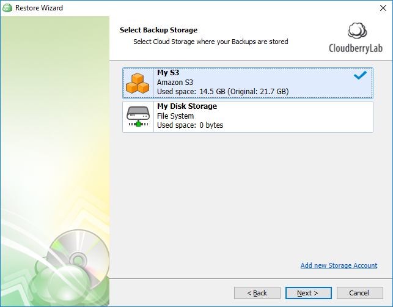

# Step 1 - Select Backup Storage

Skip the first wizard page and select a cloud or physical storage from which to restore your backup.

You can add a new storage account by clicking the corresponding link.

> See the following article to learn about the supported storage providers: [Our Partners](https://www.cloudberrylab.com/partners/our-partners.aspx).

