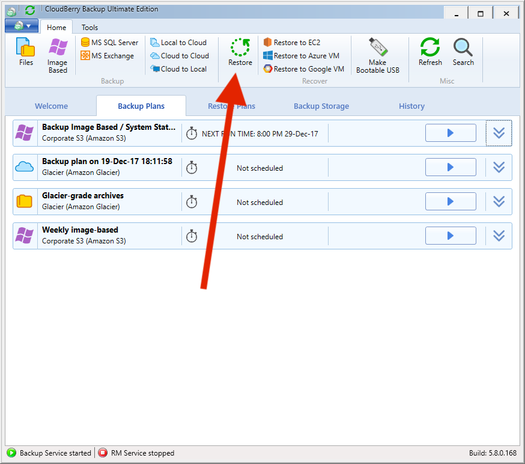
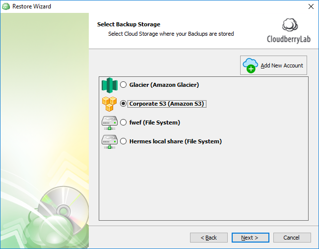
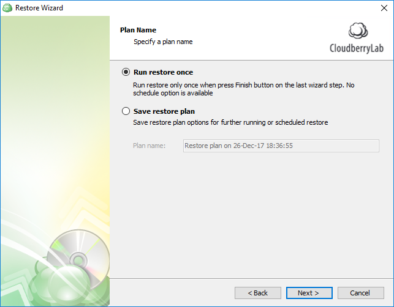
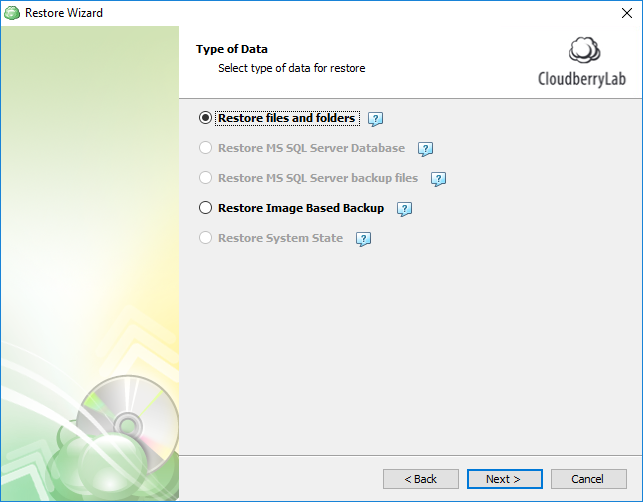
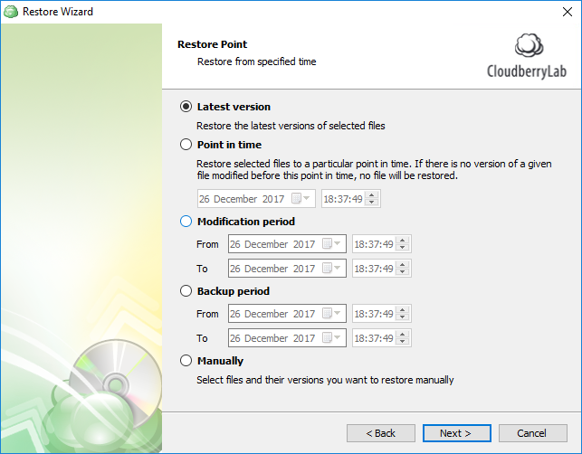
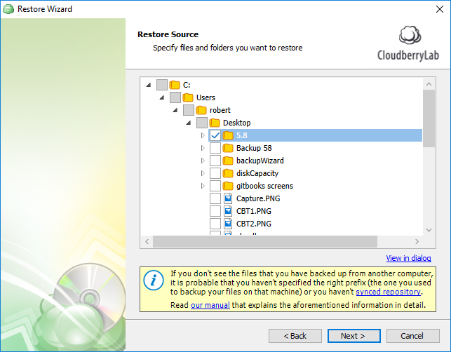
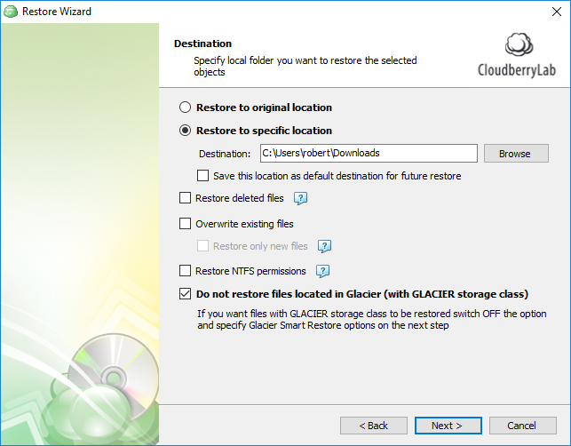
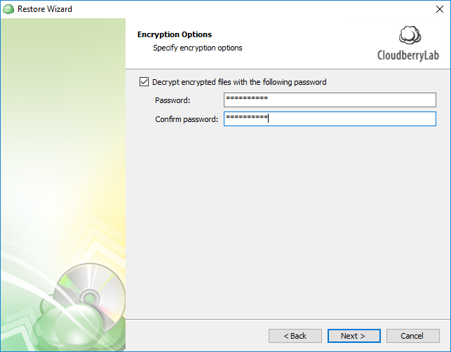
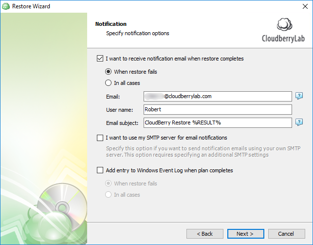
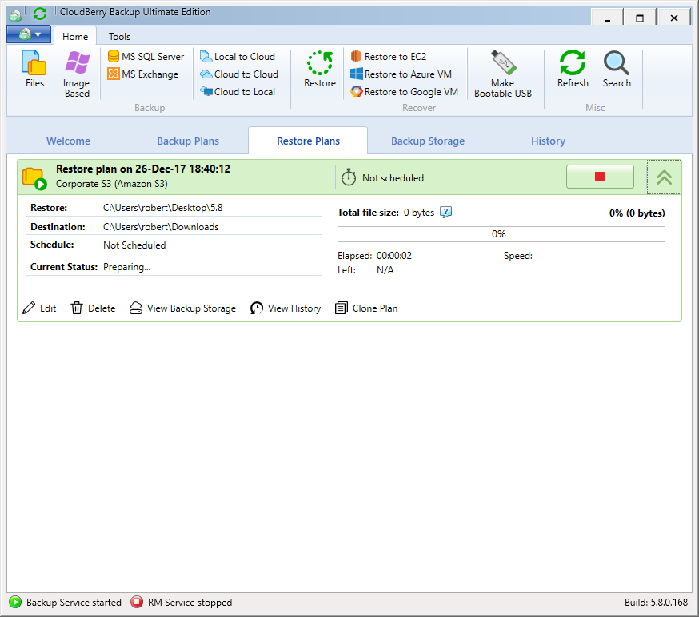

# File-Level Restore

Restoring files in CloudBerry Backup is done through the _Restore Wizard_. Basically, you indicate the storage that contains the files, select the files that need to be restored, optionally specify a few extra options and you're all set. In this tutorial we will demonstrate how to do just that.

To restore files, launch CloudBerry Backup. On the main toolbar, click **Restore**. Alternatively, utilize the Ctrl+R shortcut.

First, select the backup storage that contains the files you'd like to restore.

Now indicate if you want to perform file restoration once or save it for later.

CloudBerry Backup automatically identifies which types of backup data you have on your backup storage. Select **Restore files and folders**.

Now specify which versions of your files you'd like to retrieve.

Now select the files and folders you'd like to restore.

Now specify the location for restore data.

If you enabled encryption when backing up, enter the encryption password. If you've forgotten it, the data is permanently gone.

Specify if you want to be notified of restore completion or failure.

That's it. Conclude configuring a restore plan and execute it. The data will shortly be restored.

