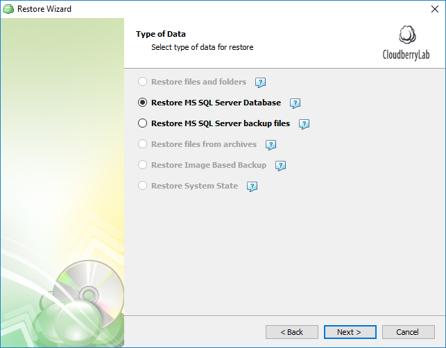
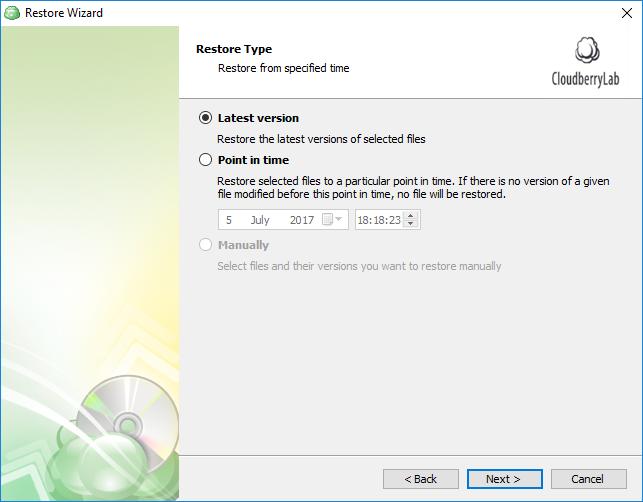
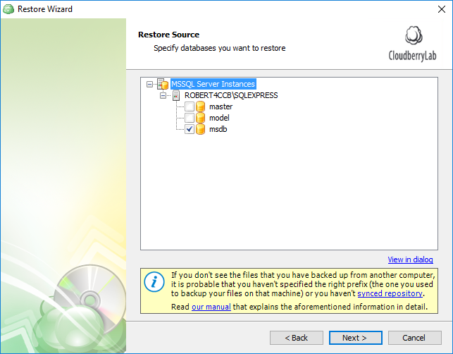
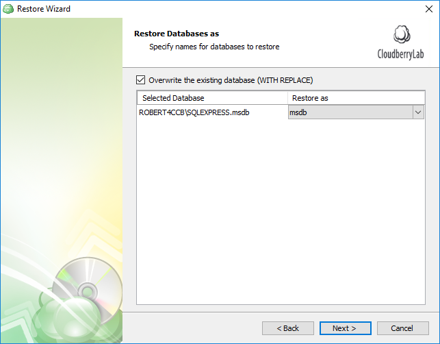
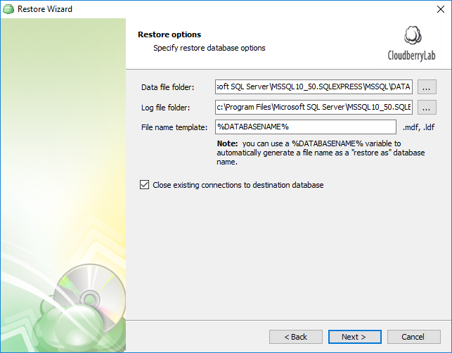
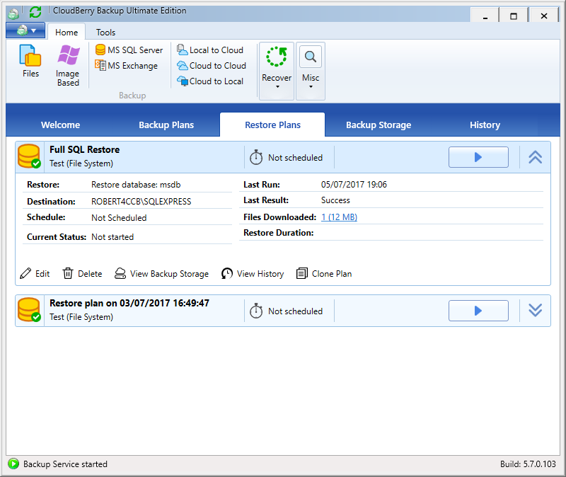

# SQL Server Restore

To restore SQL Server data, launch CloudBerry Backup and start the Restore Wizard by pressing _Ctrl+R_. You have two options here: Restore a SQL Server database or simply restore the SQL Server backup files to a specified location. We'll select the first option.

Specify the version of the backup you want to restore. You can even "go back in time" and restore the databases to a certain moment in the past. CloudBerry Backup will automatically send the SQL Server the required combination of full, differential, and transaction log backups.

Select the SQL Server instance, preferred authentication method and login information. Click **Next**_._

Select the databases you'd like to restore.

If you select **Overwrite the existing database, **then CloudBerry Backup instructs SQL Server to overwrite the database if it exists on the instance. This is a destructive operation, so select this option only if you are sure you want to overwrite the existing database.

SQL Server cannot overwrite and existing database if users are currently connected to that database. If you are sure you want to overwrite the database and are fine disconnecting any users connected, then select the **Close existing connections to destination database **checkbox to avoid a restore failure.

Complete configuring the plan and execute it afterward.

If everything goes smoothly, all of the restored databases along with transaction logs should be back on the SQL Server.

