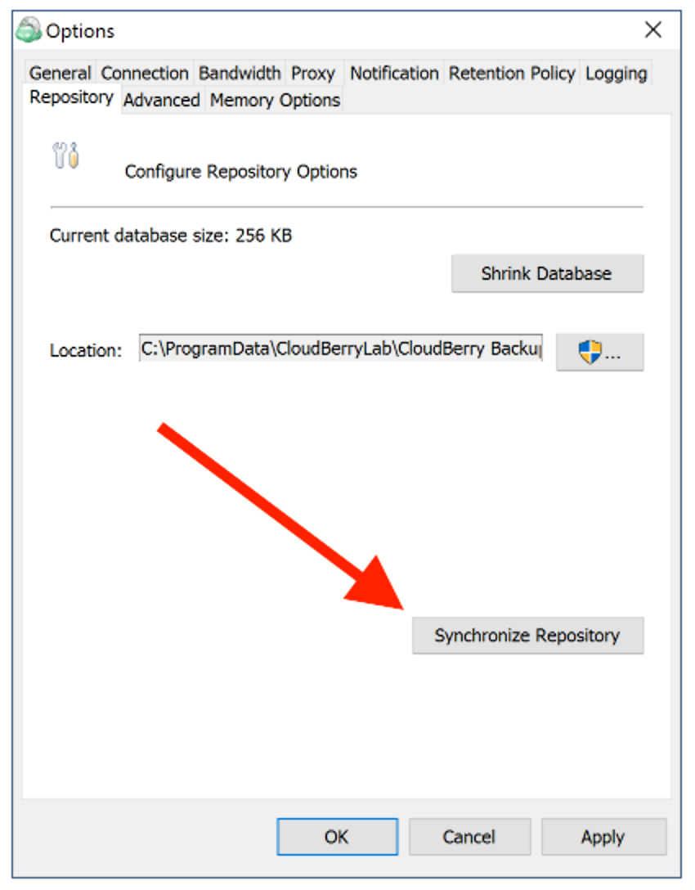

# Troubleshooting with invisible files

It is sometimes necessary to use another computer to restore your data from the same cloud storage. Naturally, the computer you're trying to restore your files on must be properly configured. Otherwise, you might face a situation in which some of your files are invisible. There are two ways to ensure that all files are displayed: specify the correct prefix and sync repository.

**Specifying the right prefix**

In order to restore files that were backed up from another machine, you have to ensure that the prefix on the machine you're restoring your files on matches the prefix of the previously mentioned. To change the prefix, go to you cloud storage settings.

Click **Advanced Settings**.

Now enter the required prefix.

**Sync Repository**

Importantly, the process is different when it comes to Amazon Glacier. This post will therefore touch upon both cases: Glacier and others.

**Glacier**

It’s critical to understand how Amazon Glacier functions so that you don’t get confused by some of its peculiarities. Since Glacier implies not having instant access to your files, it may take some time to even get the list of your files \(i.e. Sync Repository\). That process takes roughly 3-5 hours to complete. Therefore, if you don't see your files, it is likely that they haven't been synced yet.

Notice the yellow warning at the bottom of the window. It prompts you to sync repository. Click **synced repository**.

Now click **Synchronize Now.**

Once done, you may proceed to restore your files from Amazon Glacier.

**Others**

Other cloud storages do not require such hustles and are therefore easier to work with when it comes to repository sync. Open **Options**.

Under **Repository**, click **Synchronize Repository**.

Select the requisite cloud storage. Click **Synchronize Now.**

If you've done everything correctly, your files should be displayed when trying to restore them.

