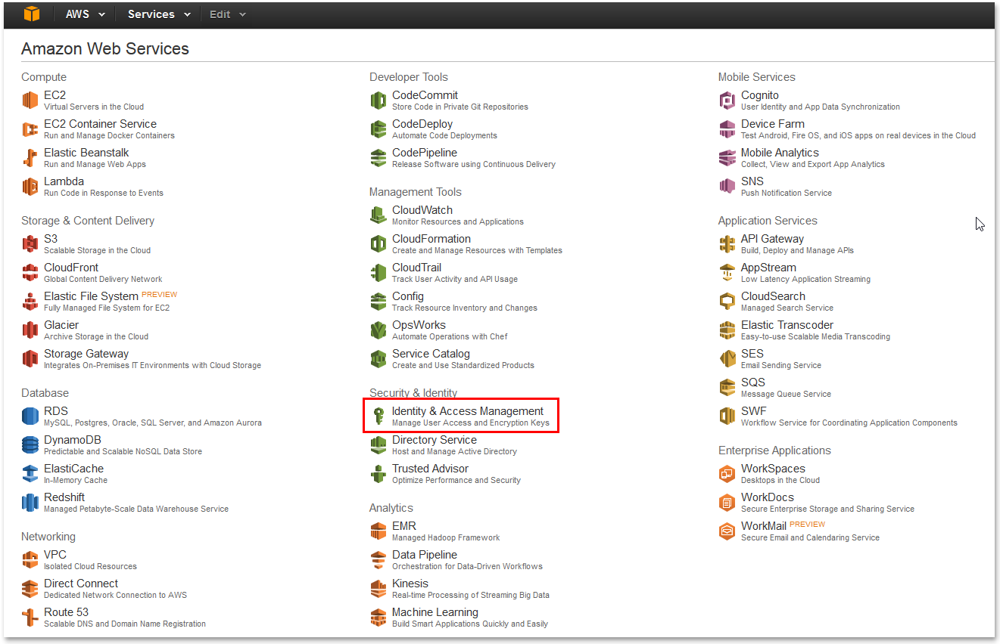

# Configuring a VMimport Role

In this post, we provide a step-by-step instruction on how to configure [Amazon VMimport Role](https://aws.amazon.com/ec2/vm-import/) in order to import virtual machine images from your existing environment to Amazon EC2 instances.

## How To Configure a VMImport Role

1. Go to [**Amazon Web Services**](https://www.amazon.com/ap/signin?openid.assoc_handle=aws&openid.return_to=https://signin.aws.amazon.com/oauth?response_type=code&client_id=arn%3Aaws%3Aiam%3A%3A015428540659%3Auser%2Fhomepage&redirect_uri=https%3A%2F%2Fconsole.aws.amazon.com%2Fconsole%2Fhome%3Fstate%3DhashArgs%23%26isauthcode%3Dtrue&noAuthCookie=true&openid.mode=checkid_setup&openid.ns=http://specs.openid.net/auth/2.0&openid.identity=http://specs.openid.net/auth/2.0/identifier_select&openid.claimed_id=http://specs.openid.net/auth/2.0/identifier_select&action=&disableCorpSignUp=&clientContext=&marketPlaceId=&poolName=&authCookies=&pageId=aws.ssop&siteState=registered,en_US&accountStatusPolicy=P1&sso=&openid.pape.preferred_auth_policies=MultifactorPhysical&openid.pape.max_auth_age=120&openid.ns.pape=http://specs.openid.net/extensions/pape/1.0&server=/ap/signin?ie=UTF8&accountPoolAlias=&forceMobileApp=0&language=en_US&forceMobileLayout=0&tag=viglink26740-20)**,** log in** **using your Amazon account \(email, password\) and go to **Identity & Access Management.**



1. Click on **Roles** in the left-hand sidebar and click **Create New Role**.


1. Enter **vmimport **in the _Role Name_  text field for the new role and then click **Next** **Step** in the lower-right corner of the screen.


1. Click **Select **next to the** Amazon EC2 **role.


1. Click **Next** **Step** to skip this page.


1. Review your role information and click **Create Role**.


1. Select your new role.


1. Expand the **Inline Policies **and click **click here**.


1. Specify the policy name in the policy document text field and insert the following policy script. 

```text
{
   "Version":"2012-10-17",
   "Statement":[
      {
         "Effect":"Allow",
         "Action":[
            "s3:ListBucket",
            "s3:GetBucketLocation"
         ],
         "Resource":[
            "arn:aws:s3:::bucket"
         ]
      },
      {
         "Effect":"Allow",
         "Action":[
            "s3:GetObject"
         ],
         "Resource":[
            "arn:aws:s3:::bucket/*"
         ]
      },
      {
         "Effect":"Allow",
         "Action":[
            "ec2:ModifySnapshotAttribute",
            "ec2:CopySnapshot",
            "ec2:RegisterImage",
            "ec2:Describe*"
         ],
         "Resource":"*"
      }
   ]
}
```

1. In the policy script, replace the black frames on the screenshot below with the name of your bucket. When done, click** Apply Policy** button.


1. Expand the _Trust Relationships_ section and click **Edit Trust Relationships**.


1. Insert the following script in the _Policy Document_ text field.

```text
{
  "Version": "2012-10-17",
  "Statement": [
    {
      "Sid": "",
      "Effect": "Allow",
      "Principal": {
        "Service": "vmie.amazonaws.com"
      },
      "Action": "sts:AssumeRole",
      "Condition": {
        "StringEquals": {
          "sts:ExternalId": "vmimport"
        }
      }
    }
  ]
}
```


When done, click Update Trust Policy. Now you have your _VMimport_ role configured.

