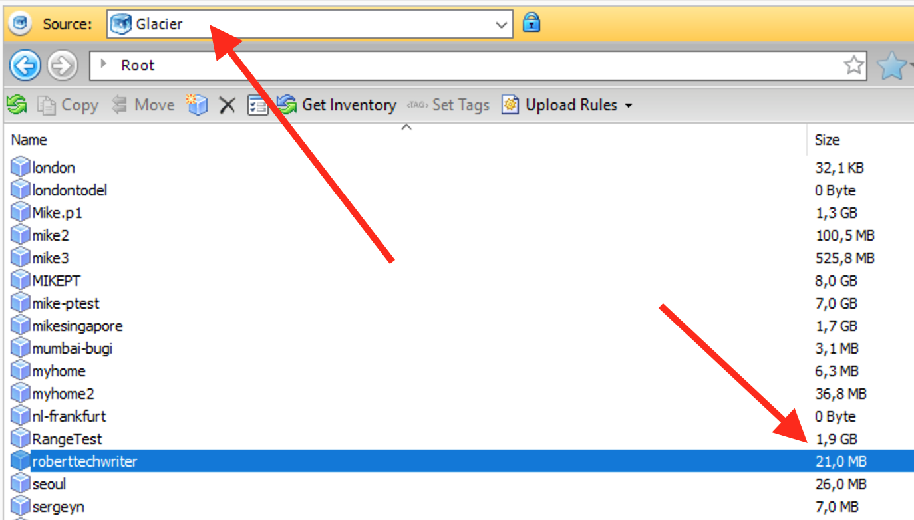
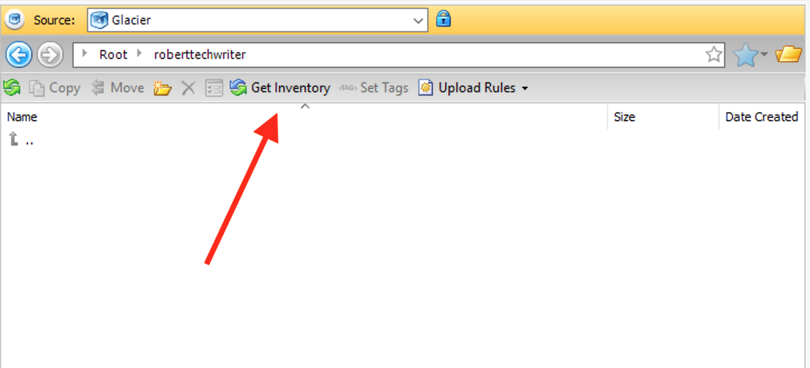
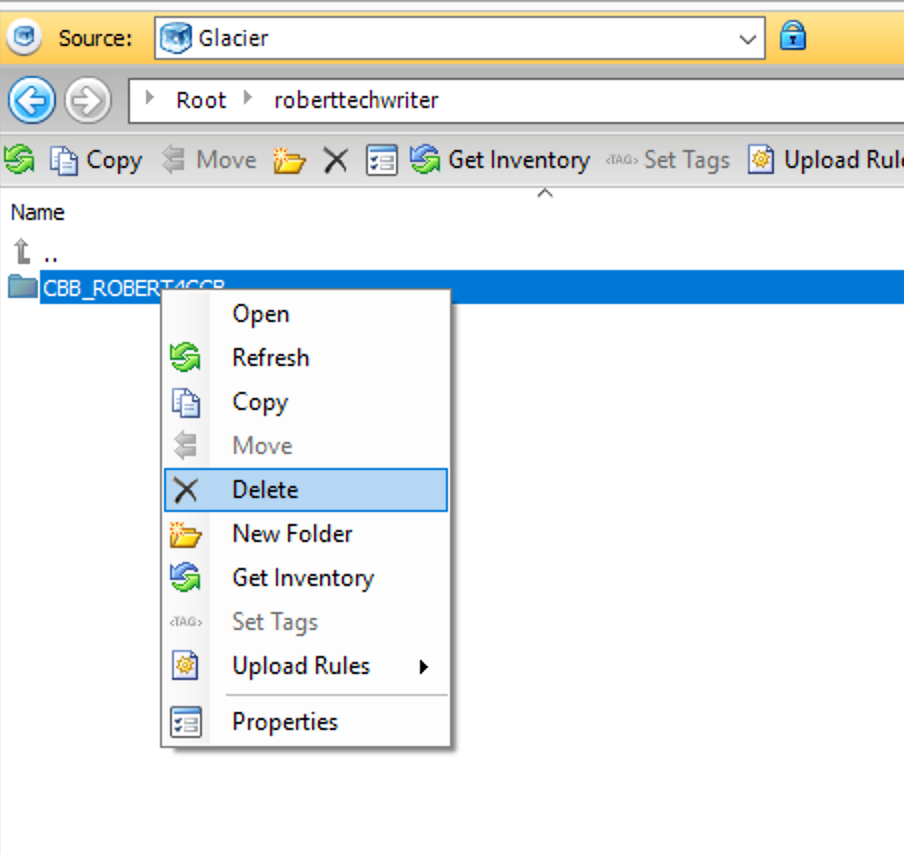
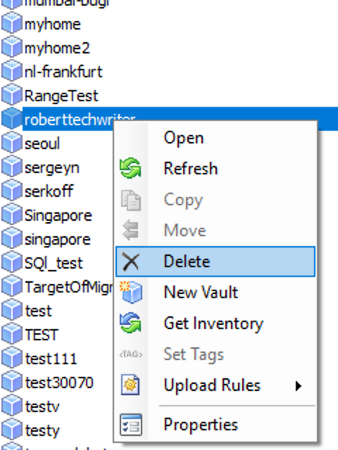
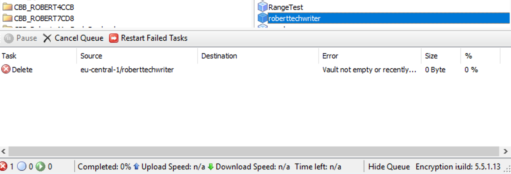

# Deleting Glacier Vaults

### Introduction

Amazon AWS Glacier is a low-cost archive storage that enables users to back up their data for the long-term at a price lower than Amazon S3. A typical use-case for AWS Glacier would be storage of data that does not require immediate restoration. Such data can include critical documents, SQL transaction logs, old video footage, etc. While Amazon S3 provides immediately accessible storage at a high price, Glacier provides low-cost storage that can be accessed only within hours. Similarly, deleting data and vaults \(data containers\) from Glacier can sometimes take a day or two and requires performing certain procedures that we will explain in this article.

### Step 1. Emptying the Vault  

The easiest way to empty and delete a Glacier vault is with the help of [CloudBerry Explorer](https://www.cloudberrylab.com/explorer/amazon-s3.aspx) \(free\). Our app enables you to perform operations with Glacier vaults with a user-friendly UI in just a few steps. Once you've installed CloudBerry Explorer, launch it and add your AWS Glacier account. 

Now let's proceed to deleting the vault. First of all, we need to erase all of the data that might still be in the vault.


You cannot delete a Glacier vault that contains data. Prior to deleting the vault, ensure that it is empty.


On the main toolbar, select your Glacier account and locate the required vault. In this case, we will select a vault named _roberttechwriter_. As you can see, it contains 21 MB worth of data. 

However, if we open it, we'll see that no data is listed. That's because we first need to request the list of data from Amazon which takes about 4-5 hours. This is a key characteristic of Glacier — pretty much all of the operations take a lot of time due to the storage's archive nature. 

To list the data in the vault, click **Get Inventory**.

The app will request the list of data, and in approximately 5 hours it will be listed.  You can close CloudBerry Explorer in the meantime, it doesn't need to be running in the background. 

Once the data is listed, select all of it, right-click on it, and click **Delete**.

### Step 2. Updating Glacier's internal inventory

Now here's the tricky part: you've deleted the data, but Amazon's internal inventory is only updated once every 24 hours, meaning that your data is "still there". In other words, you need to wait until the next AWS Glacier inventory update which will reflect the changes. Only then will you be able to delete the emptied vault.


AWS Glacier Inventory is updated daily at approximately UTC 0:00.


### 3. Deleting the Vault

Wait until the inventory is updated and then delete the vault. Right-click on it and click **Delete**.

If you attempt to delete the vault before the inventory is updated, you'll encounter the following error:

The vault will immediately be deleted, but again — you'll have to wait for the next inventory update for the vault to disappear altogether. 


Once the inventory is updated, you can immediately delete the vault.


