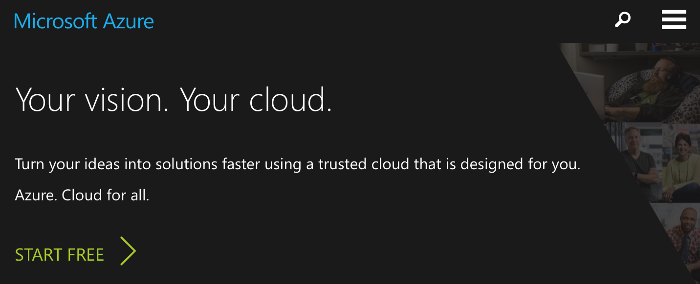
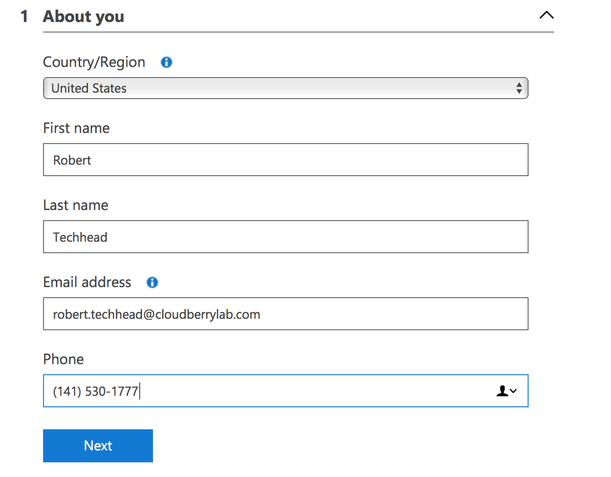
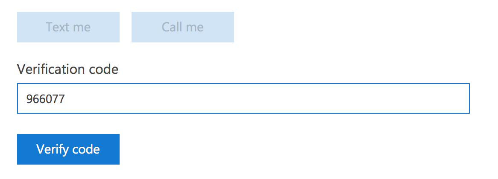
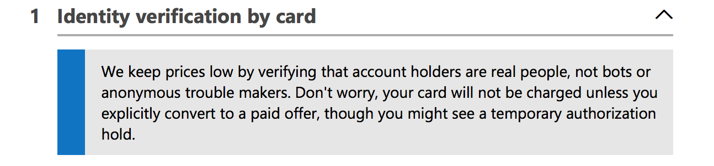

# Signing up for Microsoft Azure

To start using CloudBerry Backup with Microsoft Azure, you need an Azure account. Below is the manual describing how to sign up to Microsoft Azure services and to create a storage account.

## Signing up for Microsoft Azure

Go to the [Microsoft Azure website](http://www.windowsazure.com/en-us/).

Click **START FREE**.

You can either create an entirely new account or log in with your existing Microsoft credentials. Enter your personal information and click **Next**.

You will then need to confirm your identity with a text message and a debit card.

Conclude signing up for Microsoft Azure. Once done, you'll be redirected to the _Azure Management Portal_.

### Creating Storage Account

In the _Azure Management Portal_, click **Storage accounts** in the left sidebar. Then click **Add**.

You will be redirected to the following screen:

Specify all of the required options and click **Create**.

### Retrieving Access Keys

To start working with Managed Backup Service, you first need to generate **Azure access keys**.

In the _Azure Management Portal_, under your storage account, click **Access Keys**. Here you can generate keys or use the default ones.

Write down the keys somewhere; you're gonna need them when adding a backup destination in CloudBerry Backup.

